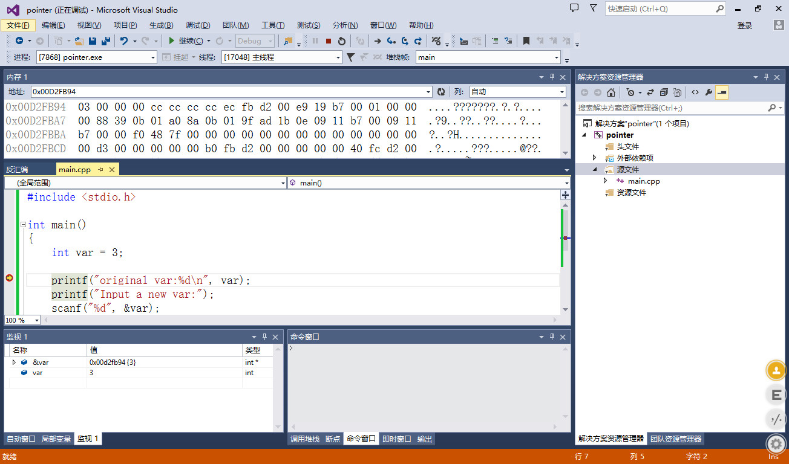
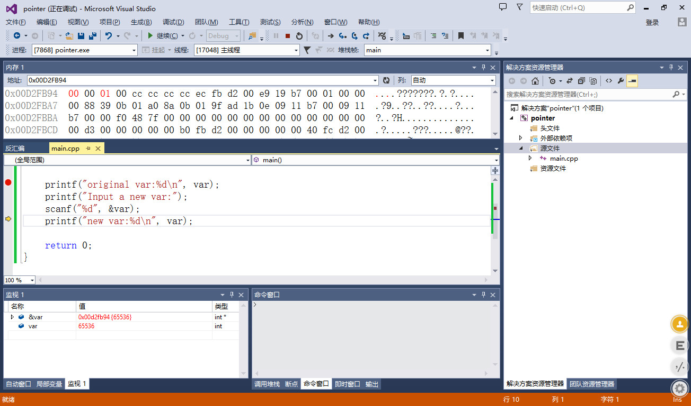
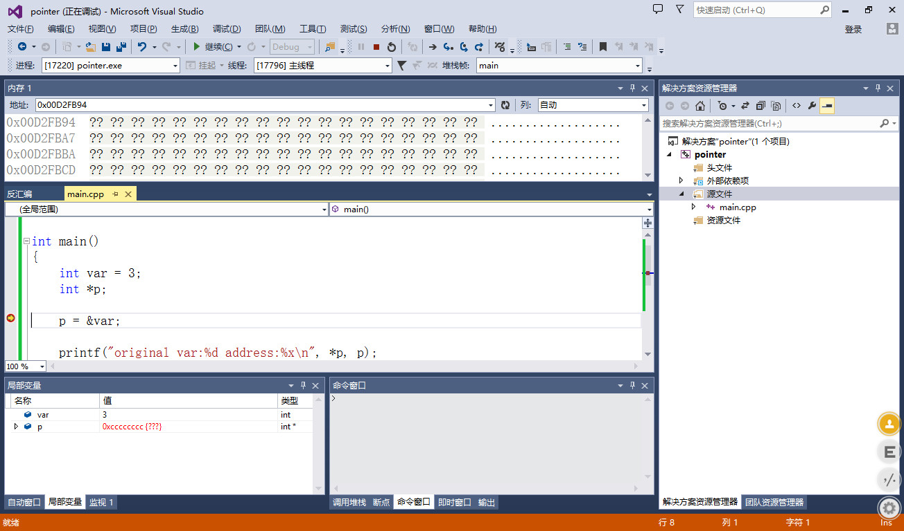
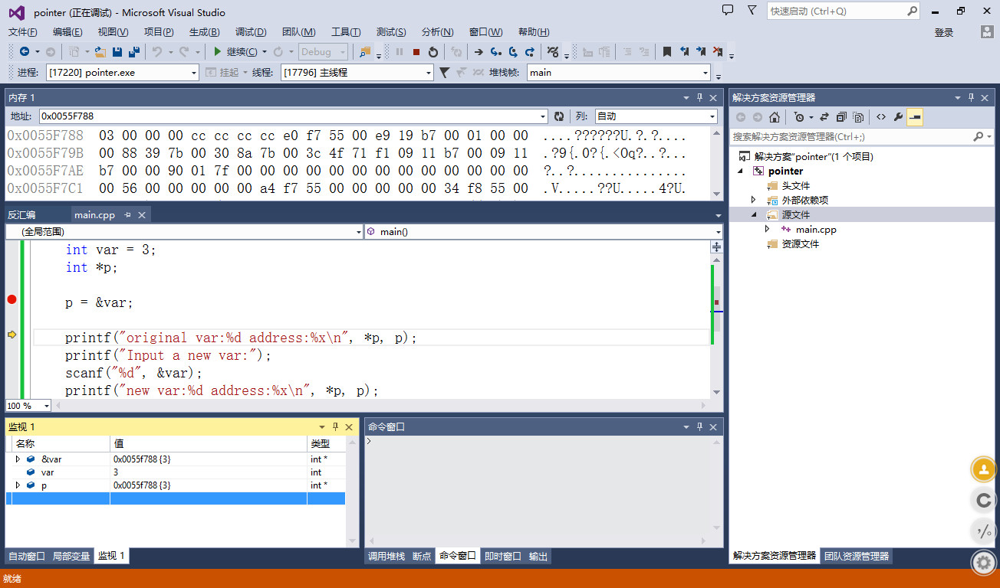
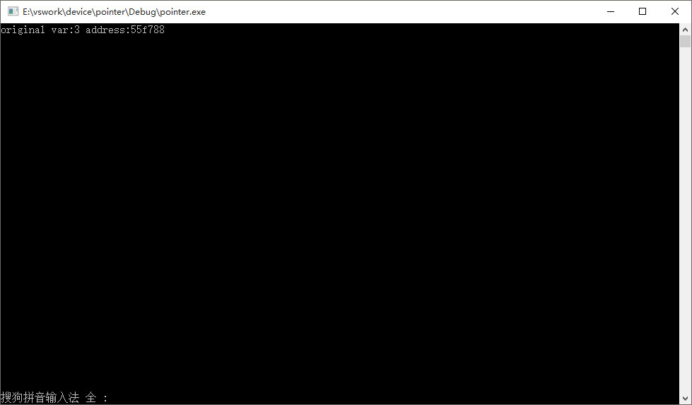
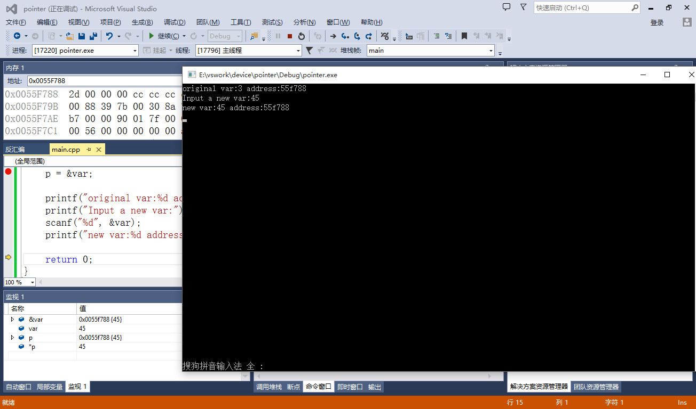

# 指针入门 #

C有两大魅力所在，其一是宏，其二便是指针。指针，是C的灵魂。
市面上的各大书籍、各类教程、老司机的教学贴，每每谈到指针，无一不是讳莫如深。诚然，对于一个没怎么接触过编程语言，对计算机内部机理不甚了解的萌新来说，想要通过流行书刊上的描述来理解指针，基本上是impossible。
究其原因，在于面向入门者时，作者往往为了避开计算机底层的原理，苦心孤诣的附加了许多“想当然”的概念。这种概念虽然可以在入门时帮助新手理解记忆，但往往到了后期，一旦其概念与程序的表现出现颠覆，这种概念就不再是帮助，反而是一种根深蒂固的毒害。行文至此，想到了早年读《疯狂的程序员》中，绝影对指针的评价：“如果写C的人和写汇编的人互相照应一下，那么无论是C的指针，还是汇编的寻址，都是一目了然的内容。”。
既然传统的讲法不受用，再去反复描摹，也并不可取。因此，本文尝试剑走偏锋，讲解指针概念时，大刀阔斧的引出内存地址的那些事。通过简单的实例与调试器帮助初学者彻底理解C的指针。

## 你真的理解变量吗？ ##
对于编程语言来说，一个最最基本的概念——变量，似乎很容易理解，初学者对其理解往往会有两个阶段：
1. 不就是个能够在运行期变化的值嘛
2. 变量并不是值，而是用来存放变化值的容器。

至此，如果没有进修过高级的秘籍，亦无高人指点，可能此生对于变量的理解也仅仅如此。不知诸位看官，可曾思考过，写程序时想当然的定义一个变量，这个变量到底是如何存储的，又存在了哪里？
看一段最简单的程序：

	```
	#include <stdio.h>
	
	int main()
	{
		int var = 3;
	
		printf("original var:%d\n", var);
		printf("Input a new var:");
		scanf("%d", &var);
		printf("new var:%d\n", var);
	
		return 0;
	}
	```

程序首先定义了一个int型变量var，并在定义时初始化值为3。在输出了这个值后又通过终端由用户来输入一个新值存储在var中，再次print出的var就应该是新输入的值。
注意，从现在开始，我将颠覆你从前的种种猜想与对变量的理解，从内存地址的角度来告诉你，上面的程序在执行时，都发生了什么。

我们通过调试器来帮助理解，这里采用VS2013自带的调试器，进行源码级调试。



运行程序，断在第一个printf调用处，此时，在监视窗口查看var的值以及其地址值。这里首先要认识一个符号:&。
这个&在C语言中有3处可以见到：
1. &&操作符，这个是逻辑与，诸位想必烂熟于胸。
2. &操作符，这个是按位与，可能一些新人不熟悉，简单来说，就是对两个变量的每一位进行and操作。
3. 取地址符，在任意的变量前加上一个&，即表示获取该变量所在的内存地址。

那么内存地址又是什么？答案已经呼之欲出了，即变量存储的地方。内存地址是一大片连续的空间，以字节为单位，用于存储程序运行时的一切，变量自然也在其中。内存按照不同的标准，将程序的各类组成部分放在不同的片区中，我们暂时不关心程序在内存地址中的构成，只需要知道变量是存储在内存中，并有一个它自己独一无二的地址值。

这里，监视窗口给出，当前var的值是3，而其地址是0x00d2fb94，这是一个32位的整数（内存地址通常用16进制数描述）。那么，在我们的程序运行期间，var变量只要还没有结束生命周期，那么这个地址就一直用来存放var的值。
在上方的内存窗口中，我们输入0x00d2fb94即可看到，这一地址的值确实是3。

我们接着执行下去，输入一个比较大的数65536：



这里，我们看到，var的值变成了65536，地址依然是0x00d2fb94，而上方的内存地址窗口也标红了该地址的变化。由03变成了00，相邻的0x00D2FB96则由00变成了01（内存地址是以字节为单位，通过这个窗口也可以看出端倪）。问题来了，我明明输入的是65536，怎么03变成了00呢，不应该是变成65535吗？
回忆之前的学习，我们了解到int型是一个4字节长的数据类型，显然需要用4个内存地址来存放，而实际上，我们通过&来取出的这个地址值，准确来讲，是索引变量存储的内存首地址。就拿var来说，&var是0x00d2fb94，但实际上因为int是4字节长度，var所用的内存地址应该是0x00d2fb94-0x00d2fb97。内存地址向高增长，且对于我们的机子来说，高地址存放高位，低地址存放低位（这就是小端 little-endian的概念，日后自然懂）。

到此，你应该明白了实际上 00 00 01 00实际上存储的恰恰就是65536（内存地址存放的数这里是十六进制表示，倒过来是0x00010000，即65536）。

## 指针是什么 ##
千呼万唤，终于要说到指针这个概念了。指针是什么？我可以很明确的告诉你，指针是一个变量类型，只不过有别于你此前学过的种种变量类型，如int、double、char，指针变量类型存储的是某种类型变量的地址值。另一方面，指针变量的定义，在语法上显得特别一些。以上总总可能提起来很绕，所以我们举个栗子：
	
	```
	#include <stdio.h>
	
	int main()
	{
		int var = 3;
		int *p;
	
		p = &var;
	
		printf("original var:%d address:%x\n", *p, p);
		printf("Input a new var:");
		scanf("%d", &var);
		printf("new var:%d address:%x\n", *p, p);
	
		return 0;
	}
	```

这里面有些你暂时看不懂的语法，听我慢慢道来。
定义一个指针变量的方法，很简单，首先你要确定这个指针变量是指向哪种类型的，这里我所定义的即是指向int型变量地址的指针，写成int *p;同理，如果想定义一个指向double类型的指针变量，只需要double *p;即可。
p = &var;这一行你应该已经猜到了，结合之前所讲，&var是var变量的内存地址，这一赋值操作实际上就是把var的地址存放在p中。
下面在输出时，%x对应的p不难理解，p的值就是var的地址嘛！而原本的var我改写成了*p，实际上*p和var此时是等价的。为了理解这一写法，我们还要再学习一个符号的用法：*。
此前，*一直用于乘法运算，但实际上，C程序中*更常见于指针的解引用操作。何谓解引用？说白了就是取出指针变量的值所在的内存地址的值。这里p存放的是var的地址（即p指向var），那么解引用*p即是var的值。

开始调试，断在p = &var;这一句。此时，var的值已经是3，而p的值是一个很奇怪的数0xcccccccc。这是因为p = &var还没有执行时，我们前面定义的p存放的值还是一个垃圾值，而在调试模式下，未初始化的变量初始垃圾值都是由cc填充（想知道为什么，查查debug及int 3，cc是int 3的机器码）。



单步执行，此时p值变为0x0055f788:



通过对比&var及p的值，以及地址0x0055f788处的内容，验证了此前的说法。
继续单步，打印出解引用得到的值以及地址：



OK，完全正确！继续下去，输入新的值45，再打印：



p的值没有发生变化，但由于var的值改写了，所以*p拿到的值也不再是此前的03，而是新的2d（45）。

## 扩展阅读 ##
如果你能够看懂上面的描述，那么恭喜你，你已经理解了指针的本质。接下来，各类指针的教科书怕是难不倒你了。本文的内容只是点到为止，对于指针来说，所授内容仅仅是冰山一角。你可以选择继续阅读我的后文来深入的系统的学习指针，也可以采取一个我更为推荐的方式：阅读《C和指针》这本书关于指针的内容。

1/26/2017 9:15:21 PM @author: 玉涵