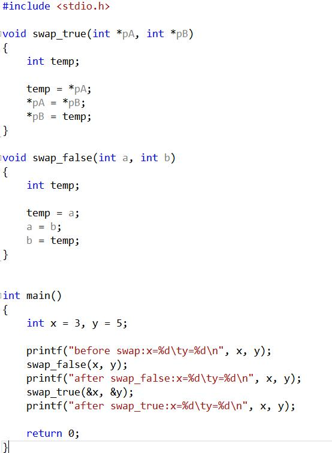
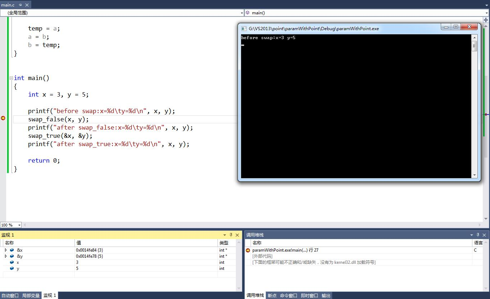
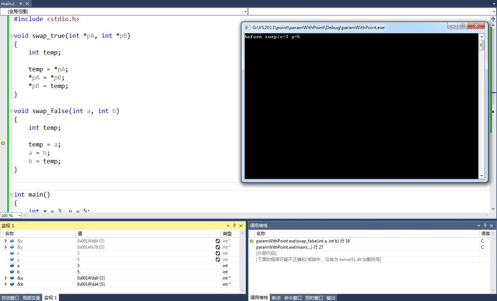
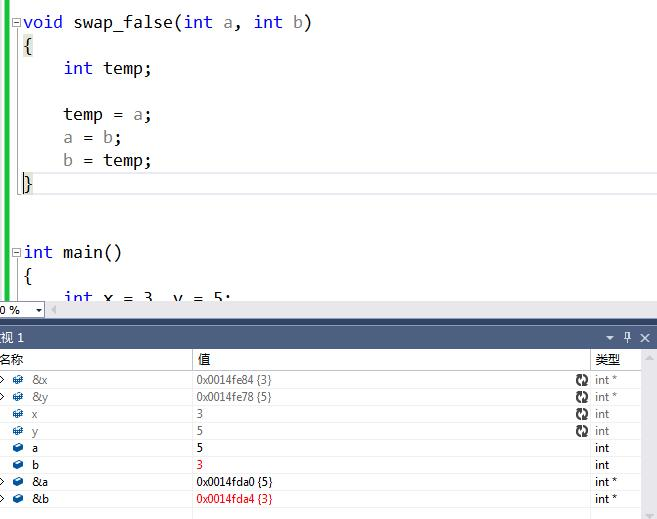
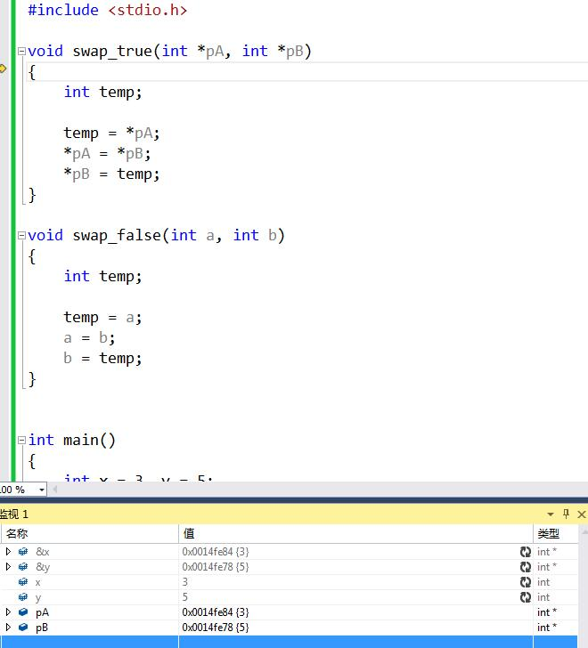
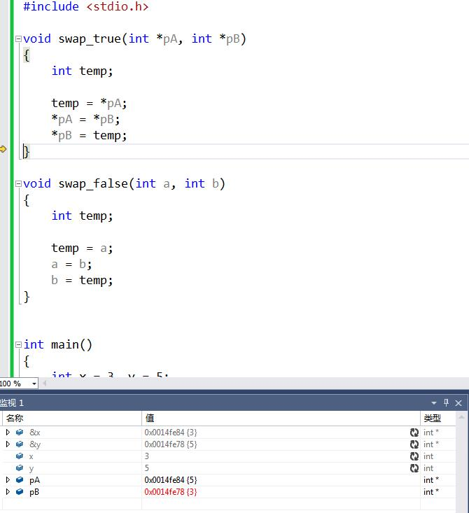
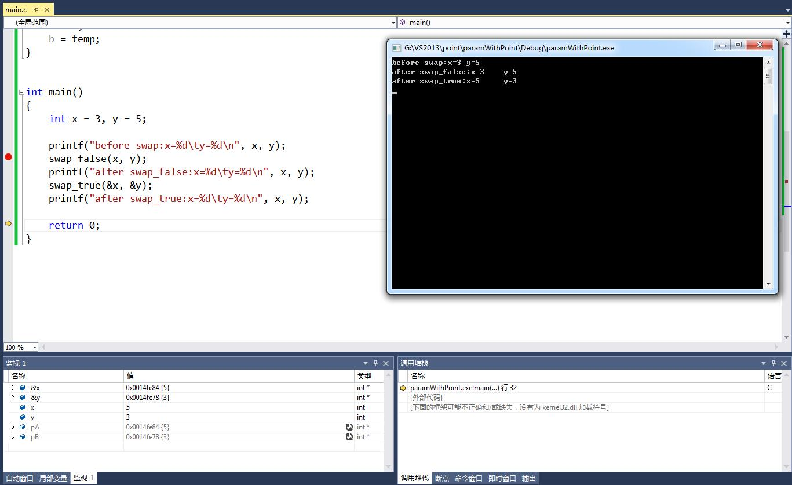

# 指针进阶之传参 #
经过前两节的学习，想必对于指针的本质，诸位看官已是有了深刻的理解。同样的，对于指针最基本的使用方法，亦是了然于胸。但是，这又会引出下一个疑问：究竟指针有什么用？适合在哪些场景使用？

关于指针的常见使用场景，我大体总结以下几点，随着日后对C的理解加深，便会有所体会：

1. 函数的参数传递
2. 协助处理各种数组操作（非字符数组+字符数组）
3. 字符串（字符串变量（字符数组）+字符串常量）处理
4. 结构体日常
5. 回调函数抽象接口设计（函数指针、函数指针数组）

关于上面的几种场景，其难度也是呈现递增。而这些正是学习指针的进阶操作的核心内容。本节我们讨论第一种，暂不论后四种场景。

## 传值？传址？ ##
看市面上各种烂大街的C程序设计书籍，谈到指针，总是会扯到上一节结尾的那个swap函数作为例子，继而故作高深的引出两个莫须有的概念：传值，传址。

先回顾一下上节的程序：

	```
	void swap(int *pA, int *pB)
	{
		int temp;
		temp = *pA;
		*pA = *pB;
		*pB = temp;
	}
	
	int main()
	{
		int a = 3, b = 5;
		//int *pA = &a, *pB = &b;
	
		printf("before swap: a=%d, b=%d\n", a, b);
		//swap(pA,pB);
		swap(&a,&b);
		printf("after swap: a=%d, b=%d\n", a, b);
	}
	```
> Tips: 如果你还没有调过这个程序，请滚回基础篇，拿好IDE，一行行调试。

在没有学习指针前，如果要我们设计一个用于交换两个数字的swap函数，一定会想当然的写成这个样子：

	```
	void swap(int a, int b)
	{
		int temp;
		temp = a;
		a = b;
		b = temp;
	}
	swap(x,y);
	```

然而，swap内部a和b是正确交换了，但是函数返回后，a和b又“恢复”了原样。

实际上，这里我们需要理解函数的一个重要概念：实参与形参。当我们定义一个函数时，比如上面的swap，其两个参数a和b就是形参，而当我们调用swap时，比如写成`swap(x,y);`，这里的x和y就是实参。

为什么要区分形参和实参呢？难道这里的x和a不是一个变量吗？问题就出在这里，实际上，实参和形参是两个变量，而调用函数的过程中，只是简单的把实参变量的值拷贝到了形参变量里。而按照我们此前对于变量的理解，两个不同的变量，那么地址肯定是不同的，只是拷贝操作使得他们内部的值相等而已。因此，在swap内部对形参a和b的操作，修改的是a和b变量地址内的值，x和y从始至终根本就没有改变过。

所以，我们可能写了个假swap。而这个swap就是讳莫如深的“传值”。

那么，为什么此前的版本却能够生效呢？我们尝试用同样的概念来分析：
	
	```
	void swap(int *pA, int *pB)
	{
		int temp;
		temp = *pA;
		*pA = *pB;
		*pB = temp;
	}
	swap(&x,&y);
	```

既然函数的调用，实际上会把实参的值拷贝到形参中，那么，对于上面的写法，便是将&x的值，也就是变量x的地址拷贝给了pA指针变量，pA指针变量中的值便是x的地址，同理pB中存储了y的地址。接下来，通过解引用操作取出pA和pB的值并进行互换。因为swap中值互换的对象，是pA和pB指向的地址的存储空间，所以当函数执行完毕返回后，x和y的值当然就交换了。

你已经猜到了，没错，这也就是所谓的“传址”。实际上地址也是个值，“传址”只不过是“传地址值”而已。

## 不跟你多BB，实践出真知 ##
BB了那么多，真的假的啊？所以，我们一起来调试，一步步跟踪变量的地址空间。



采用VS2013作为IDE，在swap_false行下断点：



一切正常！这个时候我们通过监视窗口来跟踪x和y的值、地址。
跟进swap_false函数：



这里可以看到，a、b的地址和x、y的地址并不相同，但是值确是相同的，这印证了我们上面的说法。
接着，我们跟到swap_false的结尾：



显然，这里的a和b确实互换了值，但是该函数所有的操作，却没有影响x和y地址的值。于是，函数执行后，x和y保持原样。

再进入swap_true:



这里我们分明可以看到pA和pB的值就是x和y的地址值，于是，跟到结尾再看：



pA和pB地址值处的值已经改变了（后面的花括号里的即是地址处的值）。而这里之所以x,y,&x,&y还是之前的值，是因为在swap_true函数中，x和y变量是不认识的，所以窗口把他们置灰了，等回到main中就可以看到变化了。关于各种变量的生存范围，请翻看函数的相关章节。



功德圆满~

下一节，我们将继续讲解第二种场景：数组与指针。在这之前，你需要有夯实的数组基础，不然届时会痛不欲生。