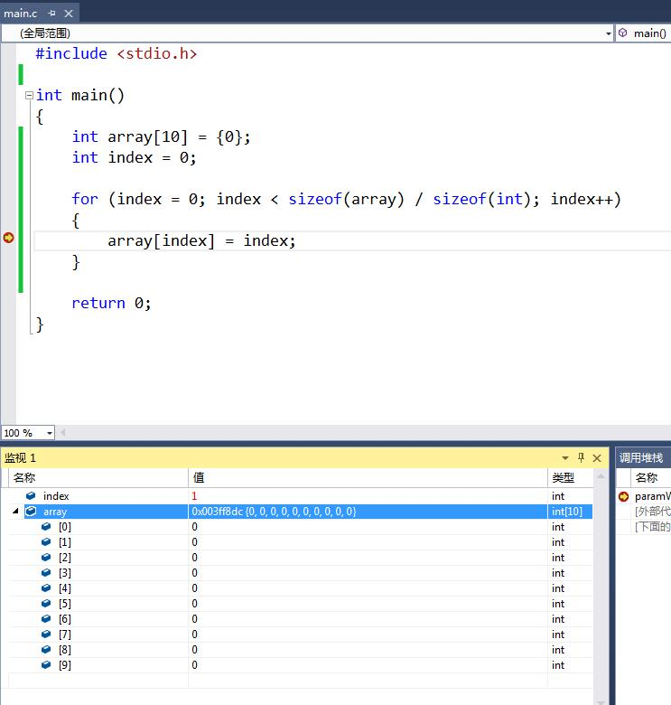
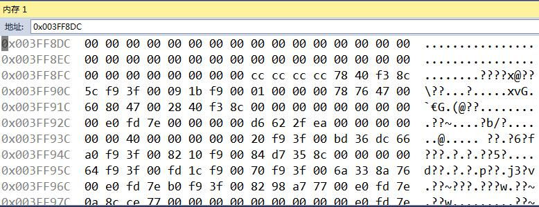
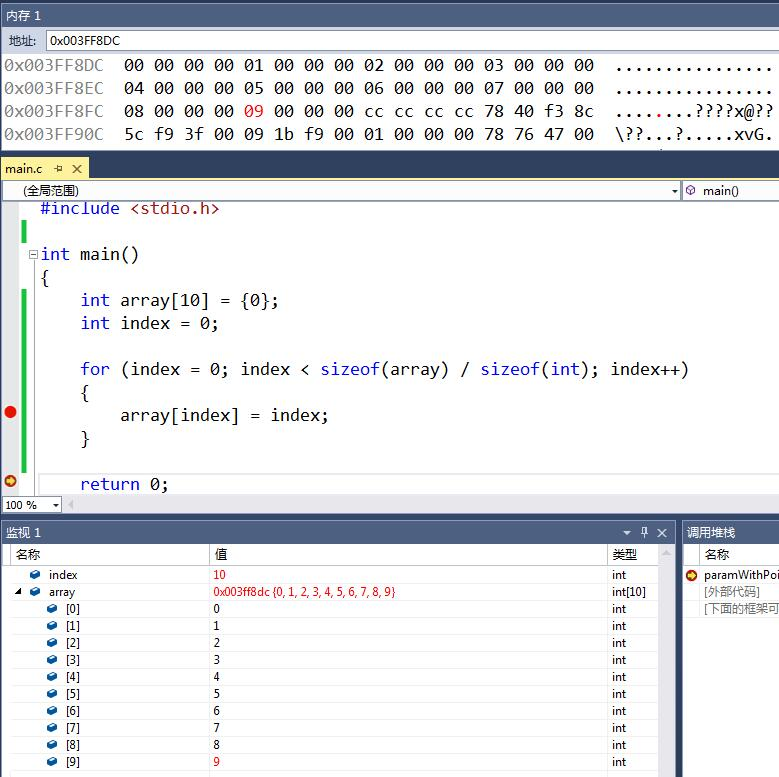
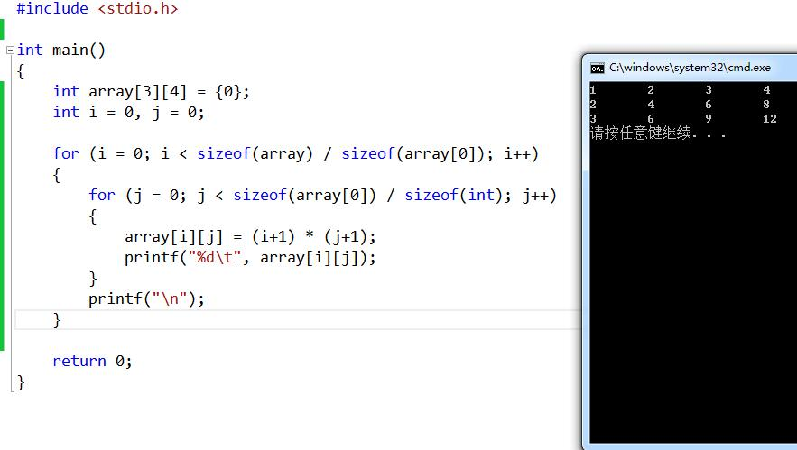
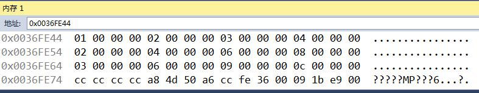
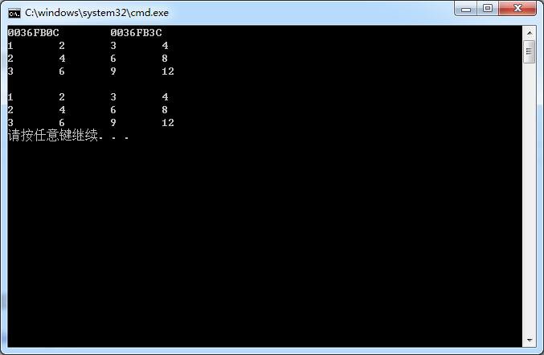
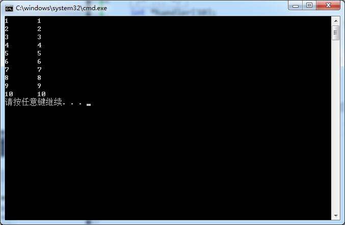

# 指针进阶之数组与指针 #
上一节，我们谈到了C中指针常用的5种场景：

1. 函数的参数传递
2. 协助处理各种数组操作（非字符数组+字符数组）
3. 字符串（字符串变量（字符数组）+字符串常量）处理
4. 结构体日常
5. 回调函数抽象接口设计（函数指针、函数指针数组）

这五种场景，其学习难度也是逐渐递增，其中第一个场景，也是最为简单的场景，上一节已做了详细的讲解。本节我们继续讨论第二种：数组与指针。

## 数组的那些事儿 ##
既然我们已然了解了地址这个概念，那么回过头来，想想那个当初十分难缠的老朋友：数组，它和地址之间的联系又是如何？
空想无益，还不赶紧掏家伙！



很简单的一段程序，我在循环中的赋值语句下了个断点，调试程序，第一次执行`array[index] = index;`时断了下来。显然，由于开始的数组初始化，array的十个成员都是0。

注意看，监视窗口中array的值中有一个地址值：0x003FF8DC，这个实际上就是array数组的首地址，可能以后你会经常听到“数组的首地址”这样一个概念，但却不是太明白，实际上，“数组的首地址”就是“数组的第一个元素的地址”，不管是几维，都是适用的。另一方面，语言设计上规定，数组名表示数组的首地址，也正是如此，监视窗口中对array的监视，其现实的值是一个地址值。

此处的0x003FF8DC是数组的首地址，是array的值，也是array[0]的地址，即&array[0]。因此，对于该一维数组来说，array 等价于&array[0]。

我们观察一下这段内存空间：



看起来，这和我们的预期一致，从0x003FF8DC到0x003FF903共40个字节都是0。我们知道int是4字节，那么拥有10个元素的array就应该占用40个字节。这里也可以看出，数组实际上是一段连续的存储空间，我相信，你在学数组时，不止一次的听过这一句话。

我们将持续执行到main的出口，再看：



完美的印证了我们此前所想所学。

> 暂停：到此，你应该停下来，自己写一个二维甚至更高维的数组，也来调试一番，看看二维数组的地址空间是如何分配的。

## 将指针加入豪华套餐 ##
既然指针可以指向int，那么自然也可以指向数组内的某一个成员，比如，我们写`int *p = &array[3];`，就将p指向了array[3]，以此类推。

我们将上面的程序改一下，利用指针来赋值：

```
	#include <stdio.h>
	
	int main()
	{
		int array[10] = {0};
		int index = 0;
		int *p = NULL;
	
		for (index = 0; index < sizeof(array) / sizeof(int); index++)
		{
			//array[index] = index;
			p = &array[index];
			*p = index;
		}
	
		return 0;
	}
```

显然，除了写的比较蠢以外，程序是完全正确的。

较为聪明的写法是这样：

```
	#include <stdio.h>
	
	int main()
	{
		int array[10] = {0};
		int index = 0;
		int *p = NULL;
	
		p = array;
		for (index = 0; index < sizeof(array) / sizeof(int); index++)
		{
			*p++ = index;
		}
		p = NULL;
	
		return 0;
	}
```

别着急，我知道你有很多看不懂的地方。看看下面的几个tips，或许你会恍然大悟。

1. 别忘了`array`和`&array[0]`的值相等（涉及到多维时，比如二维，`array`和`&array[0][0]`也相等，但意义不同）。
2. 指针是有加减操作的，但却没有乘除操作。指针的加减表示以其指向的类型大小为单位，对地址值进行加减。比如int型指针加1，则表示从0x00000004变为0x000008。
3. ++操作符具有延后性，即总是执行完这一表达式后，才会生效。

> 智者的升华：关于第二点，或许你会有疑惑，对于指针的加减操作难道不是很危险吗？如果是数组，因为其存储空间的连续性，所以加减看起来没什么问题，但如果是形单影只的变量，我们却没有办法保证它附近的地址空间是否是int。没错，实际上指针保证不了，也没有必要保证，因为哪怕你把int指向了一个不是int型的存储空间，这个指针也只是把它当成一个int而已，毕竟，指针存的不过就是地址的值，至于地址里面存的是什么，那取决于我们把它当成什么，无论是何种类型，终归是把二进制数据存进去，不是吗？

最后，在你弄懂了指针和数组的配合使用后，还有最后一个问题：我们何时选择写成数组索引的形式，比如array[]，何时又该选择指针呢？实际上，这是仁者见仁，智者见智的话题。用一句最简单的话来总结：**在不同场景，选择你认为方便的那个**。

## 加餐：二维数组 ##
搞懂了基本概念，我们加个餐，不然你一定会认为，第二种场景和第一种场景相比，难度也就那样~



在未加入指针的情况下，程序一目了然。array的内存空间依然是连成一片：



既然多维数组实际上也是线性存储，即先存array[0]的4个int，再存array[1]的4个int……，那么指针实际上也就是个简单的加减偏移：

```
	#include <stdio.h>
	
	int main()
	{
		int array[3][4] = {0};
		int i = 0, j = 0;
		int *p = NULL;
	
		for (i = 0; i < sizeof(array) / sizeof(array[0]); i++)
		{
			for (j = 0; j < sizeof(array[0]) / sizeof(int); j++)
			{
				array[i][j] = (i+1) * (j+1);
			}
		}
	
		p = &array[0][0];
		for (i = 0; i < sizeof(array)/sizeof(int); i++)
		{
			printf("%d\t", *p++);
			if ((i+1) % 4 == 0)
				printf("\n");
		}
	
		return 0;
	}
```
## 指针的维度 ##
当然，还可以有更为高级的玩法，在这之前，请你通过调试器来找出这几个表达式的值：

- array
- &array[0]
- array[0]
- &array
- &array[0][0]
- *array

没错，这六个值完全相等。**但是，他们代表的意义却完全不一样。尽管值相等，但它们所处的维度却完全不同**。

我们知道，对于数组来说，数组名表示的是数组首地址，而数组首地址即数组第一元素的首地址。这对于一维数组来说，一切都很简单，但是一旦到了二维，情况就复杂了起来。首先，`array`是个二维数组，这个数组的第一个元素是`array[0]`，即第一个元素又是一个数组（一维数组`array[0]`），这个元素的首地址呢，递归下去，也就是`array[0][0]`的地址，因此，不难理解，`array`的值和`array[0]`与`&array[0][0]`相等（`array[0]`就是`array[0][]`数组的名字）。

最容易理解的三个处理完了，剩下的则不太好理解。在理解之前，我们要先建立一个层级的概念。如上面的array，是二维数组名，相比较于`array[0]`则高了一个层级，同样的，`array[0]`相较于`&array[0][0]`又高了一个层级（比较层级的前提是值相等）。

而如果想要升级或降级，那么就有三个操作：`&,*,[]`。

其中&用于升级，即升高维度，而*和[]实际上相同，都是降维。

对于上面的6个表达式来说，维度最高的显然就是`&array`，首先`array`表示的是二维数组的第一元素`array[0]`的地址，那么`&array`则是将二维数组看成一个整体，假设我们有`sometype *p = &array;`，那么p指向的则是一整个二维数组，如果对p进行加减操作，那么其偏移的单位应该是`array`的总体尺寸，这里是12个int。`&array`的维度我们看成3维。

其次，`array`和`&array[0]`处在同一维度，&和[]进行了抵消。表示的都是二维数组的第一元素的地址。如果有`sometype *p = array;`或`sometype *p = &array[0]`，那么当p加减时，偏移单位则是`array[0]`的尺寸：4个int。这里维度看成2维。

再次，`array[0]和*array`、`&array[0][0]`处在同一维度，代表的都是`array[0][0]`的地址，如果有`sometype *p = array[0];`或`sometype *p = *array；`，则p的加减偏移单位是`array[0][0]`的尺寸，也就是1个int。这里的维度看成1维。

维度降到1维后，再次降维，就不再是指针，而是一个值了，比如`array[0][0]`。

至于每个维度的sometype如何写，这实际上就是另一个指针相关的概念：数组指针。既然每个维度都有不同的意义，那么显然对应的都有一个指针，指向不同的维度，高于1维的就叫做数组指针，即指向的是一个数组。至于如何使用，请看下面的操作。

>关于维度的说法，实际上并没有在语言定义中，这只是我个人总结的C指针和数组的本质概念。如果你通过其他方式可以学好指针，那大可不必选择我的理解方式。我不保证这种理解方式绝对最好，但保证比起市面上的所有书籍讲法，都更为高效。

所以，如果理解了上面的程序，我们可以花式输出：

```
	#include <stdio.h>
	
	int main()
	{
		int array[3][4] = {0};
		int i = 0, j = 0;
		int (*pL3)[3][4] = NULL;
		int (*pL2)[4] = NULL;
		int *pL1 = NULL;
	
		for (i = 0; i < sizeof(array) / sizeof(array[0]); i++)
		{
			for (j = 0; j < sizeof(array[0]) / sizeof(int); j++)
			{
				array[i][j] = (i+1) * (j+1);
			}
		}
	
		pL3 = &array;
		printf("%p\t%p\n", pL3, pL3 + 1);
	
		pL2 = array;
		//pL2 = &array[0];
		for (i = 0; i < sizeof(array) / sizeof(array[0]); i++)
		{
			for (j = 0; j < sizeof(array[0]) / sizeof(int); j++)
			{
				printf("%d\t", *((*pL2)+j));
			}
			pL2++;
			printf("\n");
		}
	
		printf("\n");
	
		pL1 = array[0];
		//pL1 = *array;
		//pL1 = &array[0][0];
	
		for (i = 0; i < sizeof(array) / sizeof(int); i++)
		{
			printf("%d\t", *pL1++);
			if ((i + 1) % 4 == 0)
				printf("\n");
		}
		return 0;
	}
```

运行结果：



可以看到pL3的加1操作，实际上涨了30H也就是48，刚好是12*4个字节。
看似复杂的程序，实际上，只需要牢牢记住`&、*、[]`三种操作符对维度的影响，以及array本身的维度即可。这样一来，无论多么复杂的表达式，我们都能够掌握其本质。

此外，上面的程序展示了两个维度的数组指针定义方法，聪明的人懂得自扩展知识树，我不想在如此粗浅的概念上再费唇舌。
另外，思考一下，如果把上面的pL3和pL2都定义成int *，会发生什么？

> Tips: 对指针类型转换所带来的优劣了然于胸，将是你日后成神的主要条件。

## 指针数组 ##
别怕，指针数组比数组指针好理解的多，行文的最后，我们学点简单的知识。
数组指针的落脚点是指针，所以数组指针是指针。同样的，指针数组的落脚点在数组二字，因此，这是一个数组，只不过数组中的成员都是同种类型的指针变量。

```
	#include <stdio.h>

	int main()
	{
		int *handler[10];
		int array[10] = { 1, 2, 3, 4, 5, 6, 7, 8, 9, 10 };
		int i = 0;
	
		for (i = 0; i < sizeof(array)/sizeof(int); i++)
		{
			//handler[i] = &array[i];
			handler[i] = array+i;
			printf("%d\t%d\n", array[i], *handler[i]);
		}
	
	
		return 0;
	}
```
结果：



结合此前所学再看这段程序，想必你已掌握了指针数组，并领悟了指针数组和数组指针定义时的区别。

> 自扩展： 函数指针、函数指针数组