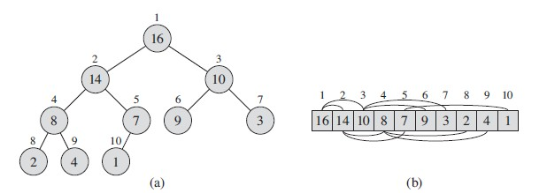
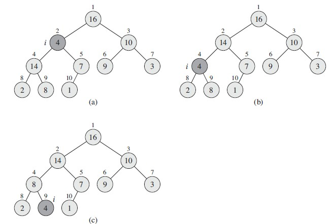
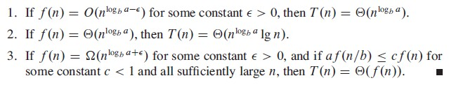
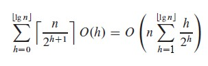
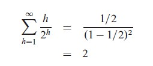
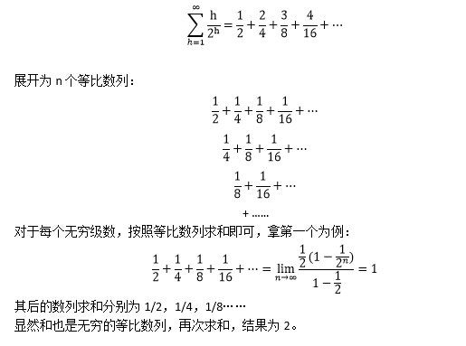
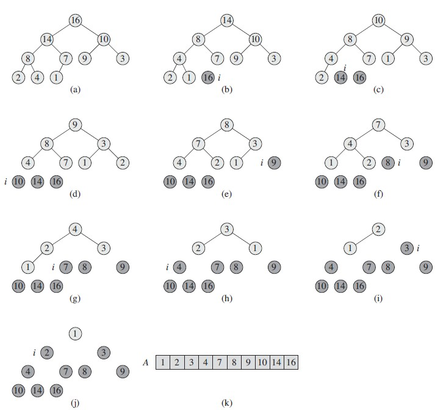
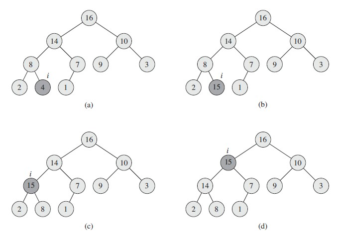
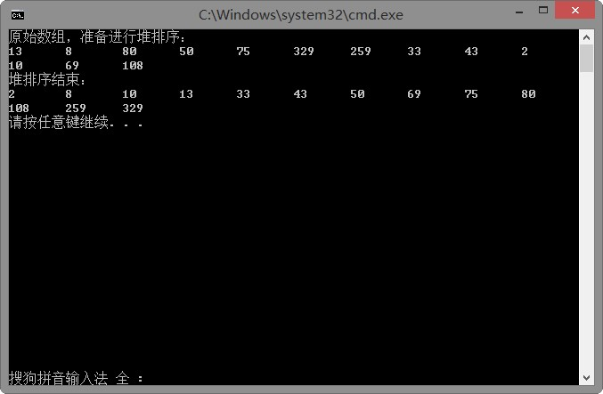
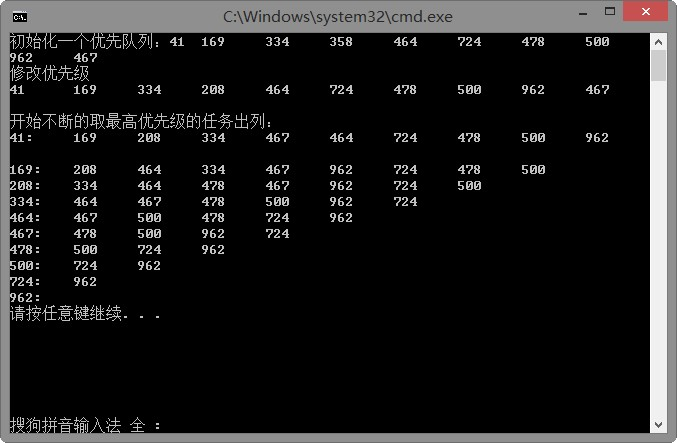

# 二叉堆的使用与堆排序 #
何为二叉堆？一图胜千言：



二叉堆本质还是个Array，也就是数组，或者严格来说，一段连续存储的node构成的数据结构。

我们用A[1..A.length]表示二叉堆。而由上图可知，将Array映射成一棵完全二叉树，是基于这样的设计：
```
PARENT(i)
	return [i/2]
LEFT(i)
	return 2i
RIGHT(i)
	return 2i + 1
```
二叉堆分最大堆(max-heap)和最小堆(min-heap)，分别有着这样两种特性：
```
max-heap: A[PARENT(i)]>=A[i]
min-heap: A[PARENT(i)]<=A[i]
```
树的定义是递归的，所以特性也就继承了下来，一言以蔽之，节点node的值大于等于或小于等于所有的子孙。

二叉堆的相关操作和时间复杂度：
- 调整堆：MAX-HEAPIFY *O(lgn)*
- 建堆：BUILD-MAX-HEAP *O(n)*
- 堆排序：HEAPSORT *O(nlgn)*
- 其他操作：MAX-HEAP-INSERT,HEAP-EXTRACT-MAX,HEAP-INCREASE-KEY,HEAP-MAXIMUM *o(lgn)*

----------

## 调整堆 ##
调整堆伪算法：
```
MAX-HEAPIFY(A,i)
l = LEFT(i)
r = RIGHT(i)
if l <= A.heap-size and A[l] > A[i]
	largest = l
else 
	largest = i
if r <= A.heap-size and A[r] > A[largest]
	largest = r
if(largest != i)
	exchange A[i] with A[largest]
	MAX-HEAPIFY(A,largest)
```
对于i节点，该算法假设i的左右子树都满足最大堆的条件，只有i节点可能有问题。
也就是说有三种情况：
1. i比左右儿子大，此时无需调整。
2. i的左儿子最大，此时调换i和左儿子，由于左儿子的位置发生了变化，可能会打破左子树的最大堆性质，因此要递归的对左儿子进行维护。
3. i的右儿子最大，与2对称。

图解调整堆的过程：



时间复杂度：exchange复杂度为Θ(1)，最坏情况下每次都要调整左子树，左子树的size不会超过2n/3。
所以，T(n)<=T(2n/3)+Θ(1)

根据主方法，T(n)=aT(n/b)+f(n)，a为1，b为3/2，f(n)为Θ(1)。
查case：



符合case2，所以T(n)=O(lgn)<=Θ(n)

> 关于主方法的结论的推导，参考算法导论--分治。

----------

## 建堆 ##
建堆伪算法：
完全二叉树，所以显然Array中A[([n/2]+1)..n]都是叶子节点。所以，对于建堆来说，只需要自底向上，对每一个非叶子节点进行调整堆操作即可。
```
BUILD-MAX-HEAP(A)
A.heap-size = A.length
for i = [A.length/2] downto 1
	MAX-HEAPIFY(A,i)
```
时间复杂度：O(n) 
>这里的时间复杂度有点怪，第一印象应该是O((n/2)*lgn)，即O(nlgn)。毕竟调整了n/2次堆，每次调整操作为lgn。但显然，这里的lgn的n规模是变化的，这样的复杂度虽然说不错但是不严格。对于元素为n的完全二叉树，其高度为[lgn]，而每一层的节点数最多不会超过[n/2^(h+1)]（易证）。

时间复杂度的计算：


而


>级数，这里我给一个简单的证明：


因此，时间复杂度为O(2n)=>O(n)。

----------

## 堆排序 ##
显然，数组Array并不是严格有序的，而利用堆的特性也非常容易对Array进行排序。
通过不断的交换根元素和A[A.length--]，即可实现最大堆=>升序数组。



伪算法：
```
BUILD-MAX-HEAP(A)
for i=A.length downto 2
	exchange A[1] with A[i]
	A.heap-size = A.heap-size - 1
	MAX-HEAPIFY(A,1)
```

时间复杂度：O(nlgn)
解析：这个很显然，建堆为O(n) + n-1次调整堆近似为O(nlgn)，所以为O(nlgn)。

----------

## 优先队列 ##
何为优先队列？算法导论的描述如下：
>A priority queue is a data structure for maintaining a set S of elements, each
with an associated value called a key.

>A max-priority queue supports the following operations:

>INSERT(S,x) inserts the element x into the set S, which is equivalent to the operation S = S ∪ {x}.

>MAXIMUM(S)  returns the element of S with the largest key.

>EXTRACT-MAX(S) removes and returns the element of S with the largest key.

>INCREASE-KEY(S,x,k) increases the value of element x's key to the new value k,which is assumed to be at least as large as x's current key value.

相反的，min-priority queue就要提供INSERT,MINIMUM,EXTRACT-MIN,DECREASE-KEY四个操作。

显然，二叉堆就可以用来实现优先队列。

相关操作的伪算法：
```
HEAP-MAXIMUM(A)
	return A[1]
```
这个时间复杂度显然是O(1)。

```
HEAP-EXTRACT-MAX(A)
if A.heap-size < 1
	error "heap underflow"
max = A[1]
A[1] = A[A.heap-size]
A.heap-size = A.heap-size - 1
MAX-HEAPIFY(A,1)
return max
```
时间复杂度显然是O(lgn)。

```
HEAP-INCREASE-KEY(A,i,key)
if key < A[i]
	error "new key is smaller than current key"
A[i] = key
while i > 1 and A[PARENT(i)] < A[i]
	exchange A[i] with A[PARENT(i)]
	i = PARENT(i)
```
时间复杂度为O(lgn)，调整的次数显然和层数一致。

```
MAX-HEAP-INSERT(A,key)
A.heap-size = A.heap-size + 1
A[A.heap-size] = -∞
HEAP-INCREASE-KEY(A,A.heap-size,key)
```
时间复杂度显然也是O(lgn)。



----------

## [CODE]BinaryHeap by C++ ##
```
/* binary_heap.h */
#include <iostream>
#include <vector>
#include <algorithm>
#include <iterator>

using namespace std;

namespace algo
{
	void AdjustHeap(vector<int> &vec, size_t len, size_t index);
	void BuildHeap(vector<int> &vec);
	void HeapSort(vector<int> &vec);
}

/* binary_heap.cpp */
#include "binary_heap.h"

namespace algo
{
	void AdjustHeap(vector<int> &vec, size_t len, size_t index)
	{
		size_t left = 2 * index + 1;
		size_t right = 2 * index + 2;
		size_t max = index;

		if(left < len && vec[left] > vec[index])
		{
			max = left;
		}
		if(right < len && vec[right] > vec[max])
		{
			max = right;
		}

		if(max != index)
		{
			std::swap(vec[index],vec[max]);
			AdjustHeap(vec,len,max);
		}
	}

	void BuildHeap(vector<int> &vec)
	{
		for(int i=vec.size()/2-1;i>=0;i--)
		{
			AdjustHeap(vec,vec.size(),i);
		}
	}

	void HeapSort(vector<int> &vec)
	{
		BuildHeap(vec);
		for(int i=vec.size()-1;i>0;i--)
		{
			std::swap(vec[0],vec[i]);
			AdjustHeap(vec,i,0);
		}
	}
}

/* main.cpp */
#include "binary_heap.h"

int testHeapSort()
{
	int init[] = {13, 8, 80, 50, 75, 329, 259, 33, 43, 2, 10, 69, 108};
	vector<int> vec(init, init + sizeof(init)/sizeof(int));
	cout << "原始数组，准备进行堆排序：" << endl;
	copy(vec.begin(), vec.end(), ostream_iterator<int>( cout, "\t" ));
	algo::HeapSort(vec);
	cout << endl << "堆排序结束：" << endl;
	copy(vec.begin(), vec.end(), ostream_iterator<int>( cout, "\t" ));
	cout << endl;

	return 0;
}

int main()
{
	testHeapSort();
	return 0;
}
```
结果：


## [CODE]PriorityQueue of BinaryHeap by C++ ##
```
/* priority_queue.h */
#include <iostream>
#include <vector>
#include <algorithm>
#include <iterator>
#include <queue>

using namespace std;

namespace algo
{
	template<
		typename ItemType,
		typename Comparator = less<ItemType>,
		typename ContainerType = vector<ItemType> >
	class PriorityQueue
	{
	public:
		typedef ItemType & Reference;
		typedef ItemType const & ConstReference;

		PriorityQueue(){}

		template<typename ItemType>
		PriorityQueue(ItemType begin, ItemType end) : _queue(begin, end)
		{
			make_heap(_queue.begin(), _queue.end(), _comparator);
		}

		void Push(ItemType const &item)
		{
			_queue.push_back(item);
			push_heap(_queue.begin(),_queue.end(),_comparator);
		}

		ConstReference Top() const
		{
			return *_queue.begin();
		}

		Reference Top()
		{
			return *_queue.begin();
		}

		void Pop()
		{
			pop_heap(_queue.begin(),_queue.end(),_comparator);
			_queue.pop_back();
		}

		bool IsEmpty()
		{
			return _queue.empty();
		}

		void RefreshQueue()
		{
			make_heap(_queue.begin(),_queue.end(),_comparator);
		}

		void Display()
		{
			copy(_queue.begin(),_queue.end(),ostream_iterator<ItemType>(cout, "\t"));
			cout << endl;
		}

		template<typename ItemType>
		void UpdateKey(size_t index, ItemType key)
		{
			_queue[index] = key;
			RefreshQueue();
		}
	private:
		ContainerType _queue;
		Comparator _comparator;
	};
}

/* main.cpp */
void testPriorityQueue()
{
	cout << "初始化一个优先队列：";
	algo::PriorityQueue<int, greater<int>> queue;
	for ( int i = 0; i < 10; ++i )
	{
		queue.Push( rand() % 1000 );
	}
	queue.Display();

	cout << "修改优先级" << endl;
	queue.UpdateKey(3,208);
	queue.Display();

	cout << "开始不断的取最高优先级的任务出列：" << endl;
	while( !queue.IsEmpty() )
	{
		cout << queue.Top() << ":\t";
		queue.Pop();
		queue.Display();
	}
}

int main()
{
	testPriorityQueue();
	return 0;
}
```
这里是以类模板实现的泛型。优先队列可以由_comparator指定升序或降序，即greater<ItemType>或less<ItemType>，默认为less<ItemType>。修改key采用的方式与描述不同，这里是无关增减（实际情况都是双向调整的，算法导论的描述才怪异）都可以update，且直接重建堆，虽然效率上从O(lgn)提高到O(n)，但是比较方便。

结果：


`6/25/2016 8:38:07 AM @author rootkit` 