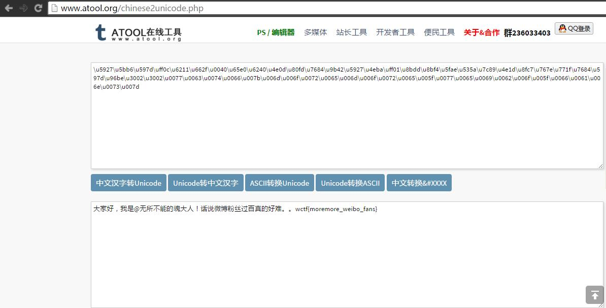
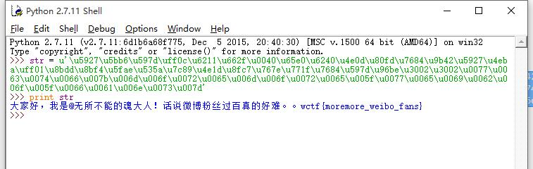
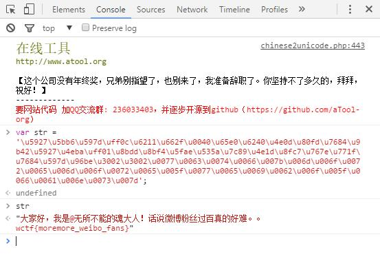

# CTF训练营——牛刀小试之ASCII码而已 #

http://ctf.idf.cn/index.php?g=game&m=article&a=index&id=32

非常干练的题目，直接丢出一大串字符：

\u5927\u5bb6\u597d\uff0c\u6211\u662f\u0040\u65e0\u6240\u4e0d\u80fd\u7684\u9b42\u5927\u4eba\uff01\u8bdd\u8bf4\u5fae\u535a\u7c89\u4e1d\u8fc7\u767e\u771f\u7684\u597d\u96be\u3002\u3002\u0077\u0063\u0074\u0066\u007b\u006d\u006f\u0072\u0065\u006d\u006f\u0072\u0065\u005f\u0077\u0065\u0069\u0062\u006f\u005f\u0066\u0061\u006e\u0073\u007d

显然，这是unicode编码，解码即可，通过在线的网站：

当然，也可以直接python print出来:

或者直接js：

其实任何直接unicode编码的语言，甚至不支持但是有库（一定有，相信我）的语言都可以直接搞定，重要的思想，不是方式。

最终flag: wctf{moremore_weibo_fans}

6/4/2016 8:55:04 AM @author: rootkit