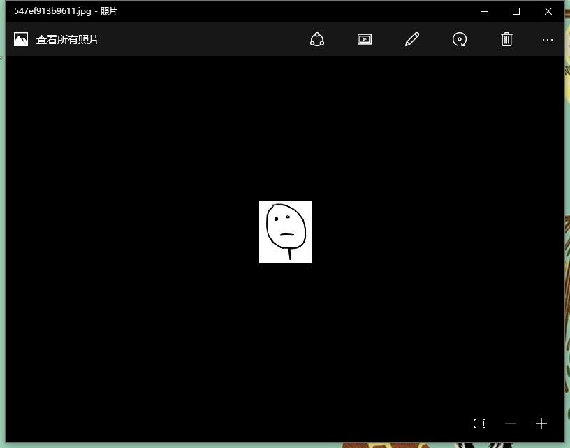
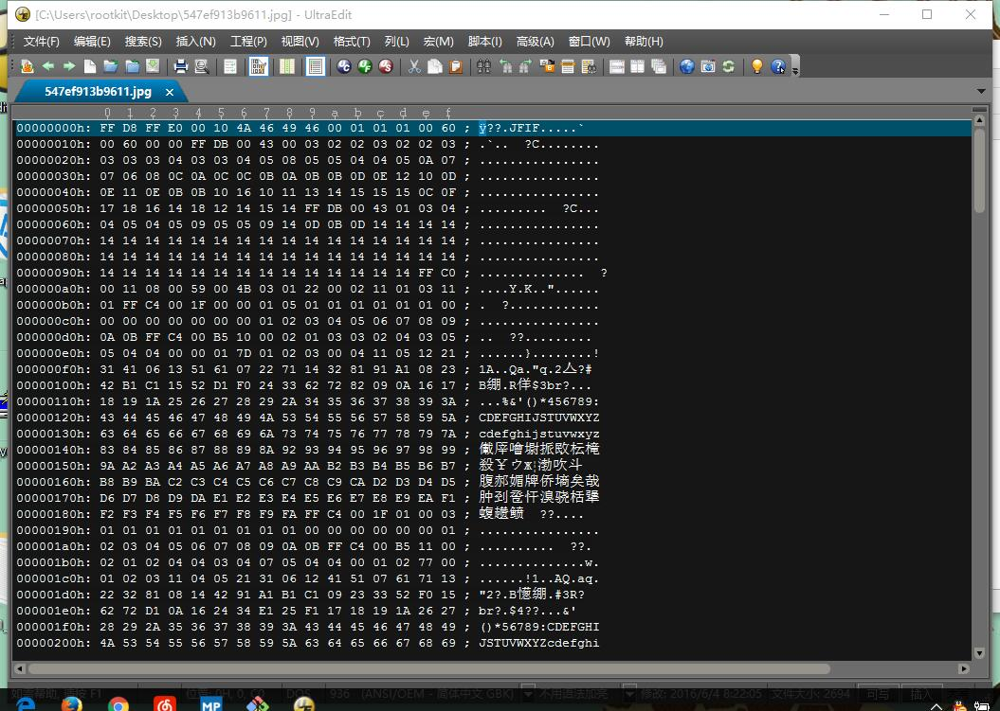
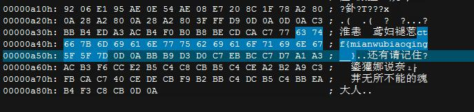

# CTF训练营——牛刀小试之啥 #

http://ctf.idf.cn/index.php?g=game&m=article&a=index&id=30

只有一张图片，显然端倪就在于此，图片本身没什么异样：

所以应该是藏匿于data当中了，用UE打开：

文件不大，从头浏览到尾巴，原以为会包含其他文件在其中，比如经典的rar图种（嘿嘿嘿）。标准的jpg头，没什么好说的，而对于数据来说，不大可能在中间，一般都是在尾部附加，果然，在尾巴处发现端倪：

最终flag：wctf{mianwubiaoqing__}

6/4/2016 8:55:17 AM @author: rootkit