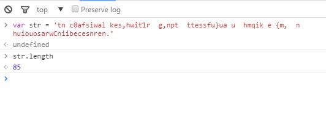
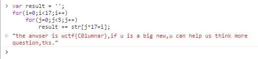

# CTF训练营——牛刀小试之被改错的密码 #

http://ctf.idf.cn/index.php?g=game&m=article&a=index&id=52

一串很神奇的密文：

tn c0afsiwal kes,hwit1r  g,npt  ttessfu}ua u  hmqik e {m,  n huiouosarwCniibecesnren.

数字，符号与英文字母组成，猜想应该是某种古典密码导致的明文乱序。

题干不断的提到栅栏，所以，估计是栅栏密码。。。

栅栏密码实际上就是把明文（可以去掉空格也可以不去）分成N组，每组M个字符（所以其长度是NxM）。然后分别取出每组的第一个字符拼接，接着每组第二个，一直到第M个，这就是密文。显然，这种密码是可逆的，只要我们知道分组的N和M。

当然，你第一时间一定想到暴力猜解N，因为N显然有范围，而且只有正确的串才有明确的意义。其实，还是有捷径的，首先算一下长度：

85=5 x 17

5和17都是质数，显然N只有两种可能，要么是5组，要么就是17组。所以此时此刻，我们分别试试就行了：

最终flag：wctf{C01umnar}

6/4/2016 9:08:27 AM @author: rootkit