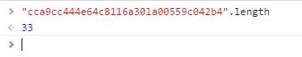
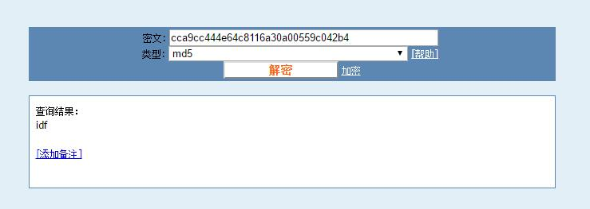

# CTF训练营——牛刀小试之被改错的密码 #

http://ctf.idf.cn/index.php?g=game&m=article&a=index&id=29

乍看密文的格式，标准的md5加密，而根据经验，网站数据库中对于密码进行md5加密是非常主流的做法，于是我们来分析一下这段密文有何异样。

cca9cc444e64c8116a30la00559c042b4

直接F12看一下长度：

33！我们知道对于md5来说，密文长度应该是32或者是64，显然，这串密文里多了一个字符。

我们仔细的看一下密文，就会发现，在0和a之间有一个长得很像1的字符l，而md5生成的密文中每一个字符应该是十六进制数，也就是[0-9A-F]，显然，这个l是乱入的，拿到正确的密文后，如果对于md5不熟悉的可能会去找解密算法，然而md5是不可逆的加密算法，但是这并不代表无计可施，有很多在线的库可以用来查阅密文，而实际上，这个所谓的在线库不过就是收集了众多的明文和密文的映射集合。

删除l然后到md5在线解密网站查一下:

最终flag：wctf{idf}

6/4/2016 8:18:45 AM @author: rootkit
