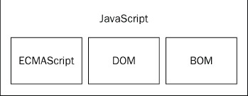

# Javascript简介 #

* [Javascript简史](#history)
* [Javascript组成](#consist)

<h2 id="history"> Javascript简史 </h2>

当年网速捉急，让服务器频繁交换数据基本上就是gg的节奏。举个例子，比方说你找到了某xx网站，注册的时候要填个表单，单击提交，服务器收到表单数据发现邮箱格式错误，打回去重填，这一来一回就要等上好久，那么请求此时此刻你的心理阴影面积。

Netscape公司研究了javascript来填坑。历经重重磨难与商业竞争，最终有了标准化的javascript。
> 讲个故事：netscape春风得意之时，微软眼红了，先天优势（os市场）的microsoft无良的内置了IE浏览器并在内部加入了名为JScript的Javascript实现（新绝招啊，连名字都是抄袭的。。。）。Netscape何许人也，也是做浏览器的（继父Mozilla，参考其浏览器内核，不解释了），恼羞成怒之际，想把事情搞大。于是ECMA（计算机制造商协会）这个老好人来调节，最终netscape，sun，微软，borland等爸爸们达成了一种标准——ECMAScript. 后来，ISO/IEC（做标准也要按照国家法）表示同意，从此ECMAScript就是各大浏览器开发商实现Javascript引擎的基础标准。

<h2 id="consist">Javascript组成 </h2>

一图胜千言！

- 核心（ECMAScript）
	- 说白了就是Js实现的标准，囊括语法，类型，语句，关键字，保留字，操作符，对象等
	- ECMAScript也是有着很长的更迭史，然而并没有什么卵用
- 文档对象模型（DOM）
	- 本身针对XML的，然而对于HTTP来说，HTML比较好用（XML解析不好写啊）
	- DOM把整个页面映射成一棵树，你应该懂HTML
	- 右键查看页面源代码，你看到了什么，那就是一棵DOM树啊
	- W3C规划了DOM标准，总之不用担心，目前浏览器都支持很好
- 浏览器对象模型（BOM）
	- BOM只处理浏览器窗口和框架，功能大抵如下：
		- 弹出新浏览器窗口
		- 移动缩放关闭窗口
		- 浏览器信息的navigator对象
		- 加载页面信息的location对象
		- 显示器分辨率信息的screen对象
		- cookies的支持
		- XMLHttpRequest, ActiveObject这样的自定义对象（AJAX）
	- BOM目前没标准，虽然有默认的潜规则，window对象啊，navigator对象啊，还是再发育发育吧。

4/15/2016 5:15:06 PM @author: rootkit