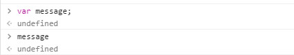
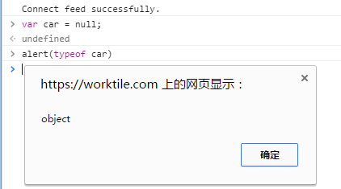

<link rel="stylesheet" href="./css/layout.css" type="text/css" />
# 基本概念 #

*	[语法](#3.1)
	*	[区分大小写](#3.1.1)
	*	[标识符](#3.1.2)
	*	[注释](#3.1.3)
	*	[语句](#3.1.4)
*	[关键字和保留字](#3.2)
*	[变量](#3.3)
*	[数据类型](#3.4)
	*	[typeof操作符](#3.4.1)
	*	[Undefined类型](#3.4.2)
	*	[Null类型](#3.4.3)
	*	[Boolean类型](#3.4.4)
	*	[Number类型](#3.4.5)
	*	[String类型](#3.4.6)
	*	[Object类型](#3.4.7)
*	[操作符](#3.5)
	*	[一元操作符](#3.5.1)
	*	[位操作符](#3.5.2)
	*	[布尔操作符](#3.5.3)
	*	[乘性操作符](#3.5.4)
	*	[加性操作符](#3.5.5)
	*	[关系操作符](#3.5.6)
	*	[相等操作符](#3.5.7)
	*	[条件操作符](#3.5.8)
	*	[赋值操作符](#3.5.9)
	*	[逗号操作符](#3.5.10)
*	[语句](#3.6)
	*	[if语句](#3.6.1)
	*	[do-while语句](#3.6.2)
	*	[while语句](#3.6.3)
	*	[for语句](#3.6.4)
	*	[for-in语句](#3.6.5)
	*	[label语句](#3.6.6)
	*	[break和continue语句](#3.6.7)
	*	[with语句](#3.6.8)
	*	[switch语句](#3.6.9)
*	[函数](#3.7)

	
<h2 id="3.1">语法</h2>

<h3 id="3.1.1">区分大小写</h3>

遵循ECMAScript的规则，Javascript中的**一切**都是区分大小写的。

<h3 id="3.1.2">标识符</h3>

变量、函数、属性的名字，是按照下列规则组合起来的一个或多个字符：

- 第一个字符必须是一个字母、下划线(_)或一个美元符号($);
- 其他字符可以是字母、下划线、美元符号或数字；

> 标识符中的字母也可以是扩展的ASCII或Unicode字母字符，但是不推荐。

按照惯例，ECMAScript标识符都采用驼峰大小写格式，即首字母小写，剩下每个分词首字母大写。

<h3 id="3.1.3">注释</h3>

ECMAScript使用C风格的注释。

	//单行注释
	
	/*
	 *	这是一个多行
	 *	（块级）注释
	 *	中间行可以删除"*"
	 */

<h3 id="3.1.4">语句</h3>

ECMAScript 中的语句以一个分号结尾；如果省略分号，则由解析器确定语句的结尾，也就是说结尾分号是可以省略的，但是**不推荐**省略。

可以使用C 风格的语法把多条语句组合到一个代码块中，即代码块以左花括号（{）开头，以右花括号（}）结尾：

	if(test){
		alert(test);
	}

不多说了，和C保持一致。

<h2 id="3.2">关键字和保留字</h2>

关键字列表：

	break 		do  	 	instanceof 		typeof
	case  		else 		new        		var
	catch 		finally		return 			void
	continue 	for 		switch 			while
	debugger 	function 	this 			with
	default 	if 			throw
	delete 		in 			try

>关键字其实还是挺事逼的，虽然在严格模式非严格模式限制并不一致，不过最简单的办法就是无论如何都不用就是了，省着冲突。

<h3 id="3.3">变量</h3>

ECMAScript 的变量是松散类型的，所谓松散类型就是可以用来保存任何类型的数据。换句话说，每个变量仅仅是一个用于保存值的占位符而已。

定义方法：
	
	var message;

这行代码定义了一个名为message 的变量，该变量可以用来保存**任何值**，未初始化的变量会保存一个特殊的值——undefined，至于undefined是什么，往下看。

和C类似，也同样支持定义时初始化：

	var message = "hello";

用var操作符定义的变量会作为定义该变量作用域中的局部变量，比如你在某个函数中用var定义了变量，那么函数返回后，var就自动销毁了。

	function test(){
		var message = "hi"; // 局部变量
	}
	test();
	alert(message); // 错误！

如果是省略var的方式：
	
	function test(){
		message = "hi"; // 全局变量
	}
	test();
	alert(message); // "hi" 正确输出、

省略var的话，无论在哪里都会先尝试寻找环境中的message变量，如果没找到的话，就自动定义一个全局变量message。

>虽然省略var 操作符可以定义全局变量，但这也不是我们推荐的做法。因为在局部作用域中定义的全局变量很难维护，而且如果有意地忽略了var 操作符，也会由于相应变量不会马上就有定义而导致不必要的混乱。给未经声明的变量赋值在**严格模式**下会导致抛出ReferenceError 错误。

<h2 id="3.4">数据类型</h2>

ECMAScript规定了5种基本类型+1种复杂类型：

- 基本类型
	- Undefined
	- Null
	- Boolean
	- Number
	- String
- 复杂类型
	- Object

这些足以代表所有类型，哪怕是function，array等等，也都可以归类到object，其他亦如此，毕竟javascript灵活。

<h3 id="3.4.1">typeof操作符</h3>

ECMAScript类型松散，就像python那样，需要有个操作符来检测变量的数据类型。Js中用typeof。

typeof会返回以下几种类型

- undefined	—— 未定义的值
- boolean	—— 布尔值
- string 	—— 字符串
- number	—— 数值
- object	—— 对象，也有可能是null（理解成空指针，当然也是对象）
- function	—— 函数，其实也是一种特殊的对象，只是因为function比较特殊，typeof想要去区分这种特殊性。

<h3 id="3.4.2">Undefined类型</h3>

Undefined类型只有一个值，就是"undefined"。这个前面说过了，定义而没有初始化或后续的赋值操作，变量就是undefined。

>特别强调一下，undefined和变量不存在（未定义）是两回事，undefined是指定义或者说声明了变量但是没有初始化也没赋值，名字可能会有歧义。

<h3 id="3.4.3">Null类型</h3>

Null类型是第二个只有一个值的数据类型，它的值是"null"。null表示空对象的指针（typeof返回object）。

此外，undefined的值实际上是派生自null值的，因此ECMA-262标准规定，如下的测试是返回true的(自己试试吧)：

	alert(null == undefined);	//true

<h3 id="3.4.4">Boolean类型</h3>

ECMAScript中用得最多的就是Boolean，他有两个值:true和false。

虽然Boolean类型只有两个字面值，但是其他的值都可以转换为一个对应的Boolean值，也就是说，其他类型的值都有一个到Boolean的映射。

这是一张其他类型的映射表，时机到了，你自然就看得懂了。

<table border="2">
<caption>数据类型到Boolean的转换</caption>
<tr>
  <td>数据类型</td>
  <td>转换为true的值</td>				
  <td>转换为false的值</td>
</tr>
<tr>
  <td>Boolean</td> 			
  <td>true</td> 						
  <td>false</td>
</tr>
<tr>
  <td>String</td> 				
  <td>任何非空字符串</td> 				
  <td>""（空字符串）</td>
</tr>
<tr>
  <td>Number</td>				
  <td>任何非零数字值（包括无穷大）</td> 	
  <td>0和NaN（参见本章后面有关NaN的内容）</td>
</tr>
<tr>
  <td>Object</td>		
  <td>任何对象</td>				
  <td>null</td>
</tr>
<tr>
  <td>Undefined</td> 			
  <td>n/a</td>				
  <td>undefined</td>
</tr>
</table>

<h3 id="3.4.5">Number类型</h3>

包含整型和浮点型，用起来较为随便，关于数范围的限制以及NaN的内容请自行查阅。

Number()、parseInt()、parseFloat()三个函数可以把其他类型值转为数值，同样的遵循着某种映射规则。

- 如果是Boolean 值，true 和false 将分别被转换为1 和0。
- 如果是数字值，只是简单的传入和返回。
- 如果是null 值，返回0。
- 如果是undefined，返回NaN。
- 如果是字符串，遵循下列规则：
	- 如果字符串中只包含数字（包括前面带正号或负号的情况），则将其转换为十进制数值，即"1"会变成1，"123"会变成123，而"011"会变成11（注意：前导的零被忽略了）；
	- 如果字符串中包含有效的浮点格式，如"1.1"，则将其转换为对应的浮点数值（同样，也会忽略前导零）；
	- 如果字符串中包含有效的十六进制格式，例如"0xf"，则将其转换为相同大小的十进制整数值；
	- 如果字符串是空的（不包含任何字符），则将其转换为0；
	- 如果字符串中包含除上述格式之外的字符，则将其转换为NaN。
- 如果是对象，则调用对象的valueOf()方法，然后依照前面的规则转换返回的值。如果转换的结果是NaN，则调用对象的toString()方法，然后再次依照前面的规则转换返回的字符串值。

		var num1 = Number("Hello world!"); //NaN
		var num2 = Number(""); //0
		var num3 = Number("000011"); //11
		var num4 = Number(true); //1
	
		var num1 = parseInt("1234blue"); // 1234
		var num2 = parseInt(""); // NaN
		var num3 = parseInt("0xA"); // 10（十六进制数）
		var num4 = parseInt(22.5); // 22
		var num5 = parseInt("070"); // 56（八进制数）
		var num6 = parseInt("70"); // 70（十进制数）
		var num7 = parseInt("0xf"); // 15（十六进制数）
	
		//ECMAScript 3 认为是56（八进制），ECMAScript 5 认为是70（十进制）
		var num = parseInt("070");
	
		var num = parseInt("0xAF", 16); //175
		var num1 = parseInt("AF", 16); //175
		var num2 = parseInt("AF"); //NaN
		var num1 = parseInt("10", 2); //2 （按二进制解析）
		var num2 = parseInt("10", 8); //8 （按八进制解析）
		var num3 = parseInt("10", 10); //10 （按十进制解析）
		var num4 = parseInt("10", 16); //16 （按十六进制解析）

		var num1 = parseFloat("1234blue"); //1234 （整数）
		var num2 = parseFloat("0xA"); //0
		var num3 = parseFloat("22.5"); //22.5
		var num4 = parseFloat("22.34.5"); //22.34
		var num5 = parseFloat("0908.5"); //908.5
		var num6 = parseFloat("3.125e7"); //31250000

<h3 id="3.4.6">String类型</h3>

字符串，妇孺皆知。

javascript可以用双引号或单引号包起来。

ECMAScript 中的字符串是不可变的，也就是说，字符串一旦创建，它们的值就不能改变。要改变某个变量保存的字符串，首先要销毁原来的字符串，然后再用另一个包含新值的字符串填充该变量。

值可以转为字符串，方式有两种。第一种是每种值几乎都有的toString()方法：

	var age = 11;
	var ageAsString = age.toString(); // 字符串"11"
	var found = true;
	var foundAsString = found.toString(); // 字符串"true"

数值、布尔值、对象和字符串值（没错，每个字符串也都有一个toString()方法，该方法返回字符串的一个副本）都有toString()方法。但null 和undefined 值没有这个方法。

多数情况下，调用toString()方法不必传递参数。但是，在调用数值的toString()方法时，可以传递一个参数：输出数值的基数。默认情况下，toString()方法以十进制格式返回数值的字符串表示。而通过传递基数，toString()可以输出以二进制、八进制、十六进制，乃至其他任意有效进制格式表示的字符串值。

	var num = 10;
	alert(num.toString()); // "10"
	alert(num.toString(2)); // "1010"
	alert(num.toString(8)); // "12"
	alert(num.toString(10)); // "10"
	alert(num.toString(16)); // "a"

在不知道要转换的值是不是null 或undefined 的情况下，还可以使用转型函数String()，这个函数能够将任何类型的值转换为字符串。String()函数遵循下列规则：

- 如果值有toString()方法，则调用该方法（没有参数）并返回相应的结果；
- 如果值是null，则返回"null"；
- 如果值是undefined，则返回"undefined"。

	var value1 = 10;
	var value2 = true;
	var value3 = null;
	var value4;
	alert(String(value1)); // "10"
	alert(String(value2)); // "true"
	alert(String(value3)); // "null"
	alert(String(value4)); // "undefined"

<h3 id="3.4.7">Object类型</h3>

ECMAScript 中的对象其实就是一组数据和功能的集合。对象可以通过执行new 操作符后跟要创建的对象类型的名称来创建。而创建Object 类型的实例并为其添加属性和（或）方法，就可以创建自定义对象。
	
	var o = new Object();

仅仅创建Object 的实例并没有什么用处，但关键是要理解一个重要的思想：即在ECMAScript 中，（就像Java 中的java.lang.Object 对象一样）Object 类型是所有它的实例的基础。换句话说，Object 类型所具有的任何属性和方法也同样存在于更具体的对象中。

>C++ Java程序员一般会懵逼，因为C++和Java自定义的叫类类型，类的实例才是对象。Javascript中只有对象，没有类，他不需要去规范一个类类型，而直接new一个Object就可以。至于Object是什么样的，你可以随时随地的定制改写。Javascript灵活性体现于此。

Object的每个实例都继承了一些属性和方法：

-	constructor：保存着用于创建当前对象的函数。对于前面的例子而言，构造函数（constructor）就是Object()。
-	hasOwnProperty(propertyName)：用于检查给定的属性在当前对象实例中（而不是在实例的原型中）是否存在。其中，作为参数的属性名（propertyName）必须以字符串形式指定（例如：o.hasOwnProperty("name")）。
-	isPrototypeOf(object)：用于检查传入的对象是否是传入对象的原型。
-	propertyIsEnumerable(propertyName)：用于检查给定的属性是否能够使用for-in 语句来枚举。与hasOwnProperty()方法一样，作为参数的属性名必须以字符串形式指定。
-	toLocaleString()：返回对象的字符串表示，该字符串与执行环境的地区对应。
-	toString()：返回对象的字符串表示。
-	valueOf()：返回对象的字符串、数值或布尔值表示。通常与toString()方法的返回值相同。

以上暂时不用记住，日后用多了自然司空见惯，烂熟于胸。

<h2 id="3.5">操作符</h2>

各语言操作符都大同小异，快速过一遍，非特殊的不详细展开。

<h3 id="3.5.1">一元操作符</h3>

-	自增自减
-	一元加和减（代表正负）

<h3 id="3.5.2">位操作符</h3>

-	按位非 "~"
-	按位与 "&"
-	按位或 "|"
-	按位异或 "^"
-	左移 "<<"
-	有符号右移 ">>"
-	无符号右移 ">>>"

<h3 id="3.5.3">布尔操作符</h3>

-	逻辑非 "!"
-	逻辑与 "&&"
-	逻辑或 "||"

<h3 id="3.5.4">乘性操作符</h3>

-	乘法 "*"
-	除法 "/"
-	求模 "%"

> 关于这三种操作符有些细节需要额外了解，javascript有NaN和Infinity，所以很多不合常理的运算往往不是异常而是用这些值来代替，个人感觉这样很好。

<h3 id="3.5.5">加性操作符</h3>

-	加法 "+"
-	减法 "-"

> 同样有NaN和Infinity的说法，不过不常见。

<h3 id="3.5.6">关系操作符</h3>

-	小于 "<"
-	大于 ">"
-	小于等于 "<="
-	大于等于 ">="

> 注意，javascript的关系表达式返回的全都是Boolean值，对于不同类型的值比较，有些隐式规则：
1、如果两个操作数都是数值，则执行数值比较。
2、如果两个操作数都是字符串，则比较两个字符串对应的字符编码值。
3、如果一个操作数是数值，则将另一个操作数转换为一个数值，然后执行数值比较。
4、如果一个操作数是对象，则调用这个对象的valueOf()方法，用得到的结果按照前面的规则执行比较。如果对象没有valueOf()方法，则调用toString()方法，并用得到的结果根据前面的规则执行比较。
5、如果一个操作数是布尔值，则先将其转换为数值，然后再执行比较。

> 当然，大部分情况你用不匹配的类型做比较，都是自找麻烦。

<h3 id="3.5.7">相等操作符</h3>

-	相等和不等 "==" "!="
-	全等和不全等 "===" "!=="

javascript这一点和其他语言不太一样，说一下二者的规则：

相等和不等：这两个操作符都会先转换操作数（通常称为强制转型），然后再比较它们的相等性。

转型和比较的规则：

-	如果有一个操作数是布尔值，则在比较相等性之前先将其转换为数值——false 转换为0，而true 转换为1；
-	如果一个操作数是字符串，另一个操作数是数值，在比较相等性之前先将字符串转换为数值；
-	如果一个操作数是对象，另一个操作数不是，则调用对象的valueOf()方法，用得到的基本类型值按照前面的规则进行比较；
-	null 和undefined 是相等的。
-	要比较相等性之前，不能将null 和undefined 转换成其他任何值。
-	如果有一个操作数是NaN，则相等操作符返回false，而不相等操作符返回true。重要提示：即使两个操作数都是NaN，相等操作符也返回false；因为按照规则，NaN 不等于NaN。
-	如果两个操作数都是对象，则比较它们是不是同一个对象。如果两个操作数都指向同一个对象，则相等操作符返回true；否则，返回false。

还有些特殊情况
<table>
<tr>
  <td>null == undefined true</td> 
  <td>true == 1 true</td>
</tr>
<tr>
  <td>"NaN" == NaN false </td>
  <td>true == 2 false </td>
</tr>
<tr>
  <td>5 == NaN false </td>
  <td>undefined == 0 false </td>
</tr>
<tr>
  <td>NaN == NaN false </td>
  <td>null == 0 false</td>
</tr>
<tr>
  <td>NaN != NaN true </td>
  <td>"5"==5 true</td>
</tr>
<tr>
  <td>false == 0 true</td>
  <td></td>
</tr>
</table>

全等和不全等：
在两个操作数未经转换就判断，你懂的。

<h3 id="3.5.8">条件操作符</h3>

-	三目运算符 "?:"

<h3 id="3.5.9">赋值操作符</h3>

-	赋值 "="
-	*= += -= /= %= <<= >>= >>>=

<h3 id="3.5.10">逗号操作符</h3>

-	, (var num1=1, num2=2;)

<h2 id="3.6">语句</h2>

语句也基本上和其他语言差不多，只展开特别的语句。

<h3 id="3.6.1">if语句</h3>

	if(condition) statement1 else statement2
	
	if(i>25){
		alert("Greater then 25.");
	}else if(i == 25){
		alert("Equal to 25.");
	}else
		alert("Less than to 25.");
	}

<h3 id="3.6.2">do-while语句</h3>

	do{
		statement
	}while(expression);

	var i = 0;
	do{
		i += 2;
	}while(i < 10);

	alert(i);	//应该输出多少？

<h3 id="3.6.3">while语句</h3>

	while(expression) statement

	var i = 10;
	while(i < 10){
		i += 2;
	}

<h3 id="3.6.4">for语句</h3>

	for(initialization; expression; post-loop-expression) statement

	var count = 10;
	for(var i=0; i<count; i++){
		alert(i);
	}

<h3 id="3.6.5">for-in语句</h3>

for-in一般用来枚举对象的属性。

	for(property in expression) statement
	
	for(var propName in window){	//window是BOM对象
		document.write(propName);
	}

ECMAScript对象属性是无序的，因此for-in也是无序的，当要迭代的对象是null或undefined时，for-in会拋异常。

<h3 id="3.6.6">label语句</h3>

	label: statement

	start: for(var i=0; i<count; i++){
		alert(i);
	}

start标签可以将来由break或continue来引用。

<h3 id="3.6.7">break和continue语句</h3>

	var num = 0;
	
	for(var i=0; i<10; i++){
		if(i % 5 == 0){
			break;
		}
		num++;
	}

	alert(num);		//4

	num = 0;
	
	for(var i=0; i<10; i++){
		if(i % 5 == 0){
			continue;
		}
		num++;
	}

	alert(num);		//8

	num = 0;
	outermost:
	for (var i=0; i < 10; i++) {
		for (var j=0; j < 10; j++) {
			if (i == 5 && j == 5) {
				break outermost;
			}
			num++;
		}
	}
	alert(num); //55

> label不建议使用，真的，容易调试时心态爆炸。

<h3 id="3.6.8">with语句</h3>

将代码的作用域设置到一个特定的对象中。

	with(expression) statement;

	var qs = location.search.substring(1);
	var hostName = location.hostname;
	var url = location.href;

	//上面代码包含location对象。如果用with语句，可以改写如下：
	with(location){
		var qs = search.substring(1);
		var hostName = hostname;
		var url = href;
	}

> 不建议使用，同上。

<h3 id="3.6.9">switch语句</h3>

	switch(expression){
		case value: statement
			break;
		case value: statement
			break;
		default: statement
	}

	switch(i){
	case 25:
		alert("25");
		break;
	case 35:
		alert("35");
		break;
	case 45:
		alert("45");
		break;
	default:
		alert("Other");
	}

<h3 id="3.7">函数</h3>

	function functionName(arg0, arg1, ... , argN){
		statements
	}

	function sayHi(name, message){
		alert("Hello " + name + "," + message);
	}

	sayHi("Rootkit", "how are you today?");

参数不必指定类型（松散类型），也不必指定返回值，javascript所有函数都有返回值，如果不用return就返回默认值undefined。

没有传递的命名参数将自动赋予undefined值。

javascript所有参数传递的都是值，不可能通过引用传递参数。

javascript不能重载函数（参数类型松散，所以说也完全没必要重载，通用做法是内部typeof分类然后处理就行了）。

4/16/2016 9:55:26 PM @author: rootkit