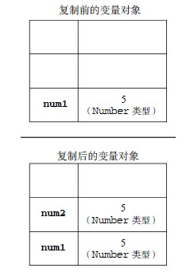
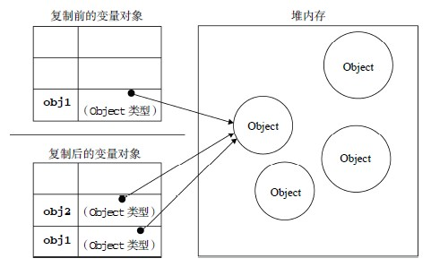

<link rel="stylesheet" href="./css/layout.css" type="text/css" />
# 变量、作用域和内存问题 #

*	[基本类型和引用类型的值](#4.1)
	*	[动态的属性](#4.1.1)
	*	[复制变量值](#4.1.2)
	*	[传递参数](#4.1.3)
	*	[检测类型](#4.1.4)
*	[执行环境及作用域](#4.2)
	*	[延长作用域链](#4.2.1)
	*	[没有块级作用域](#4.2.2)
*	[垃圾收集](#4.3)
	*	[标记清除](#4.3.1)
	*	[引用计数](#4.3.2)
	*	[性能问题](#4.3.3)
	*	[管理内存](#4.3.4)

Javascript变量松散，决定了所谓的变量只是特定时间用来保存特定类型值的一个名称而已。这种随时随地改变的特性很灵活，然而也容易出问题。

<h2 id="4.1">基本类型和引用类型的值</h2>
ECMAScript 变量可能包含两种不同数据类型的值：基本类型值和引用类型值。基本类型值指的是简单的数据段，而引用类型值指那些可能由多个值构成的对象。

基本数据类型（Undefined、Null、Boolean、Number 和String）是按值访问的，因为可以操作保存在变量中的实际的值。引用类型的值是保存在内存中的对象，当复制保存对象的某个变量时，实际操作的是引用，当为对象添加属性时，实际操作的是内存中的对象。

> 很多语言的字符串都以对象来表示，被认为是引用类型的，然而javascript放弃了这一传统。不要与3.4.6的不能“销毁”弄混，对于String来说，操作的的确是实际的值，只是后台内部的处理是销毁现有的串，然后再填充新的串，这一过程改变的依然是实际的值。

<h3 id="4.1.1">动态的属性</h3>
引用类型很特别，可以动态的增删改查属性和方法。

	var person = new Object();
	person.name = "cloudker";
	alert(person.name);		//"cloudker"

<h3 id="4.1.2">复制变量值</h3>
复制的差异也是显而易见的，对于基本类型来说：

	var num1 = 5;
	var num2 = num1;

num2和num1是完全独立的两个基本类型变量，改变num1，num2并不会改变。

而对象类型就是常说的浅拷贝：

	var obj1 = new Object();
	var obj2 = obj1;
	obj1.name = "cloudker";
	alert(obj2.name);	//"cloudker"

实际上，赋值复制的是引用（可以理解成指针）。

<h3 id="4.1.3">传递参数</h3>
ECMAScript 中所有函数的参数都是按值传递的。在向参数传递基本类型的值时，被传递的值会被复制给一个局部变量（即命名参数，或者用ECMAScript 的概念来说，就是arguments 对象中的一个元素）。在向参数传递引用类型的值时，会把这个值在内存中的地址复制给一个局部变量，因此这个局部变量的变化会反映在函数的外部。

> 其实和C是一致的，只是说法大同小异，C因为有了&,*等操作才会有传址解引用的说法，实际上参数传递就是按值复制，指针也是复制的地址值，最终指向的对象是同一个罢了。

<h3 id="4.1.4">检测类型</h3>
之前已经说过了，typeof操作符完美解决。

	var s = "Nicholas";
	var b = true;
	var i = 22;
	var u;
	var n = null;
	var o = new Object();
	alert(typeof s); //string
	alert(typeof i); //number
	alert(typeof b); //boolean
	alert(typeof u); //undefined
	alert(typeof n); //object
	alert(typeof o); //object

进一步，如果想知道某个对象的具体类型，可以用instanceof操作符。

	result = variable instanceof constructor
	
	alert(person instanceof Object); // 变量person 是Object 吗？
	alert(colors instanceof Array); // 变量colors 是Array 吗？
	alert(pattern instanceof RegExp); // 变量pattern 是RegExp 吗？

<h2 id="4.2">执行环境及作用域</h2>
执行环境定义了变量或函数有权访问的其他数据，决定了它们各自行为。每个执行环境都有与之相关的变量对象，环境中定义的所有变量和函数都保存在这个对象中。我们编写的代码无法访问这个对象，但解析器在处理数据时会在后台使用它。

全局执行环境是最外围的一个执行环境。根据ECMAScript 实现所在的宿主环境不同，表示执行环
境的对象也不一样。在Web 浏览器中，全局执行环境被认为是window 对象，因此所有全局变量和函数都是作为window 对象的属性和方法创建的。

某个执行环境中的所有代码执行完毕后，该环境被销毁，保存在其中的所有变量和函数定义也随之销毁（全局执行环境直到应用程序退出——例如关闭网页或浏览器——时才会被销毁）。每个函数都有自己的执行环境。当执行流进入一个函数时，函数的环境就会被推入一个环境栈中。而在函数执行之后，栈将其环境弹出，把控制权返回给之前的执行环境。ECMAScript 程序中的执行流正是由这个方便的机制控制着。

当代码在一个环境中执行时，会创建变量对象的一个**作用域链（scope chain）**。作用域链的用途，是保证对执行环境有权访问的所有变量和函数的有序访问。作用域链的前端，始终都是当前执行的代码所在环境的变量对象。如果这个环境是函数，则将其**活动对象（activation object）**作为变量对象。活动对象在最开始时只包含一个变量，即arguments 对象（这个对象在全局环境中是不存在的）。作用域链中的下一个变量对象来自包含（外部）环境，而再下一个变量对象则来自下一个包含环境。这样，一直延续到全局执行环境；全局执行环境的变量对象始终都是作用域链中的最后一个对象。

标识符解析是沿着作用域链一级一级地搜索标识符的过程。搜索过程始终从作用域链的前端开始，然后逐级地向后回溯，直至找到标识符为止（如果找不到标识符，通常会导致错误发生）。

<h3 id="4.2.1">延长作用域链</h3>
有些语句可以在作用于前端临时增加一个变量对象，该变量对象会在代码执行后被移除。

- try-catch中的catch块；
- with语句；

这两个语句都会在作用域链的前端添加一个变量对象。对with 语句来说，会将指定的对象添加到作用域链中。对catch 语句来说，会创建一个新的变量对象，其中包含的是被抛出的错误对象的声明。

<h3 id="4.2.2">没有块级作用域</h3>
看一个例子：

	if (true) {
		var color = "blue";
	}
	alert(color); //"blue"

这里if中定义了color变量，如果是C，Java中，color会随着if的语句块结束而销毁失效，但是javascript并没有这么做，if的变量会添加到当前的执行环境中。再比如：

	for (var i=0; i < 10; i++){
		doSomething(i);
	}
	alert(i); //10

<h2 id="4.3">垃圾收集</h2>
JavaScript 具有自动垃圾收集机制。

<h3 id="4.3.1">标记清除</h3>
垃圾收集器在运行的时候会给存储在内存中的所有变量都加上标记（当然，可以使用任何标记方式）。然后，它会去掉环境中的变量以及被环境中的变量引用的变量的标记。而在此之后再被加上标记的变量将被视为准备删除的变量，原因是环境中的变量已经无法访问到这些变量了。最后，垃圾收集器完成**内存清除**工作，销毁那些带标记的值并回收它们所占用的内存空间。

<h3 id="4.3.2">引用计数</h3>
javascript存在着循环引用的问题，因此该种方案没什么人使用，以前用过的也放弃了。

<h3 id="4.3.3">性能问题</h3>
垃圾收集器是周期性运行的，而且如果为变量分配的内存数量很可观，那么回收工作量也是相当大
的。

>IE 的垃圾收集器是根据内存分配量运行的，具体
一点说就是256 个变量、4096 个对象（或数组）字面量和数组元素（slot）或者64KB 的字符串。达到
上述任何一个临界值，垃圾收集器就会运行。这种实现方式的问题在于，如果一个脚本中包含那么多变
量，那么该脚本很可能会在其生命周期中一直保有那么多的变量。而这样一来，垃圾收集器就不得不频
繁地运行。结果，由此引发的严重性能问题促使IE7 重写了其垃圾收集例程。

>随着IE7 的发布，其JavaScript 引擎的垃圾收集例程改变了工作方式：触发垃圾收集的变量分配、
字面量和（或）数组元素的临界值被调整为动态修正。IE7 中的各项临界值在初始时与IE6 相等。如果
垃圾收集例程回收的内存分配量低于15%，则变量、字面量和（或）数组元素的临界值就会加倍。如果
例程回收了85%的内存分配量，则将各种临界值重置回默认值。这一看似简单的调整，极大地提升了IE
在运行包含大量JavaScript 的页面时的性能。

<h3 id="4.3.4">管理内存</h3>
虽然javascript具备垃圾收集机制，但是由于浏览器内存份额少的先天短板，在实际当中还是要能省则省。一旦数据不再使用，最好通过null赋值来尽早释放引用。然而解除引用的行为并不意味着立刻回收该值所占用的内存，而是让值脱离执行环境，以便垃圾收集器下次运行时回收。

4/18/2016 10:50:54 AM @author: rootkit