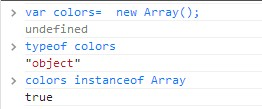
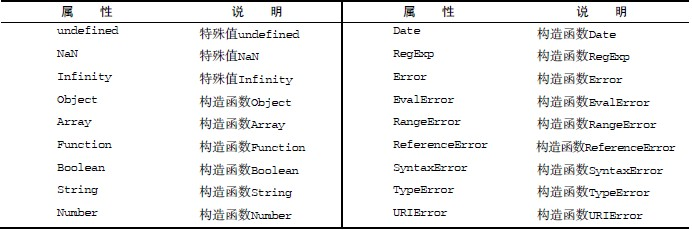
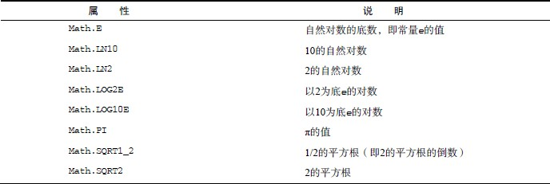
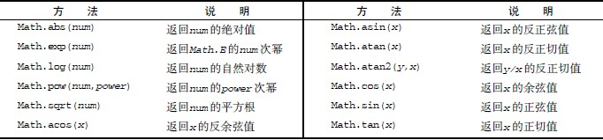

<link rel="stylesheet" href="./css/layout.css" type="text/css" />
# 引用类型 #

*	[Object类型](#5.1)
*	[Array类型](#5.2)
	*	[检测数组](#5.2.1)
	*	[转换方法](#5.2.2)
	*	[栈方法](#5.2.3)
	*	[队列方法](#5.2.4)
	*	[重排序方法](#5.2.5)
	*	[操作方法](#5.2.6)
	*	[位置方法](#5.2.7)
	*	[迭代方法](#5.2.8)
	*	[归并方法](#5.2.9)
*	[Date类型](#5.3)
	*	[继承的方法](#5.3.1)
	*	[日期格式化方法](#5.3.2)
	*	[日期/时间组件方法](#5.3.3)
*	[RegExp类型](#5.4)
	*	[RegExp实例属性](#5.4.1)
	*	[RegExp实例方法](#5.4.2)
	*	[RegExp构造函数](#5.4.3)
	*	[模式的局限性](#5.4.4)
*	[Function类型](#5.5)
	*	[没有重载（深入理解）](#5.5.1)
	*	[函数声明与函数表达式](#5.5.2)
	*	[作为值的函数](#5.5.3)
	*	[函数内部属性](#5.5.4)
	*	[函数属性和方法](#5.5.5)
*	[基本包装类型](#5.6)
	*	[Boolean类型](#5.6.1)
	*	[Number类型](#5.6.2)
	*	[String类型](#5.6.3)
*	[单体内置对象](#5.7)
	*	[Global对象](#5.7.1)
	*	[Math对象](#5.7.2)

<h2 id="5.1">Object类型</h2>
创建Object 实例的方式有两种。

第一种：new+Object构造函数

	var person = new Object();
	person.name = "rootkit";
	person.age = 24;

第二种：使用**对象字面量**

	var person = {
		name : "rootkit";
		age : 24
	};

	var person = {
		"name" : "rootkit";
		"age" : 24;
		5 : true
	};

	var person = {};

属性也可用字符串，实际上js处理时不管属性是不是字符串，都会自动转换为字符串，这里的5也会变为"5"。

访问对象一般用点表示法：

	person.name

当属性名中含有空格时，点表示法就不行了。此时用方括号语法：

	person["first name"] = "R";

显然，这在大部分情况下都是自找麻烦。

<h2 id="5.2">Array类型</h2>
Array数组，实际上也是一种Object：

js的数组和其他语言的数组很不一样。首先，由于松散类型，js可以保存任何类型数据在同一个数组变量，js的数组大小是动态变化的。

上图已经展示了如何创建一个数组，此外，还可以在构造函数中指定length属性：

	var colors = new Array(20);
	alert(colors.length);	//20 成员都是undefined

还可以直接传递数组成员：

	var colors = new Array("red","blue","green");

同样，可以用方括号创建：
	
	var colors = ["red", "blue", "green"];
	var names = [];

读取和访问：
	
	var colors = ["red", "blue", "green"];
	alert(colors[0]);		//显示第一项
	colors[2] = "black";	//修改第三项
	colors[3] = "brown";	//增加第四项

<h3 id="5.2.1">检测数组</h3>
上面使用的instanceof方法实际上有点问题，它假定只有一个全局执行环境。。如果网页中包含多个框架，那实如果你从一个框架向另一个框架传入一个数组，那么传入的数组与在第二个框架中原生创建的数组分别具有各自不同的构造函数。际上就存在两个以上不同的全局执行环境，从而存在两个以上不同版本的Array 构造函数。

为此，js中用Array.isArray()方法来探测。

	if(Array.isArray(value)){
		//对数组进行某些操作
	}

<h3 id="5.2.2">转换方法</h3>
所有对象都具有toLocaleString()、toString()和valueOf()方法。数组的toString()方法会返回由数组中每个值的字符串形式拼接而成的一个以逗号分隔的字符串。而调用valueOf()返回的还是数组。

	var colors = ["red", "blue", "green"]; // 创建一个包含3 个字符串的数组
	alert(colors.toString()); // red,blue,green
	alert(colors.valueOf()); // red,blue,green
	alert(colors); // red,blue,green

在这里，我们首先显式地调用了toString()方法，以便返回数组的字符串表示，每个值的字符串
表示拼接成了一个字符串，中间以逗号分隔。接着调用valueOf()方法，而最后一行代码直接将数组
传递给了alert()。由于alert()要接收字符串参数，所以它会在后台调用toString()方法，由此
会得到与直接调用toString()方法相同的结果。

另外，toLocaleString()方法经常也会返回与toString()和valueOf()方法相同的值，但也
不总是如此。当调用数组的toLocaleString()方法时，它也会创建一个数组值的以逗号分隔的字符
串。而与前两个方法唯一的不同之处在于，这一次为了取得每一项的值，调用的是每一项的toLocale-
String()方法，而不是toString()方法。

	var person1 = {
			toLocaleString : function () {
			return "Nikolaos";
		},
		toString : function() {
			return "Nicholas";
		}
	};
	var person2 = {
		toLocaleString : function () {
			return "Grigorios";
		},
		toString : function() {
			return "Greg";
		}
	};
	var people = [person1, person2];
	alert(people); //Nicholas,Greg
	alert(people.toString()); //Nicholas,Greg
	alert(people.toLocaleString()); //Nikolaos,Grigorios

<h3 id="5.2.3">栈方法</h3>
Js为数组提供了push()和pop()方法，使得数组可以表现得如同栈。

	var colors = new Array(); // 创建一个数组
	var count = colors.push("red", "green"); // 推入两项
	alert(count); //2
	count = colors.push("black"); // 推入另一项
	alert(count); //3
	var item = colors.pop(); // 取得最后一项
	alert(item); //"black"
	alert(colors.length); //2

<h3 id="5.2.4">队列方法</h3>
Js还提供了一个shift()方法，可以从数组最前端移除一项，没错，结合push()方法就可以表现成队列。

	var colors = new Array(); //创建一个数组
	var count = colors.push("red", "green"); //推入两项
	alert(count); //2
	count = colors.push("black"); //推入另一项
	alert(count); //3
	var item = colors.shift(); //取得第一项
	alert(item); //"red"
	alert(colors.length); //2

还有一个unshift()方法，这个方法与shift()相反，是在前端添加任意项并返回数组长度，因此，unshift()和前面几个结合起来还可以表现成双端队列。

	var colors = new Array(); //创建一个数组
	var count = colors.unshift("red", "green"); //推入两项
	alert(count); //2
	count = colors.unshift("black"); //推入另一项
	alert(count); //3
	var item = colors.pop(); //取得最后一项
	alert(item); //"green"
	alert(colors.length); //2

<h3 id="5.2.5">重排序方法</h3>
reverse()方法用于反转数组的顺序。

	var values = [1, 2, 3, 4, 5];
	values.reverse();
	alert(values); //5,4,3,2,1

sort()方法按升序排列数组项——最小的值在最前面，sort()方法会调用每个数组项的toString()转型方法，然后比较得到的字符串，以确定如何排序。即使是数值，sort()比较的也是字符串。

	var values = [0, 1, 5, 10, 15];
	values.sort();
	alert(values); //0,1,10,15,5

显然，很多时候我们并不认可这个排序策略，有一种类似C++的处理方法，即传进去一个自定义的比较函数：

	function compare(value1, value2) {
		if (value1 < value2) {
			return -1;
		} else if (value1 > value2) {
			return 1;
		} else {
			return 0;
		}
	}

	var values = [0, 1, 5, 10, 15];
	values.sort(compare);
	alert(values); //0,1,5,10,15

>compare是如何工作的：比较函数接收两个参数，如果第一个参数应该位于第二个之前则返回一个负数，如果两个参数相等则返回0，如果第一个参数应该位于第二个之后则返回一个正数。内部sort时会按照这个规则来迭代。

更简单的办法：

	function compare(value1, value2){
		return value2 - value1;
	}

<h3 id="5.2.6">操作方法</h3>
concat()方法：

	var colors = ["red", "green", "blue"];
	var colors2 = colors.concat("yellow", ["black", "brown"]);
	alert(colors); //red,green,blue
	alert(colors2); //red,green,blue,yellow,black,brown

slice()方法：

	var colors = ["red", "green", "blue", "yellow", "purple"];
	var colors2 = colors.slice(1);
	var colors3 = colors.slice(1,4);
	alert(colors); 	//red,green,blue,yellow,purple
	alert(colors2); //green,blue,yellow,purple
	alert(colors3); //green,blue,yellow

splice()方法：

- 删除：可以删除任意数量的项，只需指定2 个参数：要删除的第一项的位置和要删除的项数。例如，splice(0,2)会删除数组中的前两项。
- 插入：可以向指定位置插入任意数量的项，只需提供3 个参数：起始位置、0（要删除的项数）和要插入的项。如果要插入多个项，可以再传入第四、第五，以至任意多个项。例如，splice(2,0,"red","green")会从当前数组的位置2 开始插入字符串"red"和"green"。
- 替换：可以向指定位置插入任意数量的项，且同时删除任意数量的项，只需指定3 个参数：起始位置、要删除的项数和要插入的任意数量的项。插入的项数不必与删除的项数相等。例如，splice (2,1,"red","green")会删除当前数组位置2 的项，然后再从位置2 开始插入字符串"red"和"green"。

实际上，删除和插入就是替换的特例。

	var colors = ["red", "green", "blue"];
	var removed = colors.splice(0,1); // 删除第一项
	alert(colors); // green,blue
	alert(removed); // red，返回的数组中只包含一项
	removed = colors.splice(1, 0, "yellow", "orange"); // 从位置1 开始插入两项
	alert(colors); // green,yellow,orange,blue
	alert(removed); // 返回的是一个空数组
	removed = colors.splice(1, 1, "red", "purple"); // 插入两项，删除一项
	alert(colors); // green,red,purple,orange,blue
	alert(removed); // yellow，返回的数组中只包含一项

<h3 id="5.2.7">位置方法</h3>
indexOf(), lastIndexOf():

	var numbers = [1,2,3,4,5,4,3,2,1];
	alert(numbers.indexOf(4)); //3
	alert(numbers.lastIndexOf(4)); //5
	alert(numbers.indexOf(4, 4)); //5
	alert(numbers.lastIndexOf(4, 4)); //3
	var person = { name: "Nicholas" };
	var people = [{ name: "Nicholas" }];
	var morePeople = [person];
	alert(people.indexOf(person)); //-1
	alert(morePeople.indexOf(person)); //0

Tips1: 这两个方法都接收两个参数：要查找的项和（可选的）表示查找起点位置的索引。其中，indexOf()方法从数组的开头（位置0）开始向后查找，lastIndexOf()方法则从数组的末尾开始向前查找。

Tips2: 这两个方法都返回要查找的项在数组中的位置，或者在没找到的情况下返回1。在比较第一个参数与数组中的每一项时，会使用全等操作符；也就是说，要求查找的项必须严格相等（就像使用===一样）。

<h3 id="5.2.8">迭代方法</h3>
Js数组定义了5种迭代方法，每个方法都接收两个参数：要在每一项上运行的函数和（可选的）运行该函数的作用域对象——影响this 的值。

传入这些方法中的函数会接收三个参数：数组项的值、该项在数组中的位置和数组对象本身。根据使用的方法不同，这个函数执行后的返回值可能会也可能不会影响方法的返回值。

-	every()：对数组中的每一项运行给定函数，如果该函数对每一项都返回true，则返回true。
-	filter()：对数组中的每一项运行给定函数，返回该函数会返回true 的项组成的数组。
-	forEach()：对数组中的每一项运行给定函数。这个方法没有返回值。
-	map()：对数组中的每一项运行给定函数，返回每次函数调用的结果组成的数组。
-	some()：对数组中的每一项运行给定函数，如果该函数对某一项返回true，则返回true。

以上方法都不会修改数组中的包含的值。

some和every的区别：

	var numbers = [1,2,3,4,5,4,3,2,1];
	var everyResult = numbers.every(function(item, index, array){
		return (item > 2);
	});
	alert(everyResult); //false
	var someResult = numbers.some(function(item, index, array){
		return (item > 2);
	});
	alert(someResult); //true

filter:
	
	var numbers = [1,2,3,4,5,4,3,2,1];
	var filterResult = numbers.filter(function(item, index, array){
		return (item > 2);
	});
	alert(filterResult); //[3,4,5,4,3]

map:

	var numbers = [1,2,3,4,5,4,3,2,1];
	var mapResult = numbers.map(function(item, index, array){
		return item * 2;
	});
	alert(mapResult); //[2,4,6,8,10,8,6,4,2]

forEach:

	var numbers = [1,2,3,4,5,4,3,2,1];
	numbers.forEach(function(item, index, array){
		//执行某些操作
	});

<h3 id="5.2.9">归并方法</h3>
reduce():从数组第一项开始，逐个遍历到最后，构建一个返回值。
reduceRight():从数组最后项开始，逐个遍历到最前，构建一个返回值。

这两个方法都接收两个参数：一个在每一项上调用的函数和（可选的）作为归并基础的初始值。

传给reduce()和reduceRight()的函数接收4 个参数：前一个值、当前值、项的索引和数组对象。这
个函数返回的任何值都会作为第一个参数自动传给下一项。第一次迭代发生在数组的第二项上，因此第
一个参数是数组的第一项，第二个参数就是数组的第二项。也就是说迭代从第二项开始。

	var values = [1,2,3,4,5];
	var sum = values.reduce(function(prev, cur, index, array){
		return prev + cur;
	});
	alert(sum); //15

<h2 id="5.3">Date类型</h2>
Js的Date源于Java中的java.util.Date类。Date使用UTC时间保存日期。

	var now = new Date();

不传参则获得当前时间，而如果想创建特定时间的Date对象，就必须传入其UTC毫秒数。显然我们不可能手算，Js提供了Date.parse()和Date.UTC()方法。前者接收一个表示日期的字符串参数，返回毫秒数，标准未规定字符串格式。一种写法：

	var someDate = new Date(Date.parse("May 25, 2004"));

如果传入Date.parse()方法的字符串不能表示日期，那么它会返回NaN。实际上，如果直接将表示日期的字符串传递给Date 构造函数，也会在后台调用Date.parse()。换句话说，下面的代码与前面的例子是等价的：

	var someDate = new Date("May 25, 2004");

Date.UTC()方法同样也返回表示日期的毫秒数，但它与Date.parse()在构建值时使用不同的信
息。Date.UTC()的参数分别是年份、基于0 的月份（一月是0，二月是1，以此类推）、月中的哪一天
（1 到31）、小时数（0 到23）、分钟、秒以及毫秒数。在这些参数中，只有前两个参数（年和月）是必
需的。如果没有提供月中的天数，则假设天数为1；如果省略其他参数，则统统假设为0。

	// GMT 时间2000 年1 月1 日午夜零时
	var y2k = new Date(Date.UTC(2000, 0));
	// GMT 时间2005 年5 月5 日下午5:55:55
	var allFives = new Date(Date.UTC(2005, 4, 5, 17, 55, 55));

ECMAScript 5 添加了Date.now()方法，返回表示调用这个方法时的日期和时间的毫秒数。这个方
法简化了使用Date 对象分析代码的工作。
	
	//取得开始时间
	var start = Date.now();
	//调用函数
	doSomething();
	//取得停止时间
	var stop = Date.now(),
	result = stop – start;

<h3 id="5.3.1">继承的方法</h3>
与其他引用类型一样，Date 类型也重写了toLocaleString()、toString()和valueOf()方法，但这些方法返回的值与其他类型中的方法不同。

Date 类型的toLocaleString()方法会按照与浏览器设置的地区相适应的格式返回日期和时间。这大致意味着时间格式中会包含AM 或PM，但不会包含时区信息（当然，具体的格式会因浏览器而异）。

toString()方法则通常返回带有时区信息的日期和时间，其中时间一般以军用时间（即小时的范围是0 到23）表示。

至于Date 类型的valueOf()方法，则根本不返回字符串，而是返回日期的毫秒表示。

<h3 id="5.3.2">日期格式化方法</h3>
将日期格式化为字符串的方法：

-	toDateString()——以特定于实现的格式显示星期几、月、日和年；
-	toTimeString()——以特定于实现的格式显示时、分、秒和时区；
-	toLocaleDateString()——以特定于地区的格式显示星期几、月、日和年；
-	toLocaleTimeString()——以特定于实现的格式显示时、分、秒；
-	toUTCString()——以特定于实现的格式完整的UTC 日期。

<h3 id="5.3.3">日期/时间组件方法</h3>
<input type="button" value="显示/隐藏" onclick="showOrHide('component')"></a>
<table id="component">
<tr>
  <td width="25%">getTime() </td>
  <td>返回表示日期的毫秒数；与valueOf()方法返回的值相同</td>
</tr>
<tr>
  <td>setTime(毫秒) </td> 
  <td>以毫秒数设置日期，会改变整个日期</td>
</tr>
<tr>
  <td>getFullYear() </td>
  <td>取得4位数的年份（如2007而非仅07）</td>
</tr>
<tr>
  <td>getUTCFullYear() </td>
  <td>返回UTC日期的4位数年份</td>
</tr>
<tr>
  <td>setFullYear(年) </td>
  <td>设置日期的年份。传入的年份值必须是4位数字（如2007而非仅07）</td>
</tr>
<tr>
  <td>setUTCFullYear(年) </td>
  <td>设置UTC日期的年份。传入的年份值必须是4位数字（如2007而非仅07）</td>
</tr>
<tr>
  <td>getMonth() </td>
  <td>返回日期中的月份，其中0表示一月，11表示十二月</td>
</tr>
<tr>
  <td>getUTCMonth() </td>
  <td>返回UTC日期中的月份，其中0表示一月，11表示十二月</td>
</tr>
<tr>
  <td>setMonth(月) </td>
  <td>设置日期的月份。传入的月份值必须大于0，超过11则增加年份</td>
</tr>
<tr>
  <td>setUTCMonth(月) </td>
  <td>设置UTC日期的月份。传入的月份值必须大于0，超过11则增加年份</td>
</tr>
<tr>
  <td>getDate() </td>
  <td>返回日期月份中的天数（1到31）</td>
</tr>
<tr>
  <td>getUTCDate() </td>
  <td>返回UTC日期月份中的天数（1到31）</td>
</tr>
<tr>
  <td>setDate(日)</td>
  <td>设置日期月份中的天数。如果传入的值超过了该月中应有的天数，则增加月份</td>
</tr>
<tr>
  <td>setUTCDate(日) </td>
  <td>设置UTC日期月份中的天数。如果传入的值超过了该月中应有的天数，则增加月份</td>
</tr>
<tr>
  <td>getDay() </td>
  <td>返回日期中星期的星期几（其中0表示星期日，6表示星期六）</td>
</tr>
<tr>
  <td>getUTCDay() </td>
  <td>返回UTC日期中星期的星期几（其中0表示星期日，6表示星期六）</td>
</tr>
<tr>
  <td>getHours() </td>
  <td>返回日期中的小时数（0到23）</td>
</tr>
<tr>
  <td>getUTCHours() </td>
  <td>返回UTC日期中的小时数（0到23）</td>
</tr>
<tr>
  <td>setHours(时) </td>
  <td>设置日期中的小时数。传入的值超过了23则增加月份中的天数</td>
</tr>
<tr>
  <td>setUTCHours(时) </td>
  <td>设置UTC日期中的小时数。传入的值超过了23则增加月份中的天数</td>
</tr>
<tr>
  <td>getMinutes() </td>
  <td>返回日期中的分钟数（0到59）</td>
</tr>
<tr>
  <td>getUTCMinutes() </td>
  <td>返回UTC日期中的分钟数（0到59）</td>
</tr>
<tr>
  <td>setMinutes(分) </td>
  <td>设置日期中的分钟数。传入的值超过59则增加小时数</td>
</tr>
<tr>
  <td>setUTCMinutes(分) </td>
  <td>设置UTC日期中的分钟数。传入的值超过59则增加小时数</td>
</tr>
<tr>
  <td>getSeconds() </td>
  <td>返回日期中的秒数（0到59）</td>
</tr>
<tr>
  <td>getUTCSeconds() </td>
  <td>返回UTC日期中的秒数（0到59）</td>
</tr>
<tr>
  <td>setSeconds(秒) </td>
  <td>设置日期中的秒数。传入的值超过了59会增加分钟数</td>
</tr>
<tr>
  <td>setUTCSeconds(秒) </td>
  <td>设置UTC日期中的秒数。传入的值超过了59会增加分钟数</td>
</tr>
<tr>
  <td>getMilliseconds() </td>
  <td>返回日期中的毫秒数</td>
</tr>
<tr>
  <td>getUTCMilliseconds() </td>
  <td>返回UTC日期中的毫秒数</td>
</tr>
<tr>
  <td>setMilliseconds(毫秒) </td>
  <td>设置日期中的毫秒数</td>
</tr>
<tr>
  <td>setUTCMilliseconds(毫秒) </td>
  <td>设置UTC日期中的毫秒数</td>
</tr>
<tr>
  <td>getTimezoneOffset() </td>
  <td>返回本地时间与UTC时间相差的分钟数。例如，美国东部标准时间返回300。在某地进入夏令时的情况下，这个值会有所变化</td>
</tr>
</table>

<h2 id="5.4">RegExp类型</h2>
RegExp就是大名鼎鼎的正则表达式。有点类似Perl的语法。

	var expression = /pattern/flags;

pattern模式部分可以是任何简单或复杂的正则表达式，可以包含字符类、限定符、分组、向前查找以及反向引用。每个正则表达式都可带一个或多个标志flags，标明正则表达式的行为。

匹配模式支持下列三个flags：

-	g：表示全局（global）模式，即模式将被应用于所有字符串，而非在发现第一个匹配项时立即停止；
-	i：表示不区分大小写（case-insensitive）模式，即在确定匹配项时忽略模式与字符串的大小写;
-	m：表示多行（multiline）模式，即在到达一行文本末尾时还会继续查找下一行中是否存在与模式匹配的项。

一些例子：

	/*
	* 匹配字符串中所有"at"的实例
	*/
	var pattern1 = /at/g;
	/*
	* 匹配第一个"bat"或"cat"，不区分大小写
	*/
	var pattern2 = /[bc]at/i;
	/*
	* 匹配所有以"at"结尾的3 个字符的组合，不区分大小写
	*/
	var pattern3 = /.at/gi;

与其他语言中的正则表达式类似，模式中使用的所有元字符都必须转义。正则表达式中的元字符包括：

	( [ { \ ^ $ | ) ? * + .]}

这些元字符在正则表达式中都有一或多种特殊用途，因此如果想要匹配字符串中包含的这些字符，就必须对它们进行转义。

	/*
	* 匹配第一个"bat"或"cat"，不区分大小写
	*/
	var pattern1 = /[bc]at/i;
	/*
	* 匹配第一个" [bc]at"，不区分大小写
	*/
	var pattern2 = /\[bc\]at/i;
	/*
	* 匹配所有以"at"结尾的3 个字符的组合，不区分大小写
	*/
	var pattern3 = /.at/gi;
	/*
	* 匹配所有".at"，不区分大小写
	*/
	var pattern4 = /\.at/gi;

除了上述的字面量定义正则以外，还可以用构造函数来定义：

	/*
	* 匹配第一个"bat"或"cat"，不区分大小写
	*/
	var pattern1 = /[bc]at/i;
	/*
	* 与pattern1 相同，只不过是使用构造函数创建的
	*/
	var pattern2 = new RegExp("[bc]at", "i");

有个问题需要注意，构造函数中参数是字符串，所以当转义字符出现时，还要多一个'\'来转义'\'本身。

-	/\[bc\]at/ 	->	"\\[bc\\]at"
-	/\.at/ 		->	"\\.at"
-	/name\/age/ ->	"name\\/age"
-	/\d.\d{1,2}/ ->	"\\d.\\d{1,2}"
-	/\w\\hello\\123/ ->	"\\w\\\\hello\\\\123"

<h3 id="5.4.1">RegExp实例属性</h3>
RegExp 的每个实例都具有下列属性，通过这些属性可以取得有关模式的各种信息。
-	global: 布尔值，表示是否设置了g 标志。
-	ignoreCase：布尔值，表示是否设置了i 标志。
-	lastIndex：整数，表示开始搜索下一个匹配项的字符位置，从0 算起。
-	multiline：布尔值，表示是否设置了m 标志。
-	source：正则表达式的字符串表示，按照字面量形式而非传入构造函数中的字符串模式返回。

	var pattern1 = /\[bc\]at/i;
	alert(pattern1.global); //false
	alert(pattern1.ignoreCase); //true
	alert(pattern1.multiline); //false
	alert(pattern1.lastIndex); //0
	alert(pattern1.source); //"\[bc\]at"
	var pattern2 = new RegExp("\\[bc\\]at", "i");
	alert(pattern2.global); //false
	alert(pattern2.ignoreCase); //true
	alert(pattern2.multiline); //false
	alert(pattern2.lastIndex); //0
	aler t(pattern2.source); //"\[bc\]at"

<h3 id="5.4.2">RegExp实例方法</h3>
RegExp 对象的主要方法是exec()，该方法是专门为捕获组而设计的。exec()接受一个参数，即
要应用模式的字符串，然后返回包含第一个匹配项信息的数组；或者在没有匹配项的情况下返回null。

返回的数组虽然是Array 的实例，但包含两个额外的属性：index 和input。index 表示匹配
项在字符串中的位置，而input 表示应用正则表达式的字符串。在数组中，第一项是与整个模式匹配
的字符串，其他项是与模式中的捕获组匹配的字符串（如果模式中没有捕获组，则该数组只包含一项）。

	var text = "mom and dad and baby";
	var pattern = /mom( and dad( and baby)?)?/gi;
	var matches = pattern.exec(text);
	alert(matches.index); // 0
	alert(matches.input); // "mom and dad and baby"
	alert(matches[0]); // "mom and dad and baby"
	alert(matches[1]); // " and dad and baby"
	aler t(matches[2]); // " and baby"

对于exec()方法而言，即使在模式中设置了全局标志（g），它每次也只会返回一个匹配项。在不
设置全局标志的情况下，在同一个字符串上多次调用exec()将始终返回第一个匹配项的信息。而在设
置全局标志的情况下，每次调用exec()则都会在字符串中继续查找新匹配项。

	var text = "cat, bat, sat, fat";
	var pattern1 = /.at/;

	var matches = pattern1.exec(text);
	alert(matches.index); //0
	alert(matches[0]); //cat
	alert(pattern1.lastIndex); //0

	matches = pattern1.exec(text);
	alert(matches.index); //0
	alert(matches[0]); //cat
	alert(pattern1.lastIndex); //0

	var pattern2 = /.at/g;

	var matches = pattern2.exec(text);
	alert(matches.index); //0
	alert(matches[0]); //cat
	alert(pattern2.lastIndex); //3

	matches = pattern2.exec(text);
	alert(matches.index); //5
	alert(matches[0]); //bat
	alert(pattern2.lastIndex); //8

正则表达式的第二个方法是test()，它接受一个字符串参数。在模式与该参数匹配的情况下返回
true；否则，返回false。

	var text = "000-00-0000";
	var pattern = /\d{3}-\d{2}-\d{4}/;
	if (pattern.test(text)){
		alert("The pattern was matched.");
	}

<h3 id="5.4.3">RegExp构造函数属性</h3>
RegExp 构造函数包含一些属性（这些属性在其他语言中被看成是静态属性）。这些属性适用于作用域内所有正则表达式，并且基于所执行的最近一次正则操作而变化。这些属性分别有一个长属性名和一个短属性名，可以用两种方式来访问。

<table>
<tr>
  <td>input</td>
  <td>$_ </td>
  <td>最近一次要匹配的字符串。Opera未实现此属性</td>
</tr>
<tr>
  <td>lastMatch</td>
  <td>$& </td>
  <td>最近一次的匹配项。Opera未实现此属性</td>
</tr>
<tr>
  <td>lastParen</td> 
  <td>$+ </td>
  <td>最近一次匹配的捕获组。Opera未实现此属性</td>
</tr>
<tr>
  <td>leftContext</td> 
  <td>$` </td>
  <td>input字符串中lastMatch之前的文本</td>
</tr>
<tr>
  <td>multiline</td> 
  <td>$* </td>
  <td>布尔值，表示是否所有表达式都使用多行模式。IE和Opera未实现此属性</td>
</tr>
<tr>
  <td>rightContext 
  <td>$'</td>
  <td>Input字符串中lastMatch之后的文本</td>
</tr>
</table>

	var text = "this has been a short summer";
	var pattern = /(.)hort/g;
	/*
	* 注意：Opera 不支持input、lastMatch、lastParen 和multiline 属性
	* Internet Explorer 不支持multiline 属性
	*/
	if (pattern.test(text)){
	alert(RegExp.input); // this has been a short summer
	alert(RegExp.leftContext); // this has been a
	alert(RegExp.rightContext); // summer
	alert(RegExp.lastMatch); // short
	alert(RegExp.lastParen); // s
	alert(RegExp.multiline); // false
	}

<h3 id="5.4.4">模式的局限性</h3>
ECMAScript的正则虽然还算比较完备，但仍然缺少某些高级特性。

-	匹配字符串开始和结尾的\A 和\Z 锚（但是可以用^和$代替）
-	向后查找（lookbehind）
-	并集和交集类
-	原子组（atomic grouping）
-	Unicode 支持（单个字符除外，如\uFFFF）
-	命名的捕获组
-	s（single，单行）和x（free-spacing，无间隔）匹配模式
-	条件匹配
-	正则表达式注释

<h2 id="5.5">Function类型</h2>
最早说起函数，还是在typeof那里，已经剧透过function本质上是一个对象，每个函数都是Function类型的一个实例，且都与其他引用类型一样具有属性和方法。既然函数是一个对象，那么实际上函数名就是一个指向函数对象的指针，不会与某个函数绑定。

函数定义一般体：

	function sum(num1, num2){
		return num1 + num2;
	}

而有了以上的概念，按下面的写法更容易理解：

	var sum = function(num1, num2){
		return num1 + num2;
	};

相应的，有了上面那种字面定义方式，就还有构造函数的定义方式：

	var sum = new Function("num1", "num2", "return num1 + num2");	//不推荐

因二次解析而性能差，所以这么多年来我也没看过有什么人在用。

理解了函数的本质，你应该轻易看得懂下面的代码。

	function sum(num1, num2){
		return num1 + num2;
	}
	alert(sum(10,10)); //20
	var anotherSum = sum;
	alert(anotherSum(10,10)); //20
	sum = null;
	alert(anotherSum(10,10)); //20

<h3 id="5.5.1">没有重载（深入理解）</h3>
前面就说过，js没必要重载函数（类型松散还重载个毛啊），这里多说一句，你可能会发现当你尝试重载的时候，程序没有报错。不错，因为后来者完成了覆盖，确实没什么错的，毕竟对象。

	function addSomeNumber(num){
		return num + 100;
	}
	function addSomeNumber(num) {
		return num + 200;
	}
	var result = addSomeNumber(100); //300

后者覆盖了前者，实际上翻译过来就是：

	var addSomeNumber = function (num){
		return num + 100;
	};
	addSomeNumber = function (num) {
		return num + 200;
	};
	var result = addSomeNumber(100); //300

addSomeNumber已经指向了另一个函数对象了，当然就是覆盖，一目了然。

<h3 id="5.5.2">函数声明与函数表达式</h3>
如果你的母语是C，那么当你用Js的时候，你可能会发现一个不太理解的现象：

	alert(sum(10,10));
	function sum(num1, num2){
		return num1 + num2;
	}

这样的代码竟然工作了！

实际上，这就是解释器或者你理解成编译器都好，在实际工作中的方式差异。Js的解释器会先加载数据，这期间会先把函数声明读取进来，这样一来，任何代码在执行前，这些函数都是可定位的，当真正调用到时，再展开函数定义，或者说表达式。

然而，这样的代码就不行了：

	alert(sum(10,10));
	var sum = function(num1, num2){
		return num1 + num2;
	};

原因在于函数位于一个初始化语句而不是函数声明。你的sum是指针并不是如同上面那样的函数对象。

<h3 id="5.5.3">作为值的函数</h3>
这个没什么好说的，你当然可以传函数对象做参数。

	function callSomeFunction(someFunction, someArgument){
		return someFunction(someArgument);
	}

	function add10(num){
		return num + 10;
	}

	var result1 = callSomeFunction(add10, 10);
	alert(result1); //20

	function getGreeting(name){
		return "Hello, " + name;
	}

	var result2 = callSomeFunction(getGreeting, "Nicholas");
	alert(result2); //"Hello, Nicholas"

也可以在函数中返回另一个函数对象：

	function createComparisonFunction(propertyName) {
		return function(object1, object2){
			var value1 = object1[propertyName];
			var value2 = object2[propertyName];
	
			if (value1 < value2){
				return -1;
			} else if (value1 > value2){
				return 1;
			} else {
				return 0;
			}
		};
	}

	var data = [{name: "Zachary", age: 28}, {name: "Nicholas", age: 29}];

	data.sort(createComparisonFunction("name"));
	alert(data[0].name); //Nicholas

	data.sort(createComparisonFunction("age"));
	alert(data[0].name); //Zachary

这样sort的函数参数就做的很灵活。

<h3 id="5.5.4">函数内部属性</h3>
函数内部有两个特殊的对象：arguments和this。arguments是类数组对象，包含着传入函数中的所有参数。虽然arguments 的主要用途是保存函数参数，但这个对象还有一个名叫callee 的属性，该属性是一个指针，指向拥有这个arguments 对象的函数。

	function factorial(num){
		if (num <=1) {
			return 1;
		} else {
			return num * factorial(num-1)
		}
	}

利用arguments.callee解耦合：
	
	function factorial(num){
		if (num <=1) {
			return 1;
		} else {
			return num * arguments.callee(num-1)
		}
	}

解耦合就可以这样用了：

	var trueFactorial = factorial;
	factorial = function(){
		return 0;
	};

	alert(trueFactorial(5)); //120
	aler t(factorial(5)); //0

另一个this和Java的this差不多，this引用的是函数据以执行的环境对象（全局作用域中调用函数，this对象引用的就是window）。

	window.color = "red";
	var o = { color: "blue" };

	function sayColor(){
		alert(this.color);
	}

	sayColor(); //"red"

	o.sayColor = sayColor;
	o.sayColor(); //"blue"

<h3 id="5.5.5">函数属性和方法</h3>
每个函数都包含两个属性：length和prototype。length是函数希望接受的命名参数的个数。

	function sayName(name){
		alert(name);
	}
	function sum(num1, num2){
		return num1 + num2;
	}
	function sayHi(){
		alert("hi");
	}
	alert(sayName.length); //1
	alert(sum.length); //2
	alert(sayHi.length); //0

而这个prototype真的难懂，相信我。

对于引用类型来说，prototype是保存它们所有实例方法的真正所在。诸如toString()，valueOf()等方法实际上都保存在prototype名下，只不过是通过各自的对象实例去访问罢了。prototype一般用于创建自定义引用类型以及实现继承，prototype是不可枚举的，for-in无效。

每个函数都包含两个非继承而来的方法：apply()和call()。用途在于特定的作用域中调用函数，实际上等于设置函数体内this对象的值。首先apply()接收两个参数：一个是在其中运行函数的作用域，另一个是参数数组。第二个参数可以是Array的实例，也可以是arguments对象。

	function sum(num1, num2){
		return num1 + num2;
	}
	function callSum1(num1, num2){
		return sum.apply(this, arguments); // 传入arguments 对象
	}
	function callSum2(num1, num2){
		return sum.apply(this, [num1, num2]); // 传入数组
	}
	alert(callSum1(10,10)); //20
	alert(callSum2(10,10)); //20

call()方法作用相同，区别仅在于参数方式不同。对于call来说，第一个参数是this没变，但是其余的参数都直接传递给函数。

	function sum(num1, num2){
		return num1 + num2;
	}
	function callSum(num1, num2){
		return sum.call(this, num1, num2);
	}
	alert(callSum(10,10)); //20

事实上，传递参数并非apply()和call()真正的用武之地；它们真正强大的地方是能够扩充函数赖以运行的作用域。
	
	window.color = "red";
	var o = { color: "blue" };

	function sayColor(){
		alert(this.color);
	}

	sayColor(); //red

	sayColor.call(this); //red
	sayColor.call(window); //red
	sayColor.call(o); //blue

<h2 id="5.6">基本包装类型</h2>
为了便于操作基本类型值，Js还提供了3个特殊的引用类型：Boolean，Number和String。

看这样一个例子：

	var s1 = "some text";
	var s2 = s1.substring(2);

或许你早发现了这样的问题，String不是基本类型吗？基本类型又不是对象，怎么会信誓旦旦的调用了方法？实际上，这就是后台的暗箱操作。

当第二行代码访问s1时，访问过程处于一种读取模式，也就是要从内存中读取这个字符串的值。而在读取模式中访问字符串时，后台会自动进行下列处理：

1. 创建String类型的一个示例；
2. 在实例上调用指定的方法；
3. 销毁这个实例；

也就相当于：
	
	var s1 = new String("some text");
	var s2 = s1.substring(2);
	s1 = null;

引用类型与基本包装类型的主要区别就是对象的生存期。使用new 操作符创建的引用类型的实例，
在执行流离开当前作用域之前都一直保存在内存中。而自动创建的基本包装类型的对象，则只存在于一
行代码的执行瞬间，然后立即被销毁。因此，我们不能在运行时为基本类型值添加属性和方法。

当然，可以显式地调用Boolean、Number 和String 来创建基本包装类型的对象。不过，应该在
绝对必要的情况下再这样做。

	var obj = new Object("some text");
	alert(obj instanceof String); //true

使用new 调用基本包装类型的构造函数，与直接调用同名的转型函数是不一样的。

	var value = "25";

	var number = Number(value); //转型函数
	alert(typeof number); //"number"

	var obj = new Number(value); //构造函数
	alert(typeof obj); //"object"

最后，不建议显示创建基本包装类型对象。

<h3 id="5.6.1">Boolean类型</h3>

	var falseObject = new Boolean(false);
	var result = falseObject && true;
	alert(result); //true

	var falseValue = false;
	result = falseValue && true;
	alert(result); //false

tips：布尔表达式中的所有对象都会被转换为true。

<h3 id="5.6.2">Number类型</h3>
Number 类型也重写了valueOf()、toLocaleString()和toString()方法。

	var num = 10;
	alert(num.toString()); //"10"
	alert(num.toString(2)); //"1010"
	alert(num.toString(8)); //"12"
	alert(num.toString(10)); //"10"
	alert(num.toString(16)); //"a"
	
	/* others */
	var num = 10;
	alert(num.toFixed(2)); //"10.00"

	var num = 10;
	alert(num.toExponential(1)); //"1.0e+1"

	var num = 99;
	alert(num.toPrecision(1)); //"1e+2"
	alert(num.toPrecision(2)); //"99"
	aler t(num.toPrecision(3)); //"99.0"

<h3 id="5.6.3">String类型</h3>
String 类型是字符串的对象包装类型，可以像下面这样使用String 构造函数来创建。

	var stringObject = new String("hello world");

String 类型的每个实例都有一个length 属性，表示字符串中包含多个字符。这个很关键！
	
	var stringValue = "hello world";
	alert(stringValue.length); //"11"

提供的一些方法：

1.字符方法
	
	var stringValue = "hello world";
	alert(stringValue.charAt(1)); //"e"

	var stringValue = "hello world";
	alert(stringValue.charCodeAt(1)); //输出"101"

	var stringValue = "hello world";
	alert(stringValue[1]); //"e"
	
2.字符串操作方法

	var stringValue = "hello ";
	var result = stringValue.concat("world");
	alert(result); //"hello world"
	alert(stringValue); //"hello"

	var stringValue = "hello ";
	var result = stringValue.concat("world", "!");
	alert(result); //"hello world!"
	alert(stringValue); //"hello"

	var stringValue = "hello world";
	alert(stringValue.slice(3)); //"lo world"
	alert(stringValue.substring(3)); //"lo world"
	alert(stringValue.substr(3)); //"lo world"
	alert(stringValue.slice(3, 7)); //"lo w"
	alert(stringValue.substring(3,7)); //"lo w"
	alert(stringValue.substr(3, 7)); //"lo worl"

	var stringValue = "hello world";
	alert(stringValue.slice(-3)); //"rld"
	alert(stringValue.substring(-3)); //"hello world"
	alert(stringValue.substr(-3)); //"rld"
	alert(stringValue.slice(3, -4)); //"lo w"
	alert(stringValue.substring(3, -4)); //"hel"
	alert(stringValue.substr(3, -4)); //""（空字符串）

3.字符串位置方法

	var stringValue = "hello world";
	alert(stringValue.indexOf("o")); //4
	alert(stringValue.lastIndexOf("o")); //7

	var stringValue = "hello world";
	alert(stringValue.indexOf("o", 6)); //7
	alert(stringValue.lastIndexOf("o", 6)); //4

4.trim()方法

这个方法会创建一个字符串的副本，删除前置及后缀的所有空格，然后返回结果。

	var stringValue = " hello world ";
	var trimmedStringValue = stringValue.trim();
	alert(stringValue); //" hello world "
	alert(trimmedStringValue); //"hello world"

5.字符串大小写转换方法

	var stringValue = "hello world";
	alert(stringValue.toLocaleUpperCase()); //"HELLO WORLD"
	alert(stringValue.toUpperCase()); //"HELLO WORLD"
	alert(stringValue.toLocaleLowerCase()); //"hello world"
	alert(stringValue.toLowerCase()); //"hello world"

6.字符串的模式匹配方法

	var text = "cat, bat, sat, fat";
	var pattern = /.at/;

	//与pattern.exec(text)相同
	var matches = text.match(pattern);
	alert(matches.index); //0
	alert(matches[0]); //"cat"
	alert(pattern.lastIndex); //0

	var text = "cat, bat, sat, fat";
	var pos = text.search(/at/);
	alert(pos); //1
	
	var text = "cat, bat, sat, fat";
	var result = text.replace("at", "ond");
	alert(result); //"cond, bat, sat, fat"

	result = text.replace(/at/g, "ond");
	aler t(result); //"cond, bond, sond, fond"

	var colorText = "red,blue,green,yellow";
	var colors1 = colorText.split(","); //["red", "blue", "green", "yellow"]
	var colors2 = colorText.split(",", 2); //["red", "blue"]
	var colors3 = colorText.split(/[^\,]+/); //["", ",", ",", ",", ""]

7.localeCompare()方法

	var stringValue = "yellow";
	alert(stringValue.localeCompare("brick")); //1
	alert(stringValue.localeCompare("yellow")); //0
	alert(stringValue.localeCompare("zoo")); //-1

8.fromCharCode()方法

这个是静态方法，接收一或多个字符编码，然后将他们转成一个字符串。和charCodeAt()相反。

	alert(String.fromCharCode(104, 101, 108, 108, 111)); //"hello"

9.HTML 方法

简化常见HTML 格式化任务的方法，不推荐使用，不予记载。

<h2 id="5.7">单体内置对象</h2>
内置对象的定义：由ECMAScript 实现提供的、不依赖于宿主环境的对象，这些对象在ECMAScript 程序执行之前就已经存在了。

我们不用显示实例化这些对象，他们从开天辟地以来就存在了。比如Object，Array，String。ECMA-262还定义了两个单体内置对象：Global和Math。

<h3 id="5.7.1">Global对象</h3>
Global（全局）对象可以说是ECMAScript 中最特别的一个对象了，因为不管你从什么角度上看，
这个对象都是不存在的。ECMAScript 中的Global 对象在某种意义上是作为一个终极的“兜底儿对象”
来定义的。换句话说，不属于任何其他对象的属性和方法，最终都是它的属性和方法。事实上，没有全
局变量或全局函数；所有在全局作用域中定义的属性和函数，都是Global 对象的属性。诸如isNaN()、isFinite()、parseInt()以及parseFloat()，实际上全都是Global对象的方法。

Global()对象还有其他方法：

1.URI编码方法

	var uri = "http://www.wrox.com/illegal value.htm#start";

	//"http://www.wrox.com/illegal%20value.htm#start"
	alert(encodeURI(uri));

	//"http%3A%2F%2Fwww.wrox.com%2Fillegal%20value.htm%23start"
	alert(encodeURIComponent(uri));

	var uri = "http%3A%2F%2Fwww.wrox.com%2Fillegal%20value.htm%23start";

	//http%3A%2F%2Fwww.wrox.com%2Fillegal value.htm%23start
	alert(decodeURI(uri));

	//http://www.wrox.com/illegal value.htm#start
	alert(decodeURIComponent(uri));

2.eval()方法

这东西很邪恶很强大。它只接受一个参数，即要执行的ECMAScript （或JavaScript）字符串。当解析器发现代码中调用eval()方法时，它会将传入的参数当作实际的ECMAScript 语句来解析，然后把执行结果插入到原位置。通过eval()执行的代码被认为是包含该次调用的执行环境的一部分，因此被执行的代码具有与该执行环境相同的作用域链。这意味着通过eval()执行的代码可以引用在包含环境中定义的变量。
	
	var msg = "hello world";
	eval("alert(msg)"); //"hello world"

3.Global 对象的属性

ECMAScript 5 明确禁止给undefined、NaN 和Infinity 赋值。

4.window对象

ECMAScript 虽然没有指出如何直接访问Global 对象，但Web 浏览器都是将这个全局对象作为
window 对象的一部分加以实现的。因此，在全局作用域中声明的所有变量和函数，就都成为了window
对象的属性（呼，终于搞清楚window和Global的关系了，相信看到Global的时候很多人都会有这个疑问）。

<h3 id="5.7.2">Math对象</h3>

1.Math对象属性

2.min()和max()方法

	var max = Math.max(3, 54, 32, 16);
	alert(max); //54
	var min = Math.min(3, 54, 32, 16);
	alert(min); //3

要找到数组中的最大或最小值：

	var values = [1, 2, 3, 4, 5, 6, 7, 8];
	var max = Math.max.apply(Math, values);

Math对象作为applay()的第一个参数，从而正确设置this值。

3.舍入方法

-	Math.ceil()执行向上舍入，即它总是将数值向上舍入为最接近的整数；
-	Math.floor()执行向下舍入，即它总是将数值向下舍入为最接近的整数；
-	Math.round()执行标准舍入，即它总是将数值四舍五入为最接近的整数（这也是我们在数学课上学到的舍入规则）。

4.random()方法

Math.random()方法返回大于等于0 小于1 的一个随机数。配合其他的运算，完全可以起飞。

5.其他方法

4/19/2016 10:17:30 AM @author: rootkit