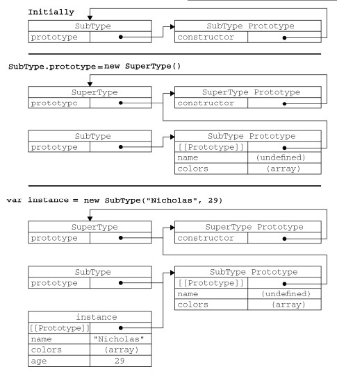

<link rel="stylesheet" href="./css/layout.css" type="text/css" />
# 面向对象的程序设计 #

*	[理解对象](#6.1)
	*	[属性类型](#6.1.1)
	*	[定义多个属性](#6.1.2)
	*	[读取属性的特性](#6.1.3)
*	[创建对象](#6.2)
	*	[工厂模式](#6.2.1)
	*	[构造函数模式](#6.2.2)
	*	[原型模式](#6.2.3)
	*	[组合使用构造函数模式和原型模式](#6.2.4)
	*	[动态原型模式](#6.2.5)
	*	[寄生构造函数模式](#6.2.6)
	*	[稳妥构造函数模式](#6.2.7)
*	[继承](#6.3)
	*	[原型链](#6.3.1)
	*	[借用构造函数](#6.3.2)
	*	[组合继承](#6.3.3)
	*	[原型式继承](#6.3.4)
	*	[寄生式继承](#6.3.5)
	*	[寄生组合式继承](#6.3.6)

说到OO，标志性的概念就是类，而前面多次提到js没有类，只有对象。

js把对象定义为：“无序属性的集合，其属性可以包含基本值、对象或者函数。”严格来讲，
这就相当于说对象是一组没有特定顺序的值。对象的每个属性或方法都有一个名字，而每个名字都映射
到一个值。

正因如此，js的对象可以看成一个散列表，无非就是键值对，键作名，值可以是数据或函数而已。

<h2 id="6.1">理解对象</h2>
常见的代码：

	var person = new Object();
	person.name = "Nicholas";
	person.age = 29;
	person.job = "Software Engineer";
	person.sayName = function(){
		alert(this.name);
	};

person有三个属性，一个方法。早期的创建对象都是用这种模式。后来，为了体现OO，字面量语法的创建成为了主流：

	var person = {
		name: "Nicholas",
		age: 29,
		job: "Software Engineer",

		sayName: function(){
			alert(this.name);
		}
	};

<h3 id="6.1.1">属性类型</h3>
ECMA-262定义了内部供javascript引擎使用的特性，用来描述属性的特征。javascript不能直接访问它们，规范把这些内部的特性放在两对方括号中。

属性分两种，数据属性和访问器属性。

1.数据属性

数据属性包含一个数据值的位置。在这个位置可以读取和写入值。

描述行为的四种特性：

-	[[Configurable]]：表示能否通过delete 删除属性从而重新定义属性，能否修改属性的特性，或者能否把属性修改为访问器属性。像前面例子中那样直接在对象上定义的属性，它们的这个特性默认值为true。
-	[[Enumerable]]：表示能否通过for-in 循环返回属性。像前面例子中那样直接在对象上定义的属性，它们的这个特性默认值为true。
-	[[Writable]]：表示能否修改属性的值。像前面例子中那样直接在对象上定义的属性，它们的这个特性默认值为true。
-	[[Value]]：包含这个属性的数据值。读取属性值的时候，从这个位置读；写入属性值的时候，把新值保存在这个位置。这个特性的默认值为undefined。

对于像前面例子中那样直接在对象上定义的属性，它们的[[Configurable]]、[[Enumerable]]
和[[Writable]]特性都被设置为true，而[[Value]]特性被设置为指定的值。

	var person = {
		name: "Nicholas"
	};

这里创建了一个名为name 的属性，为它指定的值是"Nicholas"。也就是说，[[Value]]特性将
被设置为"Nicholas"，而对这个值的任何修改都将反映在这个位置。

要修改属性默认的特性，必须使用ECMAScript 5 的Object.defineProperty()方法。这个方法
接收三个参数：属性所在的对象、属性的名字和一个描述符对象。其中，描述符（descriptor）对象的属
性必须是：configurable、enumerable、writable 和value。设置其中的一或多个值，可以修改
对应的特性值。
	
	var person = {};
	Object.defineProperty(person, "name", {
		writable: false,
		value: "Nicholas"
	});

	alert(person.name); //"Nicholas"
	person.name = "Greg";
	alert(person.name); //"Nicholas"

这个例子创建了一个名为name 的属性，它的值"Nicholas"是只读的。这个属性的值是不可修改
的，如果尝试为它指定新值，则在非严格模式下，赋值操作将被忽略；在严格模式下，赋值操作将会导
致抛出错误。

	var person = {};
	Object.defineProperty(person, "name", {
		configurable: false,
		value: "Nicholas"
	});

	alert(person.name); //"Nicholas"
	delete person.name;
	alert(person.name); //"Nicholas"

把configurable 设置为false，表示不能从对象中删除属性。如果对这个属性调用delete，则
在非严格模式下什么也不会发生，而在严格模式下会导致错误。而且，一旦把属性定义为不可配置的，
就不能再把它变回可配置了。此时，再调用Object.defineProperty()方法修改除writable 之外
的特性，都会导致错误。

也就是说，可以多次调用Object.defineProperty()方法修改同一个属性，但在把configurable
特性设置为false 之后就会有限制了。

在调用Object.defineProperty()方法时，如果不指定，configurable、enumerable 和
writable 特性的默认值都是false。多数情况下，可能都没有必要利用Object.defineProperty()
方法提供的这些高级功能。

>我是从来没用过这些高级功能。。。

2.访问器属性
访问器属性不包含数据值；它们包含一对儿getter 和setter 函数（不过，这两个函数都不是必需的）。
在读取访问器属性时，会调用getter 函数，这个函数负责返回有效的值；在写入访问器属性时，会调用
setter 函数并传入新值，这个函数负责决定如何处理数据。

访问器属性有如下4 个特性：

-	[[Configurable]]：表示能否通过delete 删除属性从而重新定义属性，能否修改属性的特性，或者能否把属性修改为数据属性。对于直接在对象上定义的属性，这个特性的默认值为true。
-	[[Enumerable]]：表示能否通过for-in 循环返回属性。对于直接在对象上定义的属性，这个特性的默认值为true。
-	[[Get]]：在读取属性时调用的函数。默认值为undefined。
-	[[Set]]：在写入属性时调用的函数。默认值为undefined。

访问器属性不能直接定义，必须使用Object.defineProperty()来定义。

	var book = {
		_year: 2004,
		edition: 1
	};

	Object.defineProperty(book, "year", {
		get: function(){
			return this._year;
		},
		set: function(newValue){
			if (newValue > 2004) {
				this._year = newValue;
				this.edition += newValue - 2004;
			}
		}
	});

	book.year = 2005;
	alert(book.edition); //2

以上代码创建了一个book 对象，并给它定义两个默认的属性：`_year` 和edition。`_year` 前面
的下划线是一种常用的记号，用于表示只能通过对象方法访问的属性。而访问器属性year 则包含一个
getter 函数和一个setter 函数。getter 函数返回`_year` 的值，setter 函数通过计算来确定正确的版本。因此，把year 属性修改为2005 会导致`_year` 变成 2005，而edition 变为2。这是使用访问器属性的常见方式，即设置一个属性的值会导致其他属性发生变化。

不一定非要同时指定getter 和setter。只指定getter 意味着属性是不能写，尝试写入属性会被忽略。非严格忽略，严格异常。只指定setter 函数的属性也不能读，非严格undefined，严格异常。

<h3 id="6.1.2">定义多个属性</h3>
由于为对象定义多个属性的可能性很大，ECMAScript 5 又定义了一个Object.defineProperties()
方法。利用这个方法可以通过描述符一次定义多个属性。这个方法接收两个对象参数：第一个对象是要添加和修改其属性的对象，第二个对象的属性与第一个对象中要添加或修改的属性一一对应。

	var book = {};
	Object.defineProperties(book, {
		_year: {
			value: 2004
		},

		edition: {
			value: 1
		},
	
		year: {
			get: function(){
				return this._year;
			},
			set: function(newValue){
				if (newValue > 2004) {
					this._year = newValue;
					this.edition += newValue - 2004;
				}
			}
		}
	});

<h3 id="6.1.3">读取属性的特性</h3>
Object.getOwnPropertyDescriptor()方法，可以取得给定属性的描述符。这个方法接收两个参数：属性所在的对象和要读取其描述符的属性名称。返回值是一个对象，如果是访问器属性，这个对象的属性有configurable、enumerable、get 和set；如果是数据属性，这个对象的属性有configurable、enumerable、writable 和value。

	var book = {};

	Object.defineProperties(book, {
		_year: {
			value: 2004
		},

		edition: {
			value: 1
		},

		year: {
			get: function(){
				return this._year;
			},

			set: function(newValue){
				if (newValue > 2004) {
					this._year = newValue;
					this.edition += newValue - 2004;
				}
			}
		}
	});

	var descriptor = Object.getOwnPropertyDescriptor(book, "_year");
	alert(descriptor.value); //2004
	alert(descriptor.configurable); //false
	alert(typeof descriptor.get); //"undefined"

	var descriptor = Object.getOwnPropertyDescriptor(book, "year");
	alert(descriptor.value); //undefined
	alert(descriptor.enumerable); //false
	alert(typeof descriptor.get); //"function"

<h2 id="6.2">创建对象</h2>
Object构造函数或者字面量创建单个对象，在大工程上会产生大量重复代码，引入了工厂模式的变体。

<h3 id="6.2.1">工厂模式</h3>
Js没有类，于是我们用这样的封装来代替：

	function createPerson(name, age, job){
		var o = new Object();
		o.name = name;
		o.age = age;
		o.job = job;
		o.sayName = function(){
			alert(this.name);
		};
		return o;
	}

	var person1 = createPerson("Nicholas",29,"Software Engineer");
	var person2 = createPerson("Greg", 27, "Doctor");

工厂模式虽然解决了创建多个相似对象的问题，但却没有解决对象识别的问题（即怎样知道一个对象的类型）。

<h3 id="6.2.2">构造函数模式</h3>
创建自定义的构造函数：

	function Person(name, age, job){
		this.name = name;
		this.age = age;
		this.job = job;
		this.sayName = function(){
			alert(this.name);
		};
	}

	var person1 = new Person("Nicholas", 29, "Software Engineer");
	var person2 = new Person("Greg", 27, "Doctor");

要创建Person 的新实例，必须使用new 操作符。以这种方式调用构造函数实际上会经历以下4
个步骤：

1. 创建一个新对象；
2.  将构造函数的作用域赋给新对象（因此this 就指向了这个新对象）；
3.  执行构造函数中的代码（为这个新对象添加属性）；
4.  返回新对象。

person1 和person2 分别保存着Person 的一个不同的实例。这两个对象都有一个constructor（构造函数）属性，该属性指向Person。

	alert(person1.constructor == Person); //true
	alert(person2.constructor == Person); //true

创建自定义的构造函数意味着将来可以将它的实例标识为一种特定的类型；而这正是构造函数模式
胜过工厂模式的地方。
	
	alert(person1 instanceof Object); //true
	alert(person1 instanceof Person); //true
	alert(person2 instanceof Object); //true
	alert(person2 instanceof Person); //true

> 之所以person1 instanceof Object是true是因为Person从Object继承。

**构造函数与其他函数的唯一区别，就在于调用它们的方式不同。**
	
	// 当作构造函数使用
	var person = new Person("Nicholas", 29, "Software Engineer");
	person.sayName(); //"Nicholas"

	// 作为普通函数调用
	Person("Greg", 27, "Doctor"); // 添加到window
	window.sayName(); //"Greg"

	// 在另一个对象的作用域中调用
	var o = new Object();
	Person.call(o, "Kristen", 25, "Nurse");
	o.sayName(); //"Kristen"

另一个问题就是每个Person 实例都包含一个不同的Function 实例（以显示name 属性）的本质。

	alert(person1.sayName == person2.sayName); //false

然而我们有恰当的解决办法：

	function Person(name, age, job){
		this.name = name;
		this.age = age;
		this.job = job;
		this.sayName = sayName;
	}

	function sayName(){
		alert(this.name);
	}

	var person1 = new Person("Nicholas", 29, "Software Engineer");
	var person2 = new Person("Greg", 27, "Doctor");

新问题又来了：在全局作用域中定义的函数实际上只能被某个对象调用，这让全局作用域有点名不副实。而更让人无法接受的是：如果对象需要定义很多方法，那么就要定义很多个全局函数，于是我们这个自定义的引用类型就丝毫没有封装性可言了。好在，这些问题可以通过使用原型模式来解决。

<h3 id="6.2.3">原型模式</h3>
我们创建的每个函数都有一个prototype（原型）属性，这个属性是一个指针，指向一个对象，而这个对象的用途是包含可以由特定类型的所有实例共享的属性和方法。

说白了，就是不用在构造函数中定义对象实例的信息，将信息直接添到原型对象prototype就行了。
	
	function Person(){
	}

	Person.prototype.name = "Nicholas";
	Person.prototype.age = 29;
	Person.prototype.job = "Software Engineer";
	Person.prototype.sayName = function(){
		alert(this.name);
	};

	var person1 = new Person();
	person1.sayName(); //"Nicholas"

	var person2 = new Person();
	person2.sayName(); //"Nicholas"

	alert(person1.sayName == person2.sayName); //true

sayName()方法和所有属性直接添加到了Person 的prototype 属性中，构造函数
变成了空函数。即使如此，也仍然可以通过调用构造函数来创建新对象，而且新对象还会具有相同的属
性和方法。但与构造函数模式不同的是，新对象的这些属性和方法是由所有实例共享的。

**person1 和person2 访问的都是同一组属性和同一个sayName()函数。**

为什么是这样？我第一次见到prototype时就为这个问题而发蒙！

首先，我们来了解原型对象。

无论什么时候，只要创建了一个新函数，就会根据一组特定的规则为该函数创建一个prototype属性，这个属性指向函数的原型对象。默认情况下，所有原型对象都会自动获得一个constructor（构造函数）属性，这个属性包含一个指向prototype 属性所在函数的指针。

就拿前面的例子来说，Person.prototype.constructor 指向Person。而通过这个构造函数，我们还可继续为原型对象添加其他属性和方法。

创建了自定义的构造函数之后，其原型对象默认只会取得constructor 属性；至于其他方法，则
都是从Object 继承而来的。当调用构造函数创建一个新实例后，该实例的内部将包含一个指针（内部
属性），指向构造函数的原型对象，这个指针叫[[Prototype]]。

**这个连接存在于实例与构造函数的原型对象之间，而不是存在于实例与构造函数之间。**

如果你还没懂，来，一图胜前言！

虽然可以通过对象实例访问保存在原型中的值，但却不能通过对象实例重写原型中的值。如果我们
在实例中添加了一个属性，而该属性与实例原型中的一个属性同名，那我们就在实例中创建该属性，该
属性将会屏蔽原型中的那个属性。

	function Person(){
	}

	Person.prototype.name = "Nicholas";
	Person.prototype.age = 29;
	Person.prototype.job = "Software Engineer";
	Person.prototype.sayName = function(){
		alert(this.name);
	};

	var person1 = new Person();
	var person2 = new Person();
	person1.name = "Greg";
	alert(person1.name); //"Greg"——来自实例
	alert(person2.name); //"Nicholas"——来自原型

更进一步：

	delete person1.name;
	alert(person1.name); //"Nicholas"——来自原型

使用hasOwnProperty()方法可以检测一个属性是存在于实例中，还是存在于原型中。这个方法（不
要忘了它是从Object 继承来的）只在给定属性存在于对象实例中时，才会返回true。

	var person1 = new Person();
	var person2 = new Person();

	alert(person1.hasOwnProperty("name")); //false

	person1.name = "Greg";
	alert(person1.name); //"Greg"——来自实例
	alert(person1.hasOwnProperty("name")); //true

	alert(person2.name); //"Nicholas"——来自原型
	alert(person2.hasOwnProperty("name")); //false

	delete person1.name;
	alert(person1.name); //"Nicholas"——来自原型
	alert(person1.hasOwnProperty("name")); //false

----------

你应该懂了前面的“矛盾”，再来看原型与in操作符。

有两种方式使用in 操作符：单独使用和在for-in 循环中使用。在单独使用时，in 操作符会在通
过对象能够访问给定属性时返回true，无论该属性存在于实例中还是原型中。

	function Person(){
	}
	
	Person.prototype.name = "Nicholas";
	Person.prototype.age = 29;
	Person.prototype.job = "Software Engineer";
	Person.prototype.sayName = function(){
		alert(this.name);
	};

	var person1 = new Person();
	var person2 = new Person();

	alert(person1.hasOwnProperty("name")); //false
	alert("name" in person1); //true

	person1.name = "Greg";
	alert(person1.name); //"Greg" ——来自实例
	alert(person1.hasOwnProperty("name")); //true
	alert("name" in person1); //true

	alert(person2.name); //"Nicholas" ——来自原型
	alert(person2.hasOwnProperty("name")); //false
	alert("name" in person2); //true

	delete person1.name;
	alert(person1.name); //"Nicholas" ——来自原型
	alert(person1.hasOwnProperty("name")); //false
	alert("name" in person1); //true

因此，同时使用hasOwnProperty()方法和in 操作符，就可以确定该属性到底是存在于对象中，还是存在于原型中。

	function hasPrototypeProperty(object, name){
		return !object.hasOwnProperty(name) && (name in object);
	}

	var person = new Person();
	alert(hasPrototypeProperty(person, "name")); //true
	person.name = "Greg";
	alert(hasPrototypeProperty(person, "name")); //false

要取得对象上所有可枚举的实例属性，可以使用ECMAScript 5 的Object.keys()方法。这个方法
接收一个对象作为参数，返回一个包含所有可枚举属性的字符串数组。

	function Person(){
	}

	Person.prototype.name = "Nicholas";
	Person.prototype.age = 29;
	Person.prototype.job = "Software Engineer";
	Person.prototype.sayName = function(){
		alert(this.name);
	};

	var keys = Object.keys(Person.prototype);
	alert(keys); //"name,age,job,sayName"

	var p1 = new Person();
	p1.name = "Rob";
	p1.age = 31;
	var p1keys = Object.keys(p1);
	alert(p1keys); //"name,age"

如果你想要得到所有实例属性，无论它是否可枚举，都可以使用Object.getOwnPropertyNames()方法。

	var keys = Object.getOwnPropertyNames(Person.prototype);
	alert(keys); //"constructor,name,age,job,sayName"

----------

好了，彻底看懂prototype原型对象了，下面的问题就是我们每次添加属性方法就要写一遍Person.prototype，麻烦的一笔。为此，做的清爽一些：

	function Person(){
	}
	
	Person.prototype = {
		//constructor : Person,
		name : "Nicholas",
		age : 29,
		job: "Software Engineer",
		sayName : function () {
			alert(this.name);
		}
	};

当然这样相当于重定义了prototype对象，默认的constructor属性就不再指向Person了。当然，如果很重要，可以自己把这个属性额外加上，如同上面注释的那行。如果想更完美：
	
	//重设构造函数，只适用于ECMAScript 5 兼容的浏览器
	Object.defineProperty(Person.prototype, "constructor", {
		enumerable: false,
		value: Person
	});

**原型模式有个好处，已存在对象因关联的原型对象改变而会改变。**

	var friend = new Person();

	Person.prototype.sayHi = function(){
		alert("hi");
	};

	friend.sayHi(); //"hi"（没有问题！）

添加固然没有问题，但是如果重写整个prototype对象就有毒了：

	function Person(){
	}

	var friend = new Person();

	Person.prototype = {
		constructor: Person,
		name : "Nicholas",
		age : 29,
		job : "Software Engineer",
		sayName : function () {
			alert(this.name);
		}
	};

	friend.sayName(); //error

----------

原型模式的重要性不仅体现在创建自定义类型方面，就连所有原生的引用类型，都是采用这种模式
创建的。所有原生引用类型（Object、Array、String，等等）都在其构造函数的原型上定义了方法。
例如，在Array.prototype 中可以找到sort()方法，而在String.prototype 中可以找到
substring()方法。

通过原生对象的原型，不仅可以取得所有默认方法的引用，而且也可以定义新方法。可以像修改自
定义对象的原型一样修改原生对象的原型，因此可以随时添加方法。

	String.prototype.startsWith = function (text) {
		return this.indexOf(text) == 0;
	};

	var msg = "Hello world!";
	alert(msg.startsWith("Hello")); //true

然而，这种修改原生对象的原型，技术上我们是承认的，但是我们并不推荐。

----------

原型模式也不是没有缺点。首先，它省略了为构造函数传递初始化参数这一环节，结果所有实例在
默认情况下都将取得相同的属性值。虽然这会在某种程度上带来一些不方便，但还不是原型的最大问题。
原型模式的最大问题是由其共享的本性所导致的。

原型中所有属性是被很多实例共享的，这种共享对于函数非常合适。对于那些包含基本值的属性倒
也说得过去，毕竟（如前面的例子所示），通过在实例上添加一个同名属性，可以隐藏原型中的对应属
性。然而，对于包含引用类型值的属性来说，问题就比较突出了。
	
	function Person(){
	}
	
	Person.prototype = {
		constructor: Person,
		name : "Nicholas",
		age : 29,
		job : "Software Engineer",
		friends : ["Shelby", "Court"],
		sayName : function () {
			alert(this.name);
		}
	};

	var person1 = new Person();
	var person2 = new Person();

	person1.friends.push("Van");

	alert(person1.friends); //"Shelby,Court,Van"
	alert(person2.friends); //"Shelby,Court,Van"
	alert(person1.friends === person2.friends); //true

共享引用类型值的属性，damn!

<h3 id="6.2.4">组合使用构造函数模式和原型模式</h3>
创建自定义类型的最常见方式，就是组合使用构造函数模式与原型模式。构造函数模式用于定义实
例属性，而原型模式用于定义方法和共享的属性。。结果，每个实例都会有自己的一份实例属性的副本，
但同时又共享着对方法的引用，最大限度地节省了内存。另外，这种混成模式还支持向构造函数传递参
数；可谓是集两种模式之长。

	function Person(name, age, job){
		this.name = name;
		this.age = age;
		this.job = job;
		this.friends = ["Shelby", "Court"];
	}

	Person.prototype = {
		constructor : Person,
		sayName : function(){
			alert(this.name);
		}
	}

	var person1 = new Person("Nicholas", 29, "Software Engineer");
	var person2 = new Person("Greg", 27, "Doctor");

	person1.friends.push("Van");
	alert(person1.friends); //"Shelby,Count,Van"
	alert(person2.friends); //"Shelby,Count"
	alert(person1.friends === person2.friends); //false
	alert(person1.sayName === person2.sayName); //true

这种构造函数与原型混成的模式，是目前在ECMAScript 中使用最广泛、认同度最高的一种创建自定义类型的方法。

<h3 id="6.2.5">动态原型模式</h3>
动态原型模式把所有信息都封装在了构造函数中，而通过在构造函数中初始化原型，又保持了同时使用构造函数和原型的优点。

	function Person(name, age, job){
		//属性
		this.name = name;
		this.age = age;
		this.job = job;
	
		//方法
		if (typeof this.sayName != "function"){
			Person.prototype.sayName = function(){
				alert(this.name);
			};
		}
	}

	var friend = new Person("Nicholas", 29, "Software Engineer");
	friend.sayName();

注意构造函数代码中加粗的部分。这里只在sayName()方法不存在的情况下，才会将它添加到原
型中。这段代码只会在初次调用构造函数时才会执行。此后，原型已经完成初始化，不需要再做什么修
改了。不过要记住，这里对原型所做的修改，能够立即在所有实例中得到反映。因此，这种方法确实可
以说非常完美。其中，if 语句检查的可以是初始化之后应该存在的任何属性或方法——不必用一大堆
if 语句检查每个属性和每个方法；只要检查其中一个即可。对于采用这种模式创建的对象，还可以使
用instanceof 操作符确定它的类型。

<h3 id="6.2.6">寄生构造函数模式</h3>
通常，在前述的几种模式都不适用的情况下，可以使用寄生（parasitic）构造函数模式。这种模式
的基本思想是创建一个函数，该函数的作用仅仅是封装创建对象的代码，然后再返回新创建的对象；但
从表面上看，这个函数又很像是典型的构造函数。
	
	function Person(name, age, job){
		var o = new Object();
		o.name = name;
		o.age = age;
		o.job = job;
		o.sayName = function(){
			alert(this.name);
		};
		return o;
	}

	var friend = new Person("Nicholas", 29, "Software Engineer");
	friend.sayName(); //"Nicholas"
除了使用new 操作符并把使用的包装函数叫做构造函数之外，这个模式跟工厂模式其实
是一模一样的。构造函数在不返回值的情况下，默认会返回新对象实例。而通过在构造函数的末尾添加一个return 语句，可以重写调用构造函数时返回的值。

这个模式可以在特殊的情况下用来为对象创建构造函数。

假设我们想创建一个具有额外方法的特殊数组。由于不能直接修改Array 构造函数，因此可以使用这个模式。

	function SpecialArray(){
		//创建数组
		var values = new Array();
		//添加值
		values.push.apply(values, arguments);
		//添加方法
		values.toPipedString = function(){
			return this.join("|");
		};
		//返回数组
		return values;
	}
	var colors = new SpecialArray("red", "blue", "green");
	alert(colors.toPipedString()); //"red|blue|green"

关于寄生构造函数模式，有一点需要说明：首先，返回的对象与构造函数或者与构造函数的原型属
性之间没有关系；也就是说，构造函数返回的对象与在构造函数外部创建的对象没有什么不同。为此，
不能依赖instanceof 操作符来确定对象类型。由于存在上述问题，我们建议在可以使用其他模式的情
况下，不要使用这种模式。

<h3 id="6.2.7">稳妥构造函数模式</h3>
所谓稳妥对象，指的是没有公共属性，而且其方法也不引用this 的对象。

稳妥对象最适合在一些安全的环境中（这些环境中会禁止使用this 和new），或者在防止数据被其他应用程序（如Mashup程序）改动时使用。

稳妥构造函数遵循与寄生构造函数类似的模式，但有两点不同：一是新创建对象的实例方法不引用this；二是不使用new 操作符调用构造函数。

	function Person(name, age, job){
		//创建要返回的对象
		var o = new Object();
		//可以在这里定义私有变量和函数
		//添加方法
		o.sayName = function(){
			alert(name);
		};
		//返回对象
		return o;
	}

	var friend = Person("Nicholas", 29, "Software Engineer");
	friend.sayName(); //"Nicholas"

在以这种模式创建的对象中，除了使用sayName()方法之外，没有其他办法访问name 的值。

>与寄生构造函数模式类似，使用稳妥构造函数模式创建的对象与构造函数之间也没有什么关系，因此instanceof 操作符对这种对象也没有意义。

<h2 id="6.3">继承</h2>
OO中津津乐道的概念之一，js的继承是继承实际的主要方法，依靠原型链来实现。

<h3 id="6.3.1">原型链</h3>
**基本思想是利用原型让一个引用类型继承另一个引用类型的属性和方法。**

我们知道，每个构造函数都有个原型对象prototype，而原型对象都包含一个指向构造函数的指针constructor。每个实例都包含一个指向原型对象的内部指针。那么，假如我们让原型对象等于另一个类型的实例，结果会如何？显然，此时的原型对象将包含一个指向另一个原型的指针，相应的递归下去，就构成了实例与原型的链。

	function SuperType(){
		this.property = true;
	}

	SuperType.prototype.getSuperValue = function(){
		return this.property;
	};

	function SubType(){
		this.subproperty = false;
	}

	//继承了SuperType
	SubType.prototype = new SuperType();

	SubType.prototype.getSubValue = function (){
		return this.subproperty;
	};

	var instance = new SubType();
	alert(instance.getSuperValue()); //true

一图胜千言：

事实上，前面例子中展示的原型链还少一环。我们知道，所有引用类型默认都继承了Object，而
这个继承也是通过原型链实现的。

可以通过两种方式来确定原型和实例之间的关系。第一种方式是使用instanceof 操作符，只要用
这个操作符来测试实例与原型链中出现过的构造函数，结果就会返回true。

	alert(instance instanceof Object); //true
	alert(instance instanceof SuperType); //true
	alert(instance instanceof SubType); //true

第二种方式是使用isPrototypeOf()方法。同样，只要是原型链中出现过的原型，都可以说是该
原型链所派生的实例的原型，因此isPrototypeOf()方法也会返回true。

	alert(Object.prototype.isPrototypeOf(instance)); //true
	alert(SuperType.prototype.isPrototypeOf(instance)); //true
	alert(SubType.prototype.isPrototypeOf(instance)); //true

子类型有时候需要重写超类型中的某个方法，或者需要添加超类型中不存在的某个方法。但不管怎
样，给原型添加方法的代码一定要放在替换原型的语句之后。

	function SuperType(){
		this.property = true;
	}

	SuperType.prototype.getSuperValue = function(){
		return this.property;
	};

	function SubType(){
		this.subproperty = false;
	}

	//继承了SuperType
	SubType.prototype = new SuperType();

	//添加新方法
	SubType.prototype.getSubValue = function (){
		return this.subproperty;
	};

	//重写超类型中的方法
	SubType.prototype.getSuperValue = function (){
		return false;
	};

	var instance = new SubType();
	alert(instance.getSuperValue()); //false

>getSuperValue()是原型链中已经存在的一个方法，但重写这个方法将会屏蔽原来的
那个方法。换句话说，当通过SubType 的实例调用getSuperValue()时，调用的就是这个重新定义
的方法；但通过SuperType 的实例调用getSuperValue()时，还会继续调用原来的那个方法。这里
要格外注意的是，必须在用SuperType 的实例替换原型之后，再定义这两个方法。

还有一点需要提醒，即在通过原型链实现继承时，不能使用对象字面量创建原型方法。因为这
样做就会重写原型链。

	function SuperType(){
		this.property = true;
	}

	SuperType.prototype.getSuperValue = function(){
		return this.property;
	};

	function SubType(){
		this.subproperty = false;
	}

	//继承了SuperType
	SubType.prototype = new SuperType();

	//使用字面量添加新方法，会导致上一行代码无效
	SubType.prototype = {
		getSubValue : function (){
			return this.subproperty;
		},

		someOtherMethod : function (){
			return false;
		}
	};

	var instance = new SubType();
	alert(instance.getSuperValue()); //error!

----------

原型链虽然很强大，可以用它来实现继承，但它也存在一些问题。其中，最主要的问题来自包含引
用类型值的原型。想必大家还记得，我们前面介绍过包含引用类型值的原型属性会被所有实例共享；而
这也正是为什么要在构造函数中，而不是在原型对象中定义属性的原因。在通过原型来实现继承时，原
型实际上会变成另一个类型的实例。于是，原先的实例属性也就顺理成章地变成了现在的原型属性了。

	function SuperType(){
		this.colors = ["red", "blue", "green"];
	}
	
	function SubType(){
	}
	
	//继承了SuperType
	SubType.prototype = new SuperType();

	var instance1 = new SubType();
	instance1.colors.push("black");
	alert(instance1.colors); //"red,blue,green,black"

	var instance2 = new SubType();
	alert(instance2.colors); //"red,blue,green,black"

原型链的第二个问题是：在创建子类型的实例时，不能向超类型的构造函数中传递参数。实际上，
应该说是没有办法在不影响所有对象实例的情况下，给超类型的构造函数传递参数。有鉴于此，再加上
前面刚刚讨论过的由于原型中包含引用类型值所带来的问题，实践中很少会单独使用原型链。

<h3 id="6.3.2">借用构造函数</h3>
为了避开原型中包含引用类型值的问题，借用构造函数技术开始兴起（也叫伪造对象或经典继承）。

这种技术的基本思想相当简单，即在子类型构造函数的内部调用超类型构造函数。

	function SuperType(){
		this.colors = ["red", "blue", "green"];
	}

	function SubType(){
		//继承了SuperType
		SuperType.call(this);
	}

	var instance1 = new SubType();
	instance1.colors.push("black");
	alert(instance1.colors); //"red,blue,green,black"

	var instance2 = new SubType();
	alert(instance2.colors); //"red,blue,green"

通过使用call()方法（或apply()方法也可以），我们实际上是在（未来将要）新创建的SubType 实例的环境下调用了SuperType 构造函数。

这样一来，就会在新SubType 对象上执行SuperType()函数中定义的所有对象初始化代码。结果，
SubType 的每个实例就都会具有自己的colors 属性的副本了。

----------

相对于原型链而言，借用构造函数有一个很大的优势，即可以在子类型构造函数中向超类型构造函
数传递参数。

	function SuperType(name){
		this.name = name;
	}

	function SubType(){
		//继承了SuperType，同时还传递了参数
		SuperType.call(this, "Nicholas");
		//实例属性
		this.age = 29;
	}

	var instance = new SubType();
	alert(instance.name); //"Nicholas";
	alert(instance.age); //29

----------

如果仅仅是借用构造函数，那么也将无法避免构造函数模式存在的问题——方法都在构造函数中定
义，因此函数复用就无从谈起了。而且，在超类型的原型中定义的方法，对子类型而言也是不可见的，结
果所有类型都只能使用构造函数模式。考虑到这些问题，借用构造函数的技术也是很少单独使用的。

<h3 id="6.3.3">组合继承</h3>
也叫伪经典继承,是将原型链和借用构造函数的技术组合到一块，从而发挥二者之长的一种继承模式。

思路是使用原型链实现对原型属性和方法的继承，而通过借用构造函数来实现对实例属性的继承。这样，既通过在原型上定义方法实现了函数复用，又能够保证每个实例都有它自己的属性。

	function SuperType(name){
		this.name = name;
		this.colors = ["red", "blue", "green"];
	}

	SuperType.prototype.sayName = function(){
		alert(this.name);
	};

	function SubType(name, age){
		//继承属性
		SuperType.call(this, name);
		this.age = age;
	}

	//继承方法
	SubType.prototype = new SuperType();
	SubType.prototype.constructor = SubType;
	SubType.prototype.sayAge = function(){
		alert(this.age);
	};

	var instance1 = new SubType("Nicholas", 29);
	instance1.colors.push("black");
	alert(instance1.colors); //"red,blue,green,black"
	instance1.sayName(); //"Nicholas";
	instance1.sayAge(); //29

	var instance2 = new SubType("Greg", 27);
	alert(instance2.colors); //"red,blue,green"
	instance2.sayName(); //"Greg";
	instance2.sayAge(); //27

实例的属性覆盖了原型属性中因构造函数而融入的属性，完美解决，KO！

<h3 id="6.3.4">原型式继承</h3>
借助原型可以基于已有的对象创建新对象，同时还不必因此创建自定义类型。

	function object(o){
		function F(){}
		F.prototype = o;
		return new F();
	}

在object()函数内部，先创建了一个临时性的构造函数，然后将传入的对象作为这个构造函数的原型，最后返回了这个临时类型的一个新实例。object()对传入其中的对象做了一次浅拷贝。

	var person = {
		name: "Nicholas",
		friends: ["Shelby", "Court", "Van"]
	};

	var anotherPerson = object(person);
	anotherPerson.name = "Greg";
	anotherPerson.friends.push("Rob");

	var yetAnotherPerson = object(person);
	yetAnotherPerson.name = "Linda";
	yetAnotherPerson.friends.push("Barbie");

	alert(person.friends); //"Shelby,Court,Van,Rob,Barbie"

ECMAScript 5 通过新增Object.create()方法规范化了原型式继承。这个方法接收两个参数：一
个用作新对象原型的对象和（可选的）一个为新对象定义额外属性的对象。在传入一个参数的情况下，
Object.create()与object()方法的行为相同。

	var person = {
		name: "Nicholas",
		friends: ["Shelby", "Court", "Van"]
	};

	var anotherPerson = Object.create(person);
	anotherPerson.name = "Greg";
	anotherPerson.friends.push("Rob");

	var yetAnotherPerson = Object.create(person);
	yetAnotherPerson.name = "Linda";
	yetAnotherPerson.friends.push("Barbie");

	alert(person.friends); //"Shelby,Court,Van,Rob,Barbie"

Object.create()方法的第二个参数与Object.defineProperties()方法的第二个参数格式相
同：每个属性都是通过自己的描述符定义的。以这种方式指定的任何属性都会覆盖原型对象上的同名属
性。

	var person = {
		name: "Nicholas",
		friends: ["Shelby", "Court", "Van"]
	};

	var anotherPerson = Object.create(person, {
		name: {
			value: "Greg"
		}
	});

	alert(anotherPerson.name); //"Greg"

<h3 id="6.3.5">寄生式继承</h3>
寄生式（parasitic）继承是与原型式继承紧密相关的一种思路。寄生式继承的思路与寄生构造函数和工厂模式类似，即创建一个仅用于封装继承过程的函数，该函数在内部以某种方式来增强对象，最后再像真地是它做了所有工作一样返回对象。

	function createAnother(original){
		var clone = object(original); 	//通过调用函数创建一个新对象
		clone.sayHi = function(){ 		//以某种方式来增强这个对象
			alert("hi");
		};
		return clone; 					//返回这个对象
	}

	var person = {
		name: "Nicholas",
		friends: ["Shelby", "Court", "Van"]
	};

	var anotherPerson = createAnother(person);
	anotherPerson.sayHi(); //"hi"

新对象不仅具有person的所有属性和方法，而且还有自己的sayHi()方法。

>使用寄生式继承来为对象添加函数，会由于不能做到函数复用而降低效率；这一
点与构造函数模式类似。

<h3 id="6.3.6">寄生组合式继承</h3>
组合继承是JavaScript 最常用的继承模式；不过，它也有自己的不足。组合继承最大的问题就是无论什么情况下，都会调用两次超类型构造函数：一次是在创建子类型原型的时候，另一次是在子类型构造函数内部。

没错，子类型最终会包含超类型对象的全部实例属性，但我们不得不在调用子类型构造函数时重写这些属性。

	function SuperType(name){
		this.name = name;
		this.colors = ["red", "blue", "green"];
	}

	SuperType.prototype.sayName = function(){
		alert(this.name);
	};

	function SubType(name, age){
		SuperType.call(this, name); //第二次调用SuperType()
		this.age = age;
	}

	SubType.prototype = new SuperType(); //第一次调用SuperType()
	SubType.prototype.constructor = SubType;
	SubType.prototype.sayAge = function(){
		alert(this.age);
	};

如图所示，有两组name 和colors 属性：一组在实例上，一组在SubType 原型中。这就是调用两次SuperType 构造函数的结果(调用SubType 构造函数时，又会调用一次SuperType 构造函数，这一次又在新对象上创建了实例属性name 和colors。于是，这两个属性就屏蔽了原型中的两个同名属性。)。好在我们已经找到了解决这个问题方法——寄生组合式继承。

所谓寄生组合式继承，即通过借用构造函数来继承属性，通过原型链的混成形式来继承方法。

基本思路是：不必为了指定子类型的原型而调用超类型的构造函数，我们所需要的无非就是超类型原型的一个副本而已。本质上，就是使用寄生式继承来继承超类型的原型，然后再将结果指定给子类型的原型。

	function inheritPrototype(subType, superType){
		var prototype = object(superType.prototype); 	//创建对象
		prototype.constructor = subType; 				//增强对象
		subType.prototype = prototype; 					//指定对象
	}

这个示例中的inheritPrototype()函数实现了寄生组合式继承的最简单形式。这个函数接收两
个参数：子类型构造函数和超类型构造函数。在函数内部，第一步是创建超类型原型的一个副本。第二
步是为创建的副本添加constructor 属性，从而弥补因重写原型而失去的默认的constructor 属性。
最后一步，将新创建的对象（即副本）赋值给子类型的原型。这样，我们就可以用调用inherit-
Prototype()函数的语句，去替换前面例子中为子类型原型赋值的语句了。

	function SuperType(name){
		this.name = name;
		this.colors = ["red", "blue", "green"];
	}

	SuperType.prototype.sayName = function(){
		alert(this.name);
	};

	function SubType(name, age){
		SuperType.call(this, name);
		this.age = age;
	}

	inheritPrototype(SubType, SuperType);

	SubType.prototype.sayAge = function(){
		alert(this.age);
	};

高效率体现在它只调用了一次SuperType 构造函数，并且因此避免了在SubType.prototype 上面创建不必要的、多余的属性。与此同时，原型链还能保持不变；因此，还能够正常使用instanceof 和isPrototypeOf()。

可以说，寄生组合式继承是引用类型最理想的继承范式。

4/19/2016 5:34:22 PM @author: rootkit