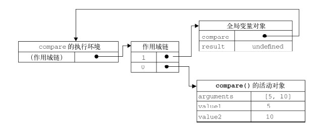
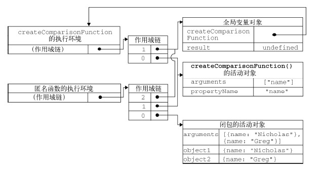

<link rel="stylesheet" href="./css/layout.css" type="text/css" />
# 函数表达式 #

*	[递归](#7.1)
*	[闭包](#7.2)
	*	[闭包与变量](#7.2.1)
	*	[关于this对象](#7.2.2)
*	[模仿块级作用域](#7.3)
*	[私有变量](#7.4)
	*	[静态私有变量](#7.4.1)
	*	[模块模式](#7.4.2)
	*	[增强的模块模式](#7.4.3)

前面已说过函数的基本内容。定义函数有两种方法：函数声明和函数表达式。

	function functionName(arg0, arg1, arg2) {
		//函数体
	}

	var functionName = function(arg0, arg1, arg2){
		//函数体
	};

后者创建的函数叫**匿名函数**。

禁忌的做法：

	//不要这样做！
	if(condition){
		function sayHi(){
			alert("Hi!");
		}
	} else {
		function sayHi(){
			alert("Yo!");
		}
	}

合理的做法：

	//可以这样做
	var sayHi;
	if(condition){
		sayHi = function(){
			alert("Hi!");
		};
	} else {
		sayHi = function(){
			alert("Yo!");
		};
	}

<h2 id="7.1">递归</h2>
递归的概念大家都懂，但是前面就已经提到过，javascript的递归函数有个问题：

	function factorial(num){
		if (num <= 1){
			return 1;
		} else {
			return num * factorial(num-1);
		}
	}
	
	var anotherFactorial = factorial;
	factorial = null;
	alert(anotherFactorial(4)); //出错！

这和C这种以函数为单位的语言不同，在factorial内部把递归调用的factorial当做一个变量来对待，当外部的代码让这个变量变为了null时，那么整个函数就崩了。

javascript当然提供了解决的补丁：

	function factorial(num){
		if (num <= 1){
			return 1;
		} else {
			return num * arguments.callee(num-1);
		}
	}

arguments.callee 是一个指向正在执行的函数的指针。

严格模式下arguments.callee是禁用的，为之奈何？

	var factorial = (function f(num){
		if (num <= 1){
			return 1;
		} else {
		return num * f(num-1);
		}
	});

命名的函数表达式完美K.O.

<h2 id="7.2">闭包</h2>
Javascript中继原型对象的第二个难点——闭包！

**闭包**是指有权访问另一个函数作用域中的变量的**函数**。

创建闭包的常见方式，就是在一个函数内部创建另一个函数。

	function createComparisonFunction(propertyName) {
		return function(object1, object2){
			var value1 = object1[propertyName];
			var value2 = object2[propertyName];

			if (value1 < value2){
				return -1;
			} else if (value1 > value2){
				return 1;
			} else {
				return 0;
			}
		};
	}

value1和value2访问了外部函数中的变量propertyName。即使这个内部函数返回了，而且在其他地方调用了，它仍然可以访问变量propertyName。而之所以能够访问这个变量，是因为内部函数作用域链中包含createComparisonFunction()的作用域。

当某个函数被调用时，会创建一个执行环境（execution context）及相应的作用域链。
然后，使用arguments 和其他命名参数的值来初始化函数的活动对象（activation object）。但在作用域链中，外部函数的活动对象始终处于第二位，外部函数的外部函数的活动对象处于第三位，……直至作为作用域链终点的全局执行环境。

在函数执行过程中，为读取和写入变量的值，就需要在作用域链中查找变量。

看这个例子：

	function compare(value1, value2){
		if (value1 < value2){
			return -1;
		} else if (value1 > value2){
			return 1;
		} else {
			return 0;
		}
	}

	var result = compare(5, 10);

以上代码先定义了compare()函数，然后又在全局作用域中调用了它。当调用compare()时，会
创建一个包含arguments、value1 和value2 的活动对象。全局执行环境的变量对象（包含result
和compare）在compare()执行环境的作用域链中则处于第二位。

状态如图：

作用域链本质上是一个指向变量对象的指针列表，它只引用但不实际包含变量对象。

无论什么时候在函数中访问一个变量时，就会从作用域链中搜索具有相应名字的变量。一般来讲，当函数执行完毕后，局部活动对象就会被销毁，内存中仅保存全局作用域，然而，闭包的差异就在于此。

在另一个函数内部定义的函数会将包含函数（即外部函数）的活动对象添加到它的作用域链中。因
此，在createComparisonFunction()函数内部定义的匿名函数的作用域链中，实际上将会包含外部
函数createComparisonFunction()的活动对象。

执行下列代码：

	var compare = createComparisonFunction("name");
	var result = compare({ name: "Nicholas" }, { name: "Greg" });

在匿名函数从createComparisonFunction()中被返回后，它的作用域链被初始化为包含createComparisonFunction()函数的活动对象和全局变量对象。这样，匿名函数就可以访问在createComparisonFunction()中定义的所有变量。更为重要的是，createComparisonFunction()函数在执行完毕后，其活动对象也不会被销毁，因为匿名函数的作用域链仍然在引用这个活动对象。换句话说，当createComparisonFunction()函数返回后，其执行环境的作用域链会被销毁，但它的活动对象仍然会留在内存中；直到匿名函数被销毁后，createComparisonFunction()的活动对象才会被销毁。
	
	//创建函数
	var compareNames = createComparisonFunction("name");
	//调用函数
	var result = compareNames({ name: "Nicholas" }, { name: "Greg" });
	//解除对匿名函数的引用（以便释放内存）
	compareNames = null;

作用域链：

>由于闭包会携带包含它的函数的作用域，因此会比其他函数占用更多的内存。过
度使用闭包可能会导致内存占用过多，我们建议读者只在绝对必要时再考虑使用闭
包。虽然像V8 等优化后的JavaScript 引擎会尝试回收被闭包占用的内存，但请大家
还是要慎重使用闭包。

<h3 id="7.2.1">闭包与变量</h3>
作用域链的这种配置机制引出了一个值得注意的副作用，即闭包只能取得包含函数中任何变量的最后一个值。别忘了闭包所保存的是整个变量对象，而不是某个特殊的变量。

	function createFunctions(){
		var result = new Array();

		for (var i=0; i < 10; i++){
			result[i] = function(){
				return i;
			};
		}

		return result;
	}

这个函数会返回一个函数数组。表面上看，似乎每个函数都应该返自己的索引值，即位置0 的函数
返回0，位置1 的函数返回1，以此类推。但实际上，每个函数都返回10。因为每个函数的作用域链中
都保存着createFunctions() 函数的活动对象， 所以它们引用的都是同一个变量i 。当
createFunctions()函数返回后，变量i 的值是10，此时每个函数都引用着保存变量i 的同一个变量
对象，所以在每个函数内部i 的值都是10。

但是，我们可以通过创建另一个匿名函数强制让闭包的行为符合预期。
	
	function createFunctions(){
		var result = new Array();

		for (var i=0; i < 10; i++){
			result[i] = function(num){
				return function(){
					return num;
				};
			}(i);
		}

		return result;
	}

在重写了前面的createFunctions()函数后，每个函数就会返回各自不同的索引值了。在这个版
本中，我们没有直接把闭包赋值给数组，而是定义了一个匿名函数，并将立即执行该匿名函数的结果赋
给数组。这里的匿名函数有一个参数num，也就是最终的函数要返回的值。在调用每个匿名函数时，我
们传入了变量i。由于函数参数是按值传递的，所以就会将变量i 的当前值复制给参数num。而在这个
匿名函数内部，又创建并返回了一个访问num 的闭包。这样一来，result 数组中的每个函数都有自己
num 变量的一个副本，因此就可以返回各自不同的数值了。

<h3 id="7.2.2">关于this对象</h3>
在闭包中使用this 对象也可能会导致一些问题。我们知道，this 对象是在运行时基于函数的执
行环境绑定的：在全局函数中，this 等于window，而当函数被作为某个对象的方法调用时，this 等
于那个对象。不过，匿名函数的执行环境具有全局性，因此其this 对象通常指向window。但有时候
由于编写闭包的方式不同，这一点可能不会那么明显。
	
	var name = "The Window";

	var object = {
		name : "My Object",

		getNameFunc : function(){
			return function(){
				return this.name;
			};
		}
	};

	alert(object.getNameFunc()()); //"The Window"（在非严格模式下）

为什么是全局的name而不是外部作用域的this对象？

前面说过，每个函数在被调用时都会自动取得两个特殊变量：this 和arguments。内部函数搜索这两个变量时，只会搜索到其活动对象为止，不再沿着上层链继续搜索了。所以永远不可能直接去访问外部函数中的这两个变量。不过，把外部作用域的this对象保存在一个闭包能够访问到的变量里就可以让闭包访问该对象了。

	var name = "The Window";

	var object = {
		name : "My Object",

		getNameFunc : function(){
			var that = this;
			return function(){
				return that.name;
			};
		}
	};

	alert(object.getNameFunc()()); //"My Object"

this是特殊对待的，但是that就不特殊了，闭包完全可以访问到外部函数getNameFunc()的that变量。

在几种特殊情况下，this 的值可能会意外地改变。比如：

	var name = "The Window";

	var object = {
		name : "My Object",
		getName: function(){
			return this.name;
		}
	};

这里的getName()方法只简单地返回this.name 的值。

	object.getName(); //"My Object"
	(object.getName)(); //"My Object"
	(object.getName = object.getName)(); //"The Window"，在非严格模式下

第三行代码先执行了一条赋值语句，然后再调用赋值后的结果。因为这个赋值表达式的值是函数本身，所以this 的值不能得到维持，结果就返回了"The Window"。当然，没有sb会这样写代码。

<h2 id="7.3">模仿块级作用域</h2>
如前所述，JavaScript 没有块级作用域的概念。这意味着在块语句中定义的变量，实际上是在包含函数中而非语句中创建的。匿名函数可以用来模仿块级作用域并避免这个问题。

	(function(){
		//这里是块级作用域
	})();

>包裹function的‘()’很重要，如果没有它，js会把function关键字当做函数声明，后面跟的();就会导致语法错误，而一旦‘()’包起来，就变成了函数表达式，当然可以立刻执行。

效果显著：

	function outputNumbers(count){
		(function () {
			for (var i=0; i < count; i++){
				alert(i);
			}
		})();

		alert(i); //导致一个错误！
	}

这种做法可以减少闭包占用的内存问题，因为没有指向匿名函数的引用。只要函数执行完毕，就可以立即销毁其作用域链及活动对象了。

<h2 id="7.4">活动对象</h2>
严格来讲，JavaScript 中没有私有成员的概念；所有对象属性都是公有的。不过，倒是有一个私有
变量的概念。任何在函数中定义的变量，都可以认为是私有变量，因为不能在函数的外部访问这些变量。
私有变量包括函数的参数、局部变量和在函数内部定义的其他函数。

我们把有权访问私有变量和私有函数的公有方法称为特权方法（privileged method）。有两种在对象
上创建特权方法的方式。第一种是在构造函数中定义特权方法：

	function MyObject(){

		//私有变量和私有函数
		var privateVariable = 10;

		function privateFunction(){
			return false;
		}

		//特权方法
		this.publicMethod = function (){
			privateVariable++;
			return privateFunction();
		};
	}

能够在构造函数中定义特权方法，是因为特权方法作为闭包有权访问在构造函数中定义的所有变量和函数。。对这个例子而言，变量privateVariable 和函数privateFunction()只能通过特权方法publicMethod()来访问。在创建MyObject 的实例后，除了使用publicMethod()这一个途径外，没有任何办法可以直接访问privateVariable 和privateFunction()。

利用私有和特权成员，可以隐藏那些不应该被直接修改的数据。

	function Person(name){
		this.getName = function(){
			return name;
		};

		this.setName = function (value) {
			name = value;
		};
	}

	var person = new Person("Nicholas");
	alert(person.getName()); //"Nicholas"
	person.setName("Greg");
	alert(person.getName()); //"Greg"

有一个缺点，那就是你必须使用构造函数模式来达到这个目的。构造函数模式的缺点是针对每个实例都会创建同样一组新方法，而使用静态私有变量来实现特权方法就可以避免这个问题。

<h3 id="7.4.1">静态私有变量</h3>

	(function(){

		//私有变量和私有函数
		var privateVariable = 10;

		function privateFunction(){
			return false;
		}

		//构造函数
			MyObject = function(){
		};

		//公有/特权方法
		MyObject.prototype.publicMethod = function(){
			privateVariable++;
			return privateFunction();
		};
	})();

这个模式创建了一个私有作用域，并在其中封装了一个构造函数及相应的方法。在私有作用域中，
首先定义了私有变量和私有函数，然后又定义了构造函数及其公有方法。公有方法是在原型上定义的，
这一点体现了典型的原型模式。需要注意的是，这个模式在定义构造函数时并没有使用函数声明，而是
使用了函数表达式。函数声明只能创建局部函数，但那并不是我们想要的。出于同样的原因，我们也没
有在声明MyObject 时使用var 关键字。记住：初始化未经声明的变量，总是会创建一个全局变量。因此，MyObject 就成了一个全局变量，能够在私有作用域之外被访问到。但也要知道，在严格模式下给未经声明的变量赋值会导致错误。

这个模式与在构造函数中定义特权方法的主要区别，就在于私有变量和函数是由实例共享的。由于
特权方法是在原型上定义的，因此所有实例都使用同一个函数。而这个特权方法，作为一个闭包，总是
保存着对包含作用域的引用。

	(function(){

		var name = "";

		Person = function(value){
			name = value;
		};

		Person.prototype.getName = function(){
			return name;
		};

		Person.prototype.setName = function (value){
			name = value;
		};
	})();

	var person1 = new Person("Nicholas");
	alert(person1.getName()); //"Nicholas"
	person1.setName("Greg");
	alert(person1.getName()); //"Greg"

	var person2 = new Person("Michael");
	alert(person1.getName()); //"Michael"
	alert(person2.getName()); //"Michael"

以这种方式创建静态私有变量会因为使用原型而增进代码复用，但每个实例都没有自己的私有变量。到底是使用实例变量，还是静态私有变量，最终还是要视你的具体需求而定。

<h3 id="7.4.2">模块模式</h3>
前面的模式是用于为自定义类型创建私有变量和特权方法的。模块模式（modulepattern）则是为单例创建私有变量和特权方法。所谓单例（singleton），指的就是只有一个实例的对象。

	var singleton = {
		name : value,
		method : function () {
			//这里是方法的代码
		}
	};

模块模式通过为单例添加私有变量和特权方法能够使其得到增强：
	
	var singleton = function(){
		//私有变量和私有函数
		var privateVariable = 10;
		
		function privateFunction(){
			return false;
		}
	
		//特权/公有方法和属性
		return {
			publicProperty: true,

			publicMethod : function(){
				privateVariable++;
				return privateFunction();
			}
		};
	}();

<h3 id="7.4.3">增强的模块模式</h3>
有人进一步改进了模块模式，即在返回对象之前加入对其增强的代码。这种增强的模块模式适合那
些单例必须是某种类型的实例，同时还必须添加某些属性和（或）方法对其加以增强的情况。

	var singleton = function(){

		//私有变量和私有函数
		var privateVariable = 10;
		
		function privateFunction(){
			return false;
		}

		//创建对象
		var object = new CustomType();

		//添加特权/公有属性和方法
		object.publicProperty = true;
		object.publicMethod = function(){
			privateVariable++;
			return privateFunction();
		};
	
		//返回这个对象
		return object;
	}();

4/20/2016 2:47:25 PM @author: rootkit