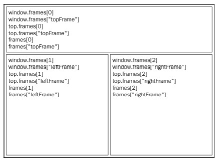
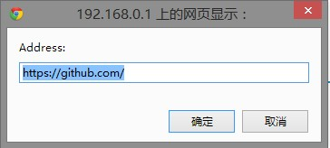
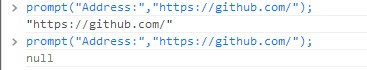

<link rel="stylesheet" href="./css/layout.css" type="text/css" />
# BOM #

*	[window对象](#8.1)
	*	[全局作用域](#8.1.1)
	*	[窗口关系及框架](#8.1.2)
	*	[窗口位置](#8.1.3)
	*	[窗口大小](#8.1.4)
	*	[导航和打开窗口](#8.1.5)
	*	[间歇调用和超时调用](#8.1.6)
	*	[系统对话框](#8.1.7)
*	[location对象](#8.2)
	*	[查询字符串参数](#8.2.1)
	*	[位置操作](#8.2.2)
*	[navigator对象](#8.3)
	*	[检测插件](#8.3.1)
*	[screen对象](#8.4)
*	[history对象](#8.5)

Js主要用于浏览器中，BOM提供的对象很关键。

<h2 id="8.1">window对象</h2>
BOM 的核心对象是window，它表示浏览器的一个实例。在浏览器中，window 对象有双重角色，它既是通过JavaScript 访问浏览器窗口的一个接口，又是ECMAScript 规定的Global 对象。

<h3 id="8.1.1">全局作用域</h3>

	var age = 29;
	function sayAge(){
		alert(this.age);
	}

	alert(window.age); //29
	sayAge(); //29
	window.sayAge(); //29

由此可见一斑。

定义全局变量与在window 对象上直接定义属性还是有一点差别：全局变量不能通过delete 操作符删除，而直接在window 对象上的定义的属性可以。

	var age = 29;
	window.color = "red";

	//在IE < 9 时抛出错误，在其他所有浏览器中都返回false
	delete window.age;

	//在IE < 9 时抛出错误，在其他所有浏览器中都返回true
	delete window.color; //returns true

	alert(window.age); //29
	alert(window.color); //undefined

还要记住一件事：尝试访问未声明的变量会抛出错误，但是通过查询window 对象，可以知
道某个可能未声明的变量是否存在。

	//这里会抛出错误，因为oldValue 未定义
	var newValue = oldValue;

	//这里不会抛出错误，因为这是一次属性查询
	//newValue 的值是undefined
	var newValue = window.oldValue;

很多全局JavaScript 对象（如location 和navigator）实际上都是window对象的属性。

<h3 id="8.1.2">窗口关系及框架</h3>
如果页面中包含框架，则每个框架都拥有自己的window 对象，并且保存在frames 集合中。可以通过数值索引（从0 开始，从左至右，从上到下）或者框架名称来访问相应的window 对象。每个window 对象都有一个name 属性，其中包含框架的名称。

	<html>
		<head>
			<title>Frameset Example</title>
		</head>
		<frameset rows="160,*">
			<frame src="frame.htm" name="topFrame">
			<frameset cols="50%,50%">
				<frame src="anotherframe.htm" name="leftFrame">
				<frame src="yetanotherframe.htm" name="rightFrame">
			</frameset>
		</frameset>
	</html>

我们知道，top 对象始终指向最高（最外）层的框架，也就是浏览器窗口。使用它可以确保在一个
框架中正确地访问另一个框架。因为对于在一个框架中编写的任何代码来说，其中的window 对象指向
的都是那个框架的特定实例，而非最高层的框架。下图展示了在最高层窗口中，通过代码来访问前面
例子中每个框架的不同方式。

与top 相对的另一个window 对象是parent。顾名思义，parent（父）对象始终指向当前框架的
直接上层框架。在某些情况下，parent 有可能等于top；但在没有框架的情况下，parent 一定等于
top（此时它们都等于window）。

	<!-- frameset1.htm -->
	<html>
		<head>
			<title>Frameset Example</title>
		</head>
		<frameset rows="100,*">
			<frame src="frame.htm" name="topFrame">
			<frameset cols="50%,50%">
				<frame src="anotherframe.htm" name="leftFrame">
				<frame src="anotherframeset.htm" name="rightFrame">
			</frameset>
		</frameset>
	</html>

	<!-- anotherframeset.htm -->
	<html>
		<head>
			<title>Frameset Example</title>
		</head>
		<frameset cols="50%,50%">
			<frame src="red.htm" name="redFrame">
			<frame src="blue.htm" name="blueFrame">
		</frameset>
	</html>

浏览器在加载完第一个框架集以后，会继续将第二个框架集加载到rightFrame 中。如果代码位于
redFrame（或blueFrame）中，那么parent 对象指向的就是rightFrame。可是，如果代码位于
topFrame 中，则parent 指向的是top，因为topFrame 的直接上层框架就是最外层框架。

除非最高层窗口是通过window.open()打开的（本章后面将会讨论），否则其window 对象的name 属性不会包含任何值。

与框架有关的最后一个对象是self，它始终指向window；实际上，self 和window 对象可以互换使用。引入self 对象的目的只是为了与top 和parent 对象对应起来，因此它不格外包含其他值。

所有这些对象都是window 对象的属性，可以通过window.parent、window.top 等形式来访问。

<h3 id="8.1.3">窗口位置</h3>
为了兼容，跨浏览器取得窗口左边和上边的位置:

	var leftPos = (typeof window.screenLeft == "number") ?
					window.screenLeft : window.screenX;
	var topPos = (typeof window.screenTop == "number") ?
					window.screenTop : window.screenY;

<h3 id="8.1.4">窗口大小</h3>
跨浏览器确定一个窗口的大小不是一件简单的事，由于各种浏览器BOM标准不一，只能退一步获得页面视口的大小：

	var pageWidth = window.innerWidth,
		pageHeight = window.innerHeight;

	if (typeof pageWidth != "number"){
		if (document.compatMode == "CSS1Compat"){
			pageWidth = document.documentElement.clientWidth;
			pageHeight = document.documentElement.clientHeight;
		} else {
			pageWidth = document.body.clientWidth;
			pageHeight = document.body.clientHeight;
		}
	}

在其他移动浏览器中，document.documentElement 度量的是布局视口，即渲染后页面的实际大
小（与可见视口不同，可见视口只是整个页面中的一小部分）。移动IE 浏览器把布局视口的信息保存在
document.body.clientWidth 和document.body.clientHeight 中。这些值不会随着页面缩放变化。

由于与桌面浏览器间存在这些差异，最好是先检测一下用户是否在使用移动设备，然后再决定使用哪个属性。

使用resizeTo()和resizeBy()方法可以调整浏览器窗口的大小（此方法可能被禁用，且对框架不生效）：

	//调整到100×100
	window.resizeTo(100, 100);
	//调整到200×150
	window.resizeBy(100, 50);
	//调整到 300×300
	window.resizeTo(300, 300);

<h3 id="8.1.5">导航和打开窗口</h3>
使用window.open()方法既可以导航到一个特定的URL，也可以打开一个新的浏览器窗口。这个
方法可以接收4 个参数：要加载的URL、窗口目标、一个特性字符串以及一个表示新页面是否取代浏览
器历史记录中当前加载页面的布尔值。通常只须传递第一个参数，最后一个参数只在不打开新窗口的情
况下使用。

如果为window.open()传递了第二个参数，而且该参数是已有窗口或框架的名称，那么就会在具
有该名称的窗口或框架中加载第一个参数指定的URL。

	//等同于< a href="http://www.wrox.com" target="topFrame"></a>
	window.open("http://www.wrox.com/", "topFrame");

调用这行代码，就如同用户单击了href 属性为http://www.wrox.com/，target 属性为"topFrame"
的链接。如果有一个名叫"topFrame"的窗口或者框架，就会在该窗口或框架加载这个URL；否则，就
会创建一个新窗口并将其命名为"topFrame"。此外，第二个参数也可以是下列任何一个特殊的窗口名
称：_self、_parent、_top 或_blank。

如果给window.open()传递的第二个参数并不是一个已经存在的窗口或框架，那么该方法就会根
据在第三个参数位置上传入的字符串创建一个新窗口或新标签页。如果没有传入第三个参数，那么就会
打开一个带有全部默认设置（工具栏、地址栏和状态栏等）的新浏览器窗口（或者打开一个新标签页—
—根据浏览器设置）。在不打开新窗口的情况下，会忽略第三个参数。

第三个参数是一个逗号分隔的设置字符串，表示在新窗口中都显示哪些特性。

<table>
<tr>
  <td width=20%>fullscreen</td> 
  <td width=20%>yes或no</td> 
  <td>表示浏览器窗口是否最大化。仅限IE</td>
</tr>
<tr>
  <td>height</td> 
  <td>数值</td> 
  <td>表示新窗口的高度。不能小于100</td>
</tr>
<tr>
  <td>left</td> 
  <td>数值</td> 
  <td>表示新窗口的左坐标。不能是负值</td>
</tr>
<tr>
  <td>location</td> 
  <td>yes或no</td> 
  <td>表示是否在浏览器窗口中显示地址栏。不同浏览器的默认值不同。如果设置为no，地址栏可能会隐藏，也可能会被禁用（取决于浏览器）</td>
</tr>
<tr>
  <td>menubar</td> 
  <td>yes或no</td>
  <td>表示是否在浏览器窗口中显示菜单栏。默认值为no</td>
</tr>
<tr>
  <td>resizable</td> 
  <td>yes或no</td> 
  <td>表示是否可以通过拖动浏览器窗口的边框改变其大小。默认值为no</td>
</tr>
<tr>
  <td>scrollbars</td> 
  <td>yes或no</td> 
  <td>表示如果内容在视口中显示不下，是否允许滚动。默认值为no</td>
</tr>
<tr>
  <td>status</td> 
  <td>yes或no</td> 
  <td>表示是否在浏览器窗口中显示状态栏。默认值为no</td>
</tr>
<tr>
  <td>toolbar</td> 
  <td>yes或no</td> 
  <td>表示是否在浏览器窗口中显示工具栏。默认值为no</td>
</tr>
<tr>
  <td>top</td> 
  <td>数值</td> 
  <td>表示新窗口的上坐标。不能是负值</td>
</tr>
<tr>
  <td>width</td> 
  <td>数值</td> 
  <td>表示新窗口的宽度。不能小于100</td>
</tr>
</table>

表中所列的部分或全部设置选项，都可以通过逗号分隔的名值对列表来指定。

	window.open("http://www.wrox.com/","wroxWindow",
		"height=400,width=400,top=10,left=10,resizable=yes");

window.open()方法会返回一个指向新窗口的引用。引用的对象与其他window 对象大致相似，但
我们可以对其进行更多控制。例如，有些浏览器在默认情况下可能不允许我们针对主浏览器窗口调整大
小或移动位置，但却允许我们针对通过window.open()创建的窗口调整大小或移动位置。通过这个返
回的对象，可以像操作其他窗口一样操作新打开的窗口。

	var wroxWin = window.open("http://www.wrox.com/","wroxWindow",
					"height=400,width=400,top=10,left=10,resizable=yes");

	//调整大小
	wroxWin.resizeTo(500,500);

	//移动位置
	wroxWin.moveTo(100,100);

	//关闭新打开的窗口。
	wroxWin.close();

<h3 id="8.1.6">间歇调用和超时调用</h3>
通过设置超时值和间歇时间值来调度代码在特定的时刻执行。前者是在指定的时间过后执行代码，而后者则是每隔指定的时间就执行一次代码。

超时调用需要使用window 对象的setTimeout()方法，它接受两个参数：要执行的代码和以毫秒
表示的时间（即在执行代码前需要等待多少毫秒）。其中，第一个参数可以是一个包含JavaScript 代码的
字符串（就和在eval()函数中使用的字符串一样），也可以是一个函数。

	//不建议传递字符串！
	setTimeout("alert('Hello world!') ", 1000);

	//推荐的调用方式
	setTimeout(function() {
		alert("Hello world!");
	}, 1000);

>第二个参数是一个表示等待多长时间的毫秒数，但经过该时间后指定的代码不一定会执行。
JavaScript 是一个单线程序的解释器，因此一定时间内只能执行一段代码。为了控制要执行的代码，就
有一个JavaScript 任务队列。这些任务会按照将它们添加到队列的顺序执行。setTimeout()的第二个
参数告诉JavaScript 再过多长时间把当前任务添加到队列中。如果队列是空的，那么添加的代码会立即
执行；如果队列不是空的，那么它就要等前面的代码执行完了以后再执行。

调用setTimeout()之后，该方法会返回一个数值ID，表示超时调用。这个超时调用ID 是计划执
行代码的唯一标识符，可以通过它来取消超时调用。要取消尚未执行的超时调用计划，可以调用
clearTimeout()方法并将相应的超时调用ID 作为参数传递给它。

	//设置超时调用
	var timeoutId = setTimeout(function() {
		alert("Hello world!");
	}, 1000);

	//注意：把它取消
	clearTimeout(timeoutId);

间歇调用与超时调用类似，只不过它会按照指定的时间间隔重复执行代码，直至间歇调用被取消或
者页面被卸载。设置间歇调用的方法是setInterval()，它接受的参数与setTimeout()相同：要执行的代码（字符串或函数）和每次执行之前需要等待的毫秒数。

	//不建议传递字符串！
	setInterval ("alert('Hello world!') ", 10000);

	//推荐的调用方式
	setInterval (function() {
		alert("Hello world!");
	}, 10000);

调用setInterval()方法同样也会返回一个间歇调用ID，该ID 可用于在将来某个时刻取消间歇
调用。要取消尚未执行的间歇调用，可以使用clearInterval()方法并传入相应的间歇调用ID。取消
间歇调用的重要性要远远高于取消超时调用，因为在不加干涉的情况下，间歇调用将会一直执行到页面
卸载。

	var num = 0;
	var max = 10;
	var intervalId = null;

	function incrementNumber() {
		num++;

		//如果执行次数达到了max 设定的值，则取消后续尚未执行的调用
		if (num == max) {
		clearInterval(intervalId);
		alert("Done");
		}
	}

	intervalId = setInterval(incrementNumber, 500);

一般认为，使用超时调用来模拟间歇调用的是一种最佳模式。在开发环境下，很少使用真正的间歇调用，原因是后一个间歇调用可能会在前一个间歇调用结束之前启动。

	var num = 0;
	var max = 10;
	
	function incrementNumber() {
		num++;

		//如果执行次数未达到max 设定的值，则设置另一次超时调用
		if (num < max) {
			setTimeout(incrementNumber, 500);
		} else {
			alert("Done");
		}
	}
	setTimeout(incrementNumber, 500);

<h3 id="8.1.7">系统对话框</h3>
浏览器通过alert()、confirm()和prompt()方法可以调用系统对话框向用户显示消息。系统对
话框与在浏览器中显示的网页没有关系，也不包含HTML。它们的外观由操作系统及（或）浏览器设置
决定，而不是由CSS 决定。

**此外，通过这几个方法打开的对话框都是同步和模态的。也就是说，显示这些对话框的时候代码会停止执行，而关掉这些对话框后代码又会恢复执行。**

alert就不说了。

confirm高级一点，带有内容和ok|cancel按钮，单击ok就返回true，否则返回false。

至于prompt则是交互式的待输入对话框，自己试试吧。

单击确定和取消，两次返回的结果：

<h2 id="8.2">location对象</h2>
location 是最有用的BOM对象之一，它提供了与当前窗口中加载的文档有关的信息，还提供了一
些导航功能。事实上，location 对象是很特别的一个对象，因为它既是window 对象的属性，也是
document 对象的属性；换句话说，window.location 和document.location 引用的是同一个对象。

location 对象的用处不只表现在它保存着当前文档的信息，还表现在它将URL 解析为独立的片段，让
开发人员可以通过不同的属性访问这些片段。

<table>
<caption><b>location对象属性表</b></caption>
<tr>
  <th>属性名</th>
  <th>例子</th>
  <th>说明</th>
</tr>
<tr>
  <td>hash</td>
  <td>"#contents"</td>
  <td>返回URL中的hash（#号后跟零或多个字符），如果URL中不包含散列，则返回空字符串</td>
</tr>
<tr>
  <td>host</td> 
  <td>"www.wrox.com:80"</td>
  <td>返回服务器名称和端口号（如果有）</td>
</tr>
<tr>
  <td>hostname</td> 
  <td>"www.wrox.com"</td> 
  <td>返回不带端口号的服务器名称</td>
</tr>
<tr>
  <td>href</td> 
  <td>"http://www.wrox.com"</td> 
  <td>返回当前加载页面的完整URL。而location对象的toString()方法也返回这个值</td>
</tr>
<tr>
  <td>pathname</td>
  <td>"/WileyCDA/"</td> 
  <td>返回URL中的目录和（或）文件名</td>
</tr>
<tr>
  <td>port</td> 
  <td>"8080"</td> 
  <td>返回URL中指定的端口号。如果URL中不包含端口号，则这个属性返回空字符串</td>
</tr>
<tr>
  <td>protocol</td> 
  <td>"http:"</td> 
  <td>返回页面使用的协议。通常是http:或https:</td>
</tr>
<tr>
  <td>search</td> 
  <td>"?q=javascript"</td> 
  <td>返回URL的查询字符串。这个字符串以问号开头</td>
</tr>
</table>

<h3 id="8.2.1">查询字符串参数</h3>
虽然通过上面的属性可以访问到location 对象的大多数信息，但其中访问URL 包含的查询字符
串的属性并不方便。尽管location.search 返回从问号到URL 末尾的所有内容，但却没有办法逐个
访问其中的每个查询字符串参数。为此，可以像下面这样创建一个函数，用以解析查询字符串，然后返
回包含所有参数的一个对象：

	function getQueryStringArgs(){
		//取得查询字符串并去掉开头的问号
		var qs = (location.search.length > 0 ? location.search.substring(1) : ""),
		
		//保存数据的对象
		args = {},
	
		//取得每一项
		items = qs.length ? qs.split("&") : [],
		item = null,
		name = null,
		value = null,

		//在for 循环中使用
		i = 0,
		len = items.length;

		//逐个将每一项添加到args 对象中
		for (i=0; i < len; i++){
			item = items[i].split("=");
			name = decodeURIComponent(item[0]);
			value = decodeURIComponent(item[1]);
			if (name.length) {
				args[name] = value;
			}
		}
		return args;
	}

<h3 id="8.2.2">位置操作</h3>
使用location 对象可以通过很多方式来改变浏览器的位置。首先，也是最常用的方式，就是使用
assign()方法并为其传递一个URL：

	location.assign("http://www.wrox.com");

这样，就可以立即打开新URL 并在浏览器的历史记录中生成一条记录。如果是将location.href
或window.location 设置为一个URL 值，也会以该值调用assign()方法。

	//效果完全相同的写法	
	window.location = "http://www.wrox.com";
	location.href = "http://www.wrox.com";

与位置有关的最后一个方法是reload()，作用是重新加载当前显示的页面。如果调用reload()
时不传递任何参数，页面就会以最有效的方式重新加载。也就是说，如果页面自上次请求以来并没有改
变过，页面就会从浏览器缓存中重新加载。如果要强制从服务器重新加载，则需要像下面这样为该方法
传递参数true。

	location.reload(); //重新加载（有可能从缓存中加载）
	location.reload(true); //重新加载（从服务器重新加载）

位于reload()调用之后的代码可能会也可能不会执行，这要取决于网络延迟或系统资源等因素。

<h2 id="8.3">navigator对象</h2>
和location一样，navigator也有一套自己的属性，这些属性一般用于检测网页浏览器类型，不是很关键，就不记了。

<h3 id="8.3.1">检测插件</h3>
检测浏览器中是否安装了特定的插件是一种最常见的检测例程。对于非IE 浏览器，可以使用plugins 数组来达到这个目的。该数组中的每一项都包含下列属性。

-	name: 插件名字
-	description: 插件描述
-	filename: 插件文件名
-	length: 插件所处理的MIME类型数量

	//检测插件（在IE 中无效）
	function hasPlugin(name){
		name = name.toLowerCase();
		for (var i=0; i < navigator.plugins.length; i++){
			if (navigator. plugins [i].name.toLowerCase().indexOf(name) > -1){
				return true;
			}
		}
		return false;
	}

	//检测Flash
	alert(hasPlugin("Flash"));

	//检测QuickTime
	alert(hasPlugin("QuickTime"));

IE不支持Netscape式的插件，唯一的方法就是专有的ActiveXObject类型。IE 是以COM对象的方式实现插件的，而COM对象使用唯一标识符来标识。因此，要想检查特定的插件，就必须知道其COM标识符。

	//检测IE 中的插件
	function hasIEPlugin(name){
		try {
			new ActiveXObject(name);
			return true;
		} catch (ex){
			return false;
		}
	}

	//检测Flash
	alert(hasIEPlugin("ShockwaveFlash.ShockwaveFlash"));

	//检测QuickTime
	alert(hasIEPlugin("QuickTime.QuickTime"));

鉴于检测这两种插件的方法差别太大，因此典型的做法是针对每个插件分别创建检测函数。

	//检测所有浏览器中的Flash
	function hasFlash(){
		var result = hasPlugin("Flash");
		if (!result){
			result = hasIEPlugin("ShockwaveFlash.ShockwaveFlash");
		}
		return result;
	}

	//检测所有浏览器中的QuickTime
	function hasQuickTime(){
		var result = hasPlugin("QuickTime");
		if (!result){
			result = hasIEPlugin("QuickTime.QuickTime");
		}
		return result;
	}

	//检测Flash
	alert(hasFlash());

	//检测QuickTime
	alert(hasQuickTime());

<h2 id="8.4">screen对象</h2>
用处不大的对象，基本上值用来表明客户端的能力，包括浏览器窗口外部的显示器信息，像素宽度和高度等。每个浏览器中screen对象都包含各不相同的属性。

<h2 id="8.5">history对象</h2>
保存着从窗口被打开的那一刻算起用户上网的历史记录。出于安全方面的考虑，开发人员无法得知用户浏览过的URL。不过，借由用户访问过的页面列表，同样可以在不知道实际URL 的情况下实现后退和前进。

使用go()方法可以在用户的历史记录中任意跳转，可以向后也可以向前。这个方法接受一个参数，
表示向后或向前跳转的页面数的一个整数值。负数表示向后跳转（类似于单击浏览器的“后退”按钮），
正数表示向前跳转（类似于单击浏览器的“前进”按钮）。

	//后退一页
	history.go(-1);
	//前进一页
	history.go(1);
	//前进两页
	history.go(2);

也可以给go()方法传递一个字符串参数，此时浏览器会跳转到历史记录中包含该字符串的第一个
位置——可能后退，也可能前进，具体要看哪个位置最近。如果历史记录中不包含该字符串，那么这个
方法什么也不做。

	//跳转到最近的wrox.com 页面
	history.go("wrox.com");
	//跳转到最近的nczonline.net 页面
	history.go("nczonline.net");

另外，还可以使用两个简写方法back()和forward()来代替go()。
	
	//后退一页
	history.back();
	//前进一页
	history.forward();

history对象还有个length属性，保存着历史记录的数量。这个数量包括所有历史记录，包括向后和向前的记录。对于加载到窗口、标签页或框架中的第一个页面而言，history.length为0。

2016/4/20 16:56:50 @author: rootkit