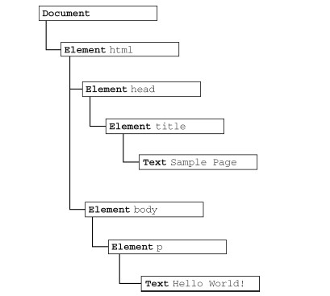
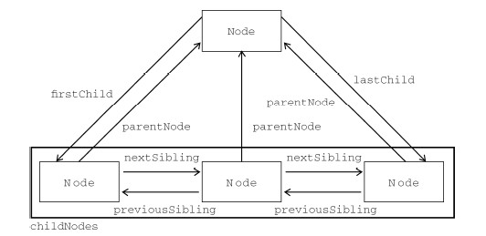

<link rel="stylesheet" href="./css/layout.css" type="text/css" />
# DOM #

*	[节点层次](#10.1)
	*	[Node类型](#10.1.1)
	*	[Document类型](#10.1.2)
	*	[Element类型](#10.1.3)
	*	[Text类型](#10.1.4)
	*	[Comment类型](#10.1.5)
*	[DOM操作技术](#10.2)
	*	[动态脚本](#10.2.1)
	*	[动态样式](#10.2.2)
	*	[操作表格](#10.2.3)
	*	[使用NodeList](#10.2.4)

DOM是针对HTML和XML的API。

<h2 id="10.1">节点层次</h2>
DOM 可以将任何HTML 或XML 文档描绘成一个由多层节点构成的结构。节点分为几种不同的类
型，每种类型分别表示文档中不同的信息及（或）标记。每个节点都拥有各自的特点、数据和方法，另
外也与其他节点存在某种关系。节点之间的关系构成了层次，而所有页面标记则表现为一个以特定节点
为根节点的树形结构。

	<html>
		<head>
			<title>Sample Page</title>
		</head>
		<body>
			
Hello World!

		</body>
	</html>

文档节点是每个文档的根节点，这里文档节点只有一个子节点——`<html>`，称为文档元素。文档元素是文档的最外层元素，文档中的其他所有元素都包含在文档元素中。每个文档只能有一个文档元素。HTML的文档元素一定是`<html>`，XML则随便自定义。

html元素通过元素节点标记，特性通过特性节点标记，文档类型通过文档类型节点标记，注释也有注释节点标记，共12种节点类型，都继承自同一基类型。

<h3 id="10.1.1">Node类型</h3>
DOM1 级定义了一个Node 接口，该接口将由DOM 中的所有节点类型实现。这个Node 接口在
JavaScript 中是作为Node 类型实现的；除了IE 之外，在其他所有浏览器中都可以访问到这个类型。
JavaScript 中的所有节点类型都继承自Node 类型，因此所有节点类型都共享着相同的基本属性和方法。

**每个节点都有一个nodeType 属性，用于表明节点的类型。节点类型由在Node 类型中定义的下列
12 个数值常量来表示，任何节点类型必居其一：**

Node.ELEMENT_NODE(1)；

- Node.ATTRIBUTE_NODE(2)；
- Node.TEXT_NODE(3)；
- Node.CDATA_SECTION_NODE(4)；
- Node.ENTITY_REFERENCE_NODE(5)；
- Node.ENTITY_NODE(6)；
- Node.PROCESSING_INSTRUCTION_NODE(7)；
- Node.COMMENT_NODE(8)；
- Node.DOCUMENT_NODE(9)；
- Node.DOCUMENT_TYPE_NODE(10)；
- Node.DOCUMENT_FRAGMENT_NODE(11)；
- Node.NOTATION_NODE(12)；

节点类型的判定句法：

	if (someNode.nodeType == 1){ //适用于所有浏览器
		alert("Node is an element.");
	}

并不是所有节点类型都受到Web 浏览器的支持。开发人员最常用的就是元素和文本节点。

1.nodeName 和nodeValue 属性
要了解节点的具体信息，可以使用nodeName 和nodeValue 这两个属性。

	if (someNode.nodeType == 1){
		value = someNode.nodeName; //nodeName 的值是元素的标签名
	}

在这个例子中，首先检查节点类型，看它是不是一个元素。如果是，则取得并保存nodeName 的值。
对于元素节点，nodeName 中保存的始终都是元素的标签名，而nodeValue 的值则始终为null。

2.节点关系

文档中所有的节点之间都存在这样或那样的关系。节点间的各种关系可以用传统的家族关系来描
述，相当于把文档树比喻成家谱。在HTML 中，可以将`<body>`元素看成是`<html>`元素的子元素；相应
地，也就可以将`<html>`元素看成是`<body>`元素的父元素。而`<head>`元素，则可以看成是`<body>`元素的同胞元素，因为它们都是同一个父元素<html>的直接子元素。

每个节点都有一个childNodes 属性，其中保存着一个NodeList 对象。NodeList 是一种类数组
对象，用于保存一组有序的节点，可以通过位置来访问这些节点。请注意，虽然可以通过方括号语法来
访问NodeList 的值，而且这个对象也有length 属性，但它并不是Array 的实例。NodeList 对象的
独特之处在于，它实际上是基于DOM 结构动态执行查询的结果，因此DOM结构的变化能够自动反映
在NodeList 对象中。我们常说，NodeList 是有生命、有呼吸的对象，而不是在我们第一次访问它们
的某个瞬间拍摄下来的一张快照。

访问方法：
	
	var firstChild = someNode.childNodes[0];
	var secondChild = someNode.childNodes.item(1);
	var count = someNode.childNodes.length;

转换成数组的一种可行方案：

	function convertToArray(nodes){
		var array = null;
		try {
			array = Array.prototype.slice.call(nodes, 0); //针对非IE 浏览器
		} catch (ex) { //IE 8之前只能枚举
			array = new Array();
			for (var i=0, len=nodes.length; i < len; i++){
				array.push(nodes[i]);
			}
		}
			return array;
	}

每个节点都有一个parentNode 属性，该属性指向文档树中的父节点。包含在childNodes 列表中
的所有节点都具有相同的父节点，因此它们的parentNode 属性都指向同一个节点。

此外，包含在childNodes 列表中的每个节点相互之间都是同胞节点。通过使用列表中每个节点的previousSibling和nextSibling 属性，可以访问同一列表中的其他节点。列表中第一个节点的previousSibling 属性值为null，而列表中最后一个节点的nextSibling 属性的值同样也为null。

父节点与其第一个和最后一个子节点之间也存在特殊关系。父节点的firstChild 和lastChild
属性分别指向其childNodes 列表中的第一个和最后一个节点。其中，someNode.firstChild 的值
始终等于someNode.childNodes[0] ， 而someNode.lastChild 的值始终等于someNode.
childNodes [someNode.childNodes.length-1]。

一图胜千言呐：

3.操作节点

因为关系指针都是只读的，所以DOM 提供了一些操作节点的方法。其中，最常用的方法是
appendChild()，用于向childNodes 列表的末尾添加一个节点。添加节点后，childNodes 的新增
节点、父节点及以前的最后一个子节点的关系指针都会相应地得到更新。更新完成后，appendChild()
返回新增的节点。
	
	var returnedNode = someNode.appendChild(newNode);
	alert(returnedNode == newNode); //true
	alert(someNode.lastChild == newNode); //true

如果传入到appendChild()中的节点已经是文档的一部分了，那结果就是将该节点从原来的位置
转移到新位置。即使可以将DOM树看成是由一系列指针连接起来的，但任何DOM节点也不能同时出
现在文档中的多个位置上。

如果需要把节点放在childNodes 列表中某个特定的位置上，而不是放在末尾，那么可以使用
insertBefore()方法。这个方法接受两个参数：要插入的节点和作为参照的节点。插入节点后，被插
入的节点会变成参照节点的前一个同胞节点（previousSibling），同时被方法返回。

	//插入后成为最后一个子节点
	returnedNode = someNode.insertBefore(newNode, null);
	alert(newNode == someNode.lastChild); //true

	//插入后成为第一个子节点
	var returnedNode = someNode.insertBefore(newNode, someNode.firstChild);
	alert(returnedNode == newNode); //true
	alert(newNode == someNode.firstChild); //true

	//插入到最后一个子节点前面
	returnedNode = someNode.insertBefore(newNode, someNode.lastChild);
	alert(newNode == someNode.childNodes[someNode.childNodes.length-2]); //true

replaceChild()方法接受的两个参数是：要插入的节点和要替换的节点。要替换的节点将由这个
方法返回并从文档树中被移除，同时由要插入的节点占据其位置。

	//替换第一个子节点
	var returnedNode = someNode.replaceChild(newNode, someNode.firstChild);
	//替换最后一个子节点
	returnedNode = someNode.replaceChild(newNode, someNode.lastChild);

removeChild()方法接受一个参数，即要移除的节点。被移除的节点将成为方法的返回值。

	//移除第一个子节点
	var formerFirstChild = someNode.removeChild(someNode.firstChild);
	//移除最后一个子节点
	var formerLastChild = someNode.removeChild(someNode.lastChild);

4.其他方法

有两个方法是所有类型的节点都有的。

cloneNode()，用于创建调用这个方法的节点
的一个完全相同的副本。cloneNode()方法接受一个布尔值参数，表示是否执行深复制。在参数为true
的情况下，执行深复制，也就是复制节点及其整个子节点树；在参数为false 的情况下，执行浅复制，
即只复制节点本身。复制后返回的节点副本属于文档所有，但并没有为它指定父节点。因此，这个节点
副本就成为了一个“孤儿”，除非通过appendChild()、insertBefore()或replaceChild()将它添加到文档中。

normalize()，这个方法唯一的作用就是处理文档树中的文本节点。
由于解析器的实现或DOM操作等原因，可能会出现文本节点不包含文本，或者接连出现两个文本节点
的情况。当在某个节点上调用这个方法时，就会在该节点的后代节点中查找上述两种情况。如果找到了
空文本节点，则删除它；如果找到相邻的文本节点，则将它们合并为一个文本节点。

<h3 id="10.1.2">Document类型</h3>
JavaScript 通过Document 类型表示文档。在浏览器中，document 对象是HTMLDocument（继承
自Document 类型）的一个实例，表示整个HTML 页面。而且，document 对象是window 对象的一个
属性，因此可以将其作为全局对象来访问。

Document节点具有下列特征：

- nodeType值为9；
- nodeName值为"#document";
- nodeValue值为null;
- parentNode值为null;
- ownerDocument值为null;
- 其子节点可能是一个DocumentType（最多一个）、Element（最多一个）、ProcessingInstruction或Comment。

1.文档的子节点

有两个内置的访问其子节点的快捷方式，documentElement属性和childNodes列表访问。

作为HTMLDocument 的实例，document 对象还有一个body 属性，直接指向`<body>`元素。因为开
发人员经常要使用这个元素，所以document.body 在JavaScript 代码中出现的频率非常高。

所有浏览器都支持document.documentElement 和document.body 属性。

2.文档信息

作为HTMLDocument 的一个实例，document 对象还有一些标准的Document 对象所没有的属性。
这些属性提供了document 对象所表现的网页的一些信息。

第一个属性就是title，包含着`<title>`元素中的文本——显示在浏览器窗口的标题栏或标签页上。通过这个属性可以取得当前页面的标题，也可以修改当前页面的标题并反映在浏览器的标题栏中。修改title 属性的值不会改变`<title>`元素。

URL 属性中包含页面完整的URL（即地址栏中显示的URL），domain 属性中只包含页面的域名，而referrer属性中则保存着链接到当前页面的那个页面的URL。所有这些信息都存在于请求的HTTP 头部，只不过是通过这些属性让我们能够在JavaScrip 中访问它们。

在这3 个属性中，只有domain 是可以设置的。但由于安全方面的限制，也并非可以给domain 设
置任何值。如果URL 中包含一个子域名，例如p2p.wrox.com，那么就只能将domain 设置为"wrox.com"
（URL 中包含"www"，如www.wrox.com 时，也是如此）。不能将这个属性设置为URL 中不包含的域。

当页面中包含来自其他子域的框架或内嵌框架时，能够设置document.domain 就非常方便了。由
于跨域安全限制， 来自不同子域的页面无法通过JavaScript 通信。而通过将每个页面的
document.domain 设置为相同的值，这些页面就可以互相访问对方包含的JavaScript 对象了。

>假设有一个页面加载自www.wrox.com，其中包含一个内嵌框架，框架内的页面加载自p2p.wrox.com。
由于document.domain 字符串不一样，内外两个页面之间无法相互访问对方的JavaScript 对象。但如
果将这两个页面的document.domain 值都设置为"wrox.com"，它们之间就可以通信了。

浏览器对domain 属性还有一个限制，即如果域名一开始是“松散的”（loose），那么不能将它再设
置为“紧绷的”（tight）。换句话说，在将document.domain 设置为"wrox.com"之后，就不能再将其
设置回"p2p.wrox.com"，否则将会导致错误。

3.查找元素

getElementById()和getElementsByTagName()，妇孺皆知。

	
Some text

	var div = document.getElementById("myDiv"); //取得
元素的引用

	//取得页面中所有的元素，并返回一个HTMLCollection
	
	var images = document.getElementsByTagName("img");

	alert(images.length); //输出图像的数量
	alert(images[0].src); //输出第一个图像元素的src 特性
	aler t(images.item(0).src); //输出第一个图像元素的src 特性

	//HTMLCollection有个namedItem()方法，根据name解索引。
	var myImage = images.namedItem("myImage");

	//这样也可以
	var myImage = images["myImage"];

要想取得文档中的所有元素，可以向getElementsByTagName()中传入`*`。在JavaScript 及CSS
中，星号（*）通常表示“全部”。

还有个方法，只有HTMLDocument 类型才有的方法，是getElementsByName()。这个方法会返回带有给定name 特性的所有元素。

最常使用getElementsByName()方法的情况是取得单选按钮；为了确保发送给浏览器的值正确无误，所有单选按钮必须具有相同的name 特性。

4.特殊集合

除了属性和方法，document 对象还有一些特殊的集合。这些集合都是HTMLCollection 对象，为访问文档常用的部分提供了快捷方式。

- document.anchors，包含文档中所有带name 特性的`<a>`元素；
- document.applets，包含文档中所有的`<applet>`元素，因为不再推荐使用`<applet>`元素，所以这个集合已经不建议使用了；
- document.forms，包含文档中所有的`<form>`元素，与document.getElementsByTagName("form")得到的结果相同；
- document.images，包含文档中所有的``元素，与document.getElementsByTagName("img")得到的结果相同；
- document.links，包含文档中所有带href 特性的`<a>`元素。

5.文档写入

有一个document 对象的功能已经存在很多年了，那就是将输出流写入到网页中的能力。这个能力
体现在下列4 个方法中：write()、writeln()、open()和close()。write()和writeln()
方法都接受一个字符串参数，即要写入到输出流中的文本。write()会原样写入，而writeln()则会
在字符串的末尾添加一个换行符（\n）。在页面被加载的过程中，可以使用这两个方法向页面中动态地
加入内容。

<h3 id="10.1.3">Element类型</h3>
除了Document 类型之外，Element 类型就要算是Web 编程中最常用的类型了。Element 类型用
于表现XML或HTML元素，提供了对元素标签名、子节点及特性的访问。

Element 节点具有以下特征：

- nodeType 的值为1；
- nodeName 的值为元素的标签名；
- nodeValue 的值为null；
- parentNode 可能是Document 或Element；
- 其子节点可能是Element、Text、Comment、ProcessingInstruction、CDATASection 或EntityReference。

要访问元素的标签名，可以使用nodeName 属性，也可以使用tagName 属性；这两个属性会返回相同的值（使用后者主要是为了清晰起见）。

	

	
	var div = document.getElementById("myDiv");
	alert(div.tagName); //"DIV"
	alert(div.tagName == div.nodeName); //true

这里的元素标签名是div，它拥有一个值为"myDiv"的ID。可是，div.tagName 实际上输出的是
"DIV"而非"div"。在HTML 中，标签名始终都以全部大写表示；而在XML（有时候也包括XHTML）
中，标签名则始终会与源代码中的保持一致。假如你不确定自己的脚本将会在HTML 还是XML 文档中
执行，最好是在比较之前将标签名转换为相同的大小写形式。

1.HTML 元素

所有HTML 元素都由HTMLElement 类型表示，不是直接通过这个类型，也是通过它的子类型来表
示。HTMLElement 类型直接继承自Element 并添加了一些属性。添加的这些属性分别对应于每个HTML
元素中都存在的下列标准特性。

- id，元素在文档中的唯一标识符。
- title，有关元素的附加说明信息，一般通过工具提示条显示出来。
- lang，元素内容的语言代码，很少使用。
- dir，语言的方向，值为"ltr"（left-to-right，从左至右）或"rtl"（right-to-left，从右至左），也很少使用。
- className，与元素的class 特性对应，即为元素指定的CSS类。

2.属性

每个元素都有一或多个特性，这些特性的用途是给出相应元素或其内容的附加信息。操作特性的
DOM方法主要有三个，分别是getAttribute()、setAttribute()和removeAttribute()。这三
个方法可以针对任何特性使用，包括那些以HTMLElement 类型属性的形式定义的特性。

3.attributes属性

Element 类型是使用attributes 属性的唯一一个DOM 节点类型。attributes 属性中包含一个
NamedNodeMap，与NodeList 类似，也是一个“动态”的集合。元素的每一个特性都由一个Attr 节
点表示，每个节点都保存在NamedNodeMap 对象中。NamedNodeMap 对象拥有下列方法。

- getNamedItem(name)：返回nodeName 属性等于name 的节点；
- removeNamedItem(name)：从列表中移除nodeName 属性等于name 的节点；
- setNamedItem(node)：向列表中添加节点，以节点的nodeName 属性为索引；
- item(pos)：返回位于数字pos 位置处的节点。

4.创建元素
使用document.createElement()方法可以创建新元素。这个方法只接受一个参数，即要创建元素的标签名。

	var div = document.createElement("div");

可以使用appendChild()、insertBefore()或replaceChild()方法进一步把创建的元素加入文档树。

<h3 id="10.1.4">Text类型</h3>
文本节点由Text 类型表示，包含的是可以照字面解释的纯文本内容。纯文本中可以包含转义后的
HTML 字符，但不能包含HTML 代码。

Text节点具有以下特征：

- nodeType 的值为3；
- nodeName 的值为"#text"；
- nodeValue 的值为节点所包含的文本；
- parentNode 是一个Element；
- 不支持（没有）子节点。
- appendData(text)：将text 添加到节点的末尾。
- deleteData(offset, count)：从offset 指定的位置开始删除count 个字符。
- insertData(offset, text)：在offset 指定的位置插入text。
- replaceData(offset, count, text)：用text 替换从offset 指定的位置开始到offset+count 为止处的文本。
- splitText(offset)：从offset 指定的位置将当前文本节点分成两个文本节点。
- substringData(offset, count)：提取从offset 指定的位置开始到offset+count 为止处的字符串。

除了这些方法之外，文本节点还有一个length 属性，保存着节点中字符的数目。而且，nodeValue.length 和data.length 中也保存着同样的值。

1.创建文本节点

可以使用document.createTextNode()创建新文本节点，这个方法接受一个参数——要插入节点
中的文本。与设置已有文本节点的值一样，作为参数的文本也将按照HTML 或XML 的格式进行编码。

	var textNode = document.createTextNode("<strong>Hello</strong> world!");

一个例子说明一切：

	var element = document.createElement("div");
	element.className = "message";
	var textNode = document.createTextNode("Hello world!");
	element.appendChild(textNode);
	document.body.appendChild(element);

一般情况下，每个元素只有一个文本子节点。不过，在某些情况下也可能包含多个文本子节点，如
下面的例子所示。

	var element = document.createElement("div");
	element.className = "message";

	var textNode = document.createTextNode("Hello world!");
	element.appendChild(textNode);

	var anotherTextNode = document.createTextNode("Yippee!");
	element.appendChild(anotherTextNode);

	document.body.appendChild(element);

如果两个文本节点是相邻的同胞节点，那么这两个节点中的文本就会连起来显示，中间不会有空格。

2.规范化文本节点

同胞节点混淆了字符串的值，于是就催生了一个能够将相邻文本节点合并的方法。这个方法是由Node 类型定义的（因而在所有节点类型中都存在），名叫normalize()。如果在一个包含两个或多个文本节点的父元素上调用normalize()方法，则会将所有文本节点合并成一个节点，结果节点的nodeValue 等于将合并前每个文本节点的nodeValue 值拼接起来的值。

	var element = document.createElement("div");
	element.className = "message";

	var textNode = document.createTextNode("Hello world!");
	element.appendChild(textNode);

	var anotherTextNode = document.createTextNode("Yippee!");
	element.appendChild(anotherTextNode);

	document.body.appendChild(element);

	alert(element.childNodes.length); //2

	element.normalize();
	alert(element.childNodes.length); //1
	alert(element.firstChild.nodeValue); // "Hello world!Yippee!"

*注：浏览器在解析文档时永远不会创建相邻的文本节点。这种情况只会作为执行DOM操作的结果出现。*

3.分割文本节点
与normalize()相反的操作也有：splitText()。

这个方法会将一个文本节点分成两个文本节点，即按照指定的位置分割nodeValue 值。原来的文本节点将包含从开始到指定位置之前的内容，新文本节点将包含剩下的文本。这个方法会返回一个新文本节点，该节点与原节点的parentNode 相同。

	var element = document.createElement("div");
	element.className = "message";

	var textNode = document.createTextNode("Hello world!");
	element.appendChild(textNode);

	document.body.appendChild(element);

	var newNode = element.firstChild.splitText(5);
	alert(element.firstChild.nodeValue); //"Hello"
	alert(newNode.nodeValue); //" world!"
	alert(element.childNodes.length); //2

<h3 id="10.1.5">Comment类型</h3>
注释在DOM中是通过Comment 类型来表示的。

- nodeType 的值为8；
- nodeName 的值为"#comment"；
- nodeValue 的值是注释的内容；
- parentNode 可能是Document 或Element；
- 不支持（没有）子节点。

Comment 类型与Text 类型继承自相同的基类，因此它拥有除splitText()之外的所有字符串操
作方法。与Text 类型相似，也可以通过nodeValue 或data 属性来取得注释的内容。

	
<!--A comment -->

	
	var div = document.getElementById("myDiv");
	var comment = div.firstChild;
	alert(comment.data); //"A comment"

使用document.createComment()并为其传递注释文本也可以创建注释节点。

----------
**剩余的几种Node或是应用场景不符，或是没什么用的摆设，不记录了。**

<h2 id="10.2">DOM操作技术</h2>
操作DOM 并不像表面上看起来那么简单。由于浏览器中充斥着隐藏的陷阱和不兼容问题，用JavaScript 代码处理DOM 的某些部分要比处理其他部分更复杂一些。

<h3 id="10.2.1">动态脚本</h3>
动态脚本，指的是在页面加载时不存在，但将来的某一时刻通过修改DOM 动态添加的脚本。跟操作HTML 元素一样，创建动态脚本也有两种方式：插入外部文件和直接插入JavaScript 代码。

	function loadScriptString(code){
		var script = document.createElement("script");
		script.type = "text/javascript";
		try {
			script.appendChild(document.createTextNode(code));
		} catch (ex){
			script.text = code;
		}
		document.body.appendChild(script);
	}

	loadScriptString("function sayHi(){alert('hi');}");

以这种方式加载的代码会在全局作用域中执行，而且当脚本执行后将立即可用。实际上，这样执行
代码与在全局作用域中把相同的字符串传递给eval()是一样的。

<h3 id="10.2.2">动态样式</h3>
把脚本换成样式。

	function loadStyleString(css){
		var style = document.createElement("style");
		style.type = "text/css";
		try{
			style.appendChild(document.createTextNode(css));
		} catch (ex){
			style.styleSheet.cssText = css;
		}
		var head = document.getElementsByTagName("head")[0];
		head.appendChild(style);
	}

	loadStyleString("body{background-color:red}");

这种方式会实时地向页面中添加样式，因此能够马上看到变化。

<h3 id="10.2.3">操作表格</h3>
利用现有的那些方法用DOM去构建表格很麻烦：

比如这样一个表格：

	<table border="1" width="100%">
		<tbody>
			<tr>
				<td>Cell 1,1</td>
				<td>Cell 2,1</td>
			</tr>
			<tr>
				<td>Cell 1,2</td>
				<td>Cell 2,2</td>
			</tr>
		</tbody>
	</table>

用DOM:

	//创建table
	var table = document.createElement("table");
	table.border = 1;
	table.width = "100%";

	//创建tbody
	var tbody = document.createElement("tbody");
	table.appendChild(tbody);

	//创建第一行
	var row1 = document.createElement("tr");
	tbody.appendChild(row1);
	var cell1_1 = document.createElement("td");
	cell1_1.appendChild(document.createTextNode("Cell 1,1"));
	row1.appendChild(cell1_1);
	var cell2_1 = document.createElement("td");
	cell2_1.appendChild(document.createTextNode("Cell 2,1"));
	row1.appendChild(cell2_1);

	//创建第二行
	var row2 = document.createElement("tr");
	tbody.appendChild(row2);
	var cell1_2 = document.createElement("td");
	cell1_2.appendChild(document.createTextNode("Cell 1,2"));
	row2.appendChild(cell1_2);
	var cell2_2= document.createElement("td");
	cell2_2.appendChild(document.createTextNode("Cell 2,2"));
	row2.appendChild(cell2_2);

	//将表格添加到文档主体中
	document.body.appendChild(table);

繁琐的代码简直就是噩梦。

HTML DOM意识到了这一点，于是添加了一些快捷方法：

为<table>元素添加的属性和方法如下。

- caption：保存着对`<caption>`元素（如果有）的指针。
- tBodies：是一个`<tbody>`元素的HTMLCollection。
- tFoot：保存着对`<tfoot>`元素（如果有）的指针。
- tHead：保存着对`<thead>`元素（如果有）的指针。
- rows：是一个表格中所有行的HTMLCollection。
- createTHead()：创建`<thead>`元素，将其放到表格中，返回引用。
- createTFoot()：创建`<tfoot>`元素，将其放到表格中，返回引用。
- createCaption()：创建`<caption>`元素，将其放到表格中，返回引用。
- deleteTHead()：删除`<thead>`元素。
- deleteTFoot()：删除`<tfoot>`元素。
- deleteCaption()：删除`<caption>`元素。
- deleteRow(pos)：删除指定位置的行。
- insertRow(pos)：向rows 集合中的指定位置插入一行。为`<tbody>`元素添加的属性和方法如下。
- rows：保存着`<tbody>`元素中行的HTMLCollection。
- deleteRow(pos)：删除指定位置的行。
- insertRow(pos)：向rows 集合中的指定位置插入一行，返回对新插入行的引用。为`<tr>`元素添加的属性和方法如下。
- cells：保存着`<tr>`元素中单元格的HTMLCollection。
- deleteCell(pos)：删除指定位置的单元格。
- insertCell(pos)：向cells 集合中的指定位置插入一个单元格，返回对新插入单元格的引用。

重写上面的代码：

	//创建table
	var table = document.createElement("table");
	table.border = 1;
	table.width = "100%";

	//创建tbody
	var tbody = document.createElement("tbody");
	table.appendChild(tbody);

	//创建第一行
	tbody.insertRow(0);
	tbody.rows[0].insertCell(0);
	tbody.rows[0].cells[0].appendChild(document.createTextNode("Cell 1,1"));
	tbody.rows[0].insertCell(1);
	tbody.rows[0].cells[1].appendChild(document.createTextNode("Cell 2,1"));

	//创建第二行
	tbody.insertRow(1);
	tbody.rows[1].insertCell(0);
	tbody.rows[1].cells[0].appendChild(document.createTextNode("Cell 1,2"));
	tbody.rows[1].insertCell(1);
	tbody.rows[1].cells[1].appendChild(document.createTextNode("Cell 2,2"));

	//将表格添加到文档主体中
	document.body.appendChild(table);

整个世界都清净了。。。

<h3 id="10.2.4">使用NodeList</h3>
理解NodeList 及其“近亲”NamedNodeMap 和HTMLCollection，是从整体上透彻理解DOM的
关键所在。这三个集合都是“动态的”；换句话说，每当文档结构发生变化时，它们都会得到更新。因
此，它们始终都会保存着最新、最准确的信息。从本质上说，所有NodeList 对象都是在访问DOM文
档时实时运行的查询。

	var divs = document.getElementsByTagName("div"),
	i,
	div;

	for (i=0; i < divs.length; i++){
		div = document.createElement("div");
		document.body.appendChild(div);
	}

这样的代码显然会引起无限循环，因为divs.length始终在改变。

如果想要迭代一个NodeList，最好是使用length 属性初始化第二个变量，然后将迭代器与该变量进行比较：

	var divs = document.getElementsByTagName("div"),
	i,
	len,
	div;

	for (i=0, len=divs.length; i < len; i++){
		div = document.createElement("div");
		document.body.appendChild(div);
	}

2016/4/21 16:03:07 @author: rootkit