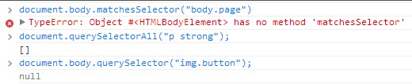

<link rel="stylesheet" href="./css/layout.css" type="text/css" />
前排提示：这章可以不用看，好奇宝宝可以深入了解。
# DOM扩展 #

*	[选择符API](#11.1)
	*	[querySelector()方法](#11.1.1)
	*	[querySelectorAll()方法](#11.1.2)
	*	[matchesSelector()方法](#11.1.3)
*	[元素遍历](#11.2)
*	[HTML5](#11.3)
	*	[与类相关的扩充](#11.3.1)
	*	[焦点管理](#11.3.2)
	*	[HTMLDocument的变化](#11.3.3)
	*	[字符集属性](#11.3.4)
	*	[自定义数据属性](#11.3.5)
	*	[插入标记](#11.3.6)
	*	[scrollIntoView()方法](#11.3.7)

对DOM 的两个主要的扩展是Selectors API（选择符API）和HTML5。这两个扩展都源自开发社区，
而将某些常见做法及API 标准化一直是众望所归。此外还有一个不那么引人瞩目的Element Traversal
（元素遍历）规范，为DOM添加了一些属性。

<h2 id="11.1">选择符API</h2>
众多JavaScript 库中最常用的一项功能，就是根据CSS 选择符选择与某个模式匹配的DOM 元素。
实际上，jQuery（www.jquery.com）的核心就是通过CSS 选择符查询DOM文档取得元素的引用，从而
抛开了getElementById()和getElementsByTagName()。

Selectors API（www.w3.org/TR/selectors-api/）是由W3C 发起制定的一个标准，致力于让浏览器原
生支持CSS 查询。现有的js库为了实现这样的功能都会写一个基础的CSS 解析器，然后再使用已有的
DOM 方法查询文档并找到匹配的节点。不论库代码如何优化，最终落脚点都是js代码查询。而Selectors API则封装在浏览器内部的编译代码中，性能当然优越。

Selectors API Level 1 的核心是两个方法：querySelector()和querySelectorAll()。在兼容的浏
览器中，可以通过Document 及Element 类型的实例调用它们。目前已完全支持Selectors API Level 1
的浏览器有IE 8+、Firefox 3.5+、Safari 3.1+、Chrome 和Opera 10+。

<h3 id="11.1.1">querySelector()方法</h3>
querySelector()方法接收一个CSS 选择符，返回与该模式匹配的第一个元素，如果没有找到匹
配的元素，返回null。

	//取得body 元素
	var body = document.querySelector("body");
	//取得ID 为"myDiv"的元素
	var myDiv = document.querySelector("#myDiv");
	//取得类为"selected"的第一个元素
	var selected = document.querySelector(".selected");
	//取得类为"button"的第一个图像元素
	var img = document.body.querySelector("img.button");

通过Document 类型调用querySelector()方法时，会在文档元素的范围内查找匹配的元素。而
通过Element 类型调用querySelector()方法时，只会在该元素后代元素的范围内查找匹配的元素。

<h3 id="11.1.2">querySelectorAll()方法</h3>
querySelectorAll()方法接收的参数与querySelector()方法一样，都是一个CSS 选择符，但
返回的是所有匹配的元素而不仅仅是一个元素。这个方法返回的是一个NodeList 的实例。

具体来说，返回的值实际上是带有所有属性和方法的NodeList，而其底层实现则类似于一组元素
的快照，而非不断对文档进行搜索的动态查询。这样实现可以避免使用NodeList 对象通常会引起的大
多数性能问题。

只要传给querySelectorAll()方法的CSS 选择符有效，该方法都会返回一个NodeList 对象，
而不管找到多少匹配的元素。如果没有找到匹配的元素，NodeList 就是空的。与querySelector()类似，能够调用querySelectorAll()方法的类型包括Document、DocumentFragment 和Element。

	//取得某
中的所有<em>元素（类似于getElementsByTagName("em")）
	var ems = document.getElementById("myDiv").querySelectorAll("em");
	//取得类为"selected"的所有元素
	var selecteds = document.querySelectorAll(".selected");
	//取得所有
元素中的所有<strong>元素
	var strongs = document.querySelectorAll("p strong");

要取得返回的NodeList 中的每一个元素，可以使用item()方法，也可以使用方括号语法：

	var i, len, strong;
	for (i=0, len=strongs.length; i < len; i++){
		strong = strongs[i]; //或者strongs.item(i)
		strong.className = "important";
	}

<h3 id="11.1.3">matchesSelector()方法</h3>
Selectors API Level 2 规范为Element 类型新增了一个方法matchesSelector()。这个方法接收
一个参数，即CSS 选择符，如果调用元素与该选择符匹配，返回true；否则，返回false。

	if (document.body.matchesSelector("body.page1")){
		//true
	}

然而，支持这个东西的浏览器少得可怜：

所以，在web新标准覆盖率低的可怜的当前，这几个就雪藏了（jquery那么好用，何必呢。。）。

<h2 id="11.2">元素遍历</h2>
对于元素间的空格，IE9 及之前版本不会返回文本节点，而其他所有浏览器都会返回文本节点。这样，
就导致了在使用childNodes 和firstChild 等属性时的行为不一致。为了弥补这一差异，而同时又保
持DOM规范不变，Element Traversal 规范（www.w3.org/TR/ElementTraversal/）新定义了一组属性。

- childElementCount：返回子元素（不包括文本节点和注释）的个数。
- firstElementChild：指向第一个子元素；firstChild 的元素版。
- lastElementChild：指向最后一个子元素；lastChild 的元素版。
- previousElementSibling：指向前一个同辈元素；previousSibling 的元素版。
- nextElementSibling：指向后一个同辈元素；nextSibling 的元素版。

利用这些元素不必担心空白文本节点。

过去，要跨浏览器遍历某元素的所有子元素，需要像下面这样写代码。

	var i,
	len,
	child = element.firstChild;

	while(child != element.lastChild){
		if (child.nodeType == 1){ //检查是不是元素
			processChild(child);
		}
		child = child.nextSibling;
	}

而使用Element Traversal 新增的元素，代码会更简：

	var i,
	len,
	child = element.firstElementChild;

	while(child != element.lastElementChild){
		processChild(child); //已知其是元素
		child = child.nextElementSibling;
	}

支持Element Traversal 规范的浏览器有IE 9+、Firefox 3.5+、Safari 4+、Chrome 和Opera 10+。

<h2 id="11.3">HTML5</h2>

对于传统HTML 而言，HTML5 是一个叛逆。所有之前的版本对JavaScript 接口的描述都不过三言
两语，主要篇幅都用于定义标记，与JavaScript 相关的内容一概交由DOM 规范去定义。
而HTML5 规范则围绕如何使用新增标记定义了大量JavaScript API。其中一些API 与DOM 重叠，
定义了浏览器应该支持的DOM扩展。

HTML5 涉及的面非常广，本节只讨论与DOM 节点相关的内容。

<h3 id="11.3.1">与类相关的扩充</h3>
HTML4 在Web 开发领域得到广泛采用后导致了一个很大的变化，即class 属性用得越来越多，一
方面可以通过它为元素添加样式，另一方面还可以用它表示元素的语义。于是，自然就有很多JavaScript
代码会来操作CSS 类，比如动态修改类或者搜索文档中具有给定类或给定的一组类的元素，等等。为了
让开发人员适应并增加对class 属性的新认识，HTML5 新增了很多API，致力于简化CSS 类的用法。

1.getElementByClassName()方法

getElementsByClassName()方法接收一个参数，即一个包含一或多个类名的字符串，返回带有
指定类的所有元素的NodeList。传入多个类名时，类名的先后顺序不重要。

	//取得所有类中包含"username"和"current"的元素，类名的先后顺序无所谓
	var allCurrentUsernames = document.getElementsByClassName("username current");
	//取得ID 为"myDiv"的元素中带有类名"selected"的所有元素
	var selected = document.getElementById("myDiv").getElementsByClassName("selected");

支持getElementsByClassName()方法的浏览器有IE 9+、Firefox 3+、Safari 3.1+、Chrome 和
Opera 9.5+，真的好用。

2.classList属性

在操作类名时，需要通过className 属性添加、删除和替换类名。因为className 中是一个字
符串，所以即使只修改字符串一部分，也必须每次都设置整个字符串的值。

比如：

	
...

如果要删除其中一个class属性，原始的做法：

	//删除"user"类

	//首先，取得类名字符串并拆分成数组
	var classNames = div.className.split(/\s+/);

	//找到要删的类名
	var pos = -1,
	i,
	len;

	for (i=0, len=classNames.length; i < len; i++){
		if (classNames[i] == "user"){
			pos = i;
			break;
		}
	}
	//删除类名
	classNames.splice(i,1);

	//把剩下的类名拼成字符串并重新设置
	div.className = classNames.join(" ");

一顿操作真的烦啊。

HTML5 新增了一种操作类名的方式，可以让操作更简单也更安全，那就是为所有元素添加classList 属性。这个classList 属性是新集合类型DOMTokenList 的实例。DOMTokenList 有一个表示自己包含多少元素的length 属性，而要取得每个元素可以使用item()方法，也可以使用方括号语法，也是非常懂事。

这个新类型还定义了几个方法：

- add(value)：将给定的字符串值添加到列表中。如果值已经存在，就不添加了。
- contains(value)：表示列表中是否存在给定的值，如果存在则返回true，否则返回false。
- remove(value)：从列表中删除给定的字符串。
- toggle(value)：如果列表中已经存在给定的值，删除它；如果列表中没有给定的值，添加它。

上面的一顿操作，也就一句话搞定：

	div.classList.remove("user");

一些用法：

	//删除"disabled"类
	div.classList.remove("disabled");

	//添加"current"类
	div.classList.add("current");
	//切换"user"类
	div.classList.toggle("user");

	//确定元素中是否包含既定的类名
	if (div.classList.contains("bd") && !div.classList.contains("disabled")){
		//执行操作
	)

	//迭代类名
	for (var i=0, len=div.classList.length; i < len; i++){
		doSomething(div.classList[i]);
	}

有了classList 属性，除非你需要全部删除所有类名，或者完全重写元素的class 属性，否则也
就用不到className 属性了。

支持classList 属性的浏览器有Firefox 3.6+和Chrome。

<h3 id="11.3.2">焦点管理</h3>
HTML5 也添加了辅助管理DOM 焦点的功能。首先就是document.activeElement 属性，这个
属性始终会引用DOM 中当前获得了焦点的元素。元素获得焦点的方式有页面加载、用户输入（通常是
通过按Tab 键）和在代码中调用focus()方法。

	var button = document.getElementById("myButton");
	button.focus();
	alert(document.activeElement === button); //true

>默认情况下，文档刚刚加载完成时，document.activeElement 中保存的是document.body 元
素的引用。文档加载期间，document.activeElement 的值为null。

另外就是新增了document.hasFocus()方法，这个方法用于确定文档是否获得了焦点。

	var button = document.getElementById("myButton");
	button.focus();
	alert(document.hasFocus()); //true

通过检测文档是否获得了焦点，可以知道用户是不是正在与页面交互。

实现了这两个属性的浏览器的包括IE 4+、Firefox 3+、Safari 4+、Chrome 和Opera 8+。

<h3 id="11.3.3">HTMLDocument的变化</h3>
HTML5 扩展了HTMLDocument，增加了新的功能。

1.readyState属性

Document 的readyState 属性有两个可能的值：

- loading，正在加载文档；
- complete，已经加载完文档。

使用document.readyState 的最恰当方式，就是通过它来实现一个指示文档已经加载完成的指
示器。在这个属性得到广泛支持之前，要实现这样一个指示器，必须借助onload 事件处理程序设置一
个标签，表明文档已经加载完毕。

	if (document.readyState == "complete"){
		//执行操作
	}

支持readyState 属性的浏览器有IE4+、Firefox 3.6+、Safari、Chrome 和Opera 9+。

2.兼容模式

自从IE6 开始区分渲染页面的模式是标准的还是混杂的，检测页面的兼容模式就成为浏览器的必要
功能。IE 为此给document 添加了一个名为compatMode 的属性，这个属性就是为了告诉开发人员浏
览器采用了哪种渲染模式。就像下面例子中所展示的那样，在标准模式下，document.compatMode 的
值等于"CSS1Compat"，而在混杂模式下，document.compatMode 的值等于"BackCompat"。

	if (document.compatMode == "CSS1Compat"){
		alert("Standards mode");
	} else {
		alert("Quirks mode");
	}

后来，陆续实现这个属性的浏览器有Firefox、Safari 3.1+、Opera 和Chrome。最终，HTML5 也把
这个属性纳入标准，对其实现做出了明确规定。

3.head属性
作为对document.body 引用文档的`<body>`元素的补充，HTML5 新增了document.head 属性，
引用文档的`<head>`元素。要引用文档的`<head>`元素，可以结合使用这个属性和另一种后备方法。

	var head = document.head || document.getElementsByTagName("head")[0];

实现document.head 属性的浏览器包括Chrome 和Safari 5。

<h3 id="11.3.4">字符集属性</h3>
HTML5 新增了几个与文档字符集有关的属性。其中，charset 属性表示文档中实际使用的字符集，
也可以用来指定新字符集。默认情况下，这个属性的值为"UTF-16"，但可以通过`<meta>`元素、响应头
部或直接设置charset 属性修改这个值。

	alert(document.charset); //"UTF-16"
	document.charset = "UTF-8";

另一个属性是defaultCharset，表示根据默认浏览器及操作系统的设置，当前文档默认的字符集
应该是什么。如果文档没有使用默认的字符集，那charset 和defaultCharset 属性的值可能会不一
样。

	if (document.charset != document.defaultCharset){
		alert("Custom character set being used.");
	}

通过这两个属性可以得到文档使用的字符编码的具体信息，也能对字符编码进行准确地控制。运行
适当的情况下，可以保证用户正常查看页面或使用应用。

支持document.charset 属性的浏览器有IE 、Firefox 、Safari 、Opera 和Chrome 。支持
document.defaultCharset 属性的浏览器有IE、Safari 和Chrome。

<h3 id="11.3.5">自定义数据属性</h3>
HTML5 规定可以为元素添加非标准的属性，但要添加前缀data-，目的是为元素提供与渲染无关的
信息，或者提供语义信息。这些属性可以任意添加、随便命名，只要以data-开头即可。

	

添加了自定义属性之后，可以通过元素的dataset 属性来访问自定义属性的值。dataset 属性的
值是DOMStringMap 的一个实例，也就是一个名值对儿的映射。在这个映射中，每个data-name 形式
的属性都会有一个对应的属性，只不过属性名没有data-前缀。

	//本例中使用的方法仅用于演示
	var div = document.getElementById("myDiv");
	
	//取得自定义属性的值
	var appId = div.dataset.appId;
	var myName = div.dataset.myname;

	//设置值
	div.dataset.appId = 23456;
	div.dataset.myname = "Michael";

	//有没有"myname"值呢？
	if (div.dataset.myname){
		alert("Hello, " + div.dataset.myname);
	}

支持自定义数据属性的浏览器有Firefox 6+和Chrome。

<h3 id="11.3.6">插入标记</h3>
虽然DOM 为操作节点提供了细致入微的控制手段，但在需要给文档插入大量新HTML 标记的情况
下，通过DOM操作仍然非常麻烦，因为不仅要创建一系列DOM 节点，而且还要小心地按照正确的顺
序把它们连接起来。相对而言，使用插入标记的技术，直接插入HTML 字符串不仅更简单，速度也更
快。以下与插入标记相关的DOM 扩展已经纳入了HTML5 规范。

1.innerHTML 属性

在读模式下，innerHTML 属性返回与调用元素的所有子节点（包括元素、注释和文本节点）对应
的HTML 标记。在写模式下，innerHTML 会根据指定的值创建新的DOM树，然后用这个DOM树完全
替换调用元素原先的所有子节点。

	

		
This is a <strong>paragraph</strong> with a list following it.

		<ul>
			<li>Item 1</li>
			<li>Item 2</li>
			<li>Item 3</li>
		</ul>
	

对于上面的
元素来说，它的innerHTML 属性会返回如下字符串。

	
This is a <strong>paragraph</strong> with a list following it.

	<ul>
		<li>Item 1</li>
		<li>Item 2</li>
		<li>Item 3</li>
	</ul>

在写模式下，innerHTML 的值会被解析为DOM 子树，替换调用元素原来的所有子节点。因为它的
值被认为是HTML，所以其中的所有标签都会按照浏览器处理HTML 的标准方式转换为元素（同样，
这里的转换结果也因浏览器而异）。如果设置的值仅是文本而没有HTML 标签，那么结果就是设置纯文
本。

	div.innerHTML = "Hello world!";

为innerHTML 设置的包含HTML 的字符串值与解析后innerHTML 的值大不相同。来看下面的
例子。

	div.innerHTML = "Hello & welcome, <b>\"reader\"!</b>";

以上操作得到的结果如下：

	
Hello &amp; welcome, <b>&quot;reader&quot;!</b>

>为innerHTML 设置HTML 字符串后，浏览器会将这个字符串解析为相应的DOM
树。因此设置了innerHTML 之后，再从中读取HTML 字符串，会得到与设置时不一
样的结果。原因在于返回的字符串是根据原始HTML 字符串创建的DOM树经过序列
化之后的结果。

2.outerHTML属性

在读模式下，outerHTML 返回调用它的元素及所有子节点的HTML 标签。在写模式下，outerHTML
会根据指定的HTML 字符串创建新的DOM 子树，然后用这个DOM子树完全替换调用元素。

3.insertAdjacentHTML()方法

接收两个参数：插入位置和要插入的HTML 文本。第一个参数必须是下列值之一：

- "beforebegin"，在当前元素之前插入一个紧邻的同辈元素；
- "afterbegin"，在当前元素之下插入一个新的子元素或在第一个子元素之前再插入新的子元素；
- "beforeend"，在当前元素之下插入一个新的子元素或在最后一个子元素之后再插入新的子元素；
- "afterend"，在当前元素之后插入一个紧邻的同辈元素。

<h3 id="11.3.7">scrollIntoView()方法</h3>
如何滚动页面也是DOM 规范没有解决的一个问题。为了解决这个问题，浏览器实现了一些方法，
以方便开发人员更好地控制页面滚动。在各种专有方法中，HTML5 最终选择了scrollIntoView()作
为标准方法。

scrollIntoView()可以在所有HTML 元素上调用，通过滚动浏览器窗口或某个容器元素，调用元素就可以出现在视口中。如果给这个方法传入true 作为参数，或者不传入任何参数，那么窗口滚动
之后会让调用元素的顶部与视口顶部尽可能平齐。如果传入false 作为参数，调用元素会尽可能全部
出现在视口中，（可能的话，调用元素的底部会与视口顶部平齐。）

	//让元素可见
	document.forms[0].scrollIntoView();

2016/4/22 10:55:27 @author: rootkit