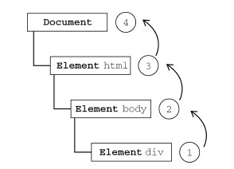
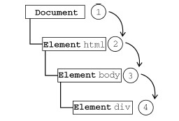

<link rel="stylesheet" href="./css/layout.css" type="text/css" />
# 事件 #
JavaScript 与HTML 之间的交互是通过事件实现的。事件，就是文档或浏览器窗口中发生的一些
特定的交互瞬间。可以使用侦听器（或处理程序）来预订事件，以便事件发生时执行相应的代
码。

<h2 id="13.1">事件流</h2>
浏览器厂商在这一点上达成了一致：单击按钮的同时，也单击了按钮的容器元素，甚至也单击了整个页面。

事件流描述的是从页面中接收事件的顺序。然而IE 和Netscape 开发团队居然提出了差不多是完全相反的事件流的概念。IE 的事件流是事件冒泡流，而Netscape Communicator 的事件流是事件捕获流。

<h3 id="13.1.1">事件冒泡</h3>
IE 的事件流叫做事件冒泡（event bubbling），即事件开始时由最具体的元素（文档中嵌套层次最深
的那个节点）接收，然后逐级向上传播到较为不具体的节点（文档）。

	<!DOCTYPE html>
	<html>
	<head>
		<title>Event Bubbling Example</title>
	</head>
	<body>
		
Click Me

	</body>
	</html>

如果你单击了页面中的
元素，那么这个click 事件会按照如下顺序传播：

所有现代浏览器都支持事件冒泡，但在具体实现上还是有一些差别。IE5.5 及更早版本中的事件冒泡会跳过`<html>`元素（从`<body>`直接跳到document）。IE9、Firefox、Chrome 和Safari 则将事件一直冒泡到window 对象。

<h3 id="13.1.2">事件捕获</h3>
Netscape Communicator 团队提出的另一种事件流叫做事件捕获（event capturing）。事件捕获的思想是不太具体的节点应该更早接收到事件，而最具体的节点应该最后接收到事件。事件捕获的用意在于在事件到达预定目标之前捕获它。如果仍以前面的HTML 页面作为演示事件捕获的例子，那么单击`
`元素就会以下列顺序触发click 事件。

虽然事件捕获是Netscape Communicator 唯一支持的事件流模型，但IE9、Safari、Chrome、Opera
和Firefox 目前也都支持这种事件流模型。

**由于老版本的浏览器不支持，因此很少有人使用事件捕获。我们也建议读者放心地使用事件冒泡，
在有特殊需要时再使用事件捕获。**

<h2 id="13.2">事件处理程序</h2>
事件就是用户或浏览器自身执行的某种动作。诸如click、load 和mouseover，都是事件的名字。
而响应某个事件的函数就叫做事件处理程序（或事件侦听器）。事件处理程序的名字以"on"开头，因此
click 事件的事件处理程序就是onclick，load 事件的事件处理程序就是onload。为事件指定处理
程序的方式有好几种。

<h3 id="13.2.1">HTML事件处理程序</h3>

	<input type="button" value="Click Me" onclick="alert('Clicked')" />

没什么好说的。

	
	<input type="button" value="Click Me" onclick="showMessage()" />

这样指定事件处理程序具有一些独到之处。首先，这样会创建一个封装着元素属性值的函数。这个
函数中有一个局部变量event，也就是事件对象。

	<!-- 输出 "click" -->
	<input type="button" value="Click Me" onclick="alert(event.type)">

通过event 变量，可以直接访问事件对象，你不用自己定义它，也不用从函数的参数列表中读取。
在这个函数内部，this 值等于事件的目标元素，例如：

	<!-- 输出 "Click Me" -->
	<input type="button" value="Click Me" onclick="alert(this.value)">

关于这个动态创建的函数，另一个有意思的地方是它扩展作用域的方式。在这个函数内部，可以像
访问局部变量一样访问document 及该元素本身的成员。这个函数使用with 像下面这样扩展作用域：

	function(){
		with(document){
			with(this){
				//元素属性值
			}
		}
	}

如此一来，事件处理程序要访问自己的属性就简单多了。下面这行代码与前面的例子效果相同：

	<!-- 输出 "Click Me" -->
	<input type="button" value="Click Me" onclick="alert(value)">

如果当前元素是一个表单输入元素，则作用域中还会包含访问表单元素（父元素）的入口，这个函
数就变成了如下所示：
	
	function(){
		with(document){
			with(this.form){
				with(this){
					//元素属性值
				}
			}
		}
	}

实际上，这样扩展作用域的方式，无非就是想让事件处理程序无需引用表单元素就能访问其他表单字段。

	<form method="post">
		<input type="text" name="username" value="">
		<input type="button" value="Echo Username" onclick="aler(username.value)">
	</form>

<h3 id="13.2.2">DOM0级事件处理程序</h3>

	var btn = document.getElementById("myBtn");
	btn.onclick = function(){
		alert("Clicked");
	};

使用DOM0 级方法指定的事件处理程序被认为是元素的方法。因此，这时候的事件处理程序是在
元素的作用域中运行；换句话说，程序中的this 引用当前元素。

	var btn = document.getElementById("myBtn");
	btn.onclick = function(){
		alert(this.id); //"myBtn"
	};

<h3 id="13.2.3">DOM2级事件处理程序</h3>
“DOM2级事件”定义了两个方法，用于处理指定和删除事件处理程序的操作：addEventListener()
和removeEventListener()。所有DOM节点中都包含这两个方法，并且它们都接受3 个参数：要处
理的事件名、作为事件处理程序的函数和一个布尔值。最后这个布尔值参数如果是true，表示在捕获
阶段调用事件处理程序；如果是false，表示在冒泡阶段调用事件处理程序。
	
	var btn = document.getElementById("myBtn");
	btn.addEventListener("click", function(){
		alert(this.id);
	}, false);

使用DOM2 级方法添加事件处理程序的主要好处是可以添加多个事件处理程序。

	var btn = document.getElementById("myBtn");
	btn.addEventListener("click", function(){
		alert(this.id);
	}, false);

	btn.addEventListener("click", function(){
		alert("Hello world!");
	}, f alse);

这里为按钮添加了两个事件处理程序。这两个事件处理程序会按照添加它们的顺序触发，因此首先
会显示元素的ID，其次会显示"Hello world!"消息。

通过addEventListener()添加的事件处理程序只能使用removeEventListener()来移除；移
除时传入的参数与添加处理程序时使用的参数相同。这也意味着通过addEventListener()添加的匿
名函数将无法移除。

	var btn = document.getElementById("myBtn");
	var handler = function(){
		alert(this.id);
	};

	btn.addEventListener("click", handler, false);

	//这里省略了其他代码

	btn.removeEventListener("click", handler, false); //有效！

IE9、Firefox、Safari、Chrome 和Opera 支持DOM2 级事件处理程序。

<h3 id="13.2.4">IE事件处理程序</h3>
IE 实现了与DOM 中类似的两个方法：attachEvent()和detachEvent()。这两个方法接受相同
的两个参数：事件处理程序名称与事件处理程序函数。由于IE8 及更早版本只支持事件冒泡，所以通过
attachEvent()添加的事件处理程序都会被添加到冒泡阶段。

捞比函数不展开了。

<h3 id="13.2.5">跨浏览器的事件处理程序</h3>
好用的事件处理程序应该像这样：

	var EventUtil = {
		addHandler: function(element, type, handler){
			if (element.addEventListener){
				element.addEventListener(type, handler, false);
			} else if (element.attachEvent){
				element.attachEvent("on" + type, handler);
			} else {
				element["on" + type] = handler;
			}
		},
		removeHandler: function(element, type, handler){
			if (element.removeEventListener){
				element.removeEventListener(type, handler, false);
			} else if (element.detachEvent){
				element.detachEvent("on" + type, handler);
			} else {
				element["on" + type] = null;
			}
		}
	};

使用如下：

	var btn = document.getElementById("myBtn");
	var handler = function(){
		alert("Clicked");
	};

	EventUtil.addHandler(btn, "click", handler);

	//这里省略了其他代码

	EventUtil.removeHandler(btn, "click", handler);

<h2 id="13.3">事件对象</h2>
在触发DOM上的某个事件时，会产生一个事件对象event，这个对象中包含着所有与事件有关的
信息。包括导致事件的元素、事件的类型以及其他与特定事件相关的信息。例如，鼠标操作导致的事件
对象中，会包含鼠标位置的信息，而键盘操作导致的事件对象中，会包含与按下的键有关的信息。所有
浏览器都支持event 对象，但支持方式不同。

<h3 id="13.3.1">DOM中的事件对象</h3>
兼容DOM 的浏览器会将一个event 对象传入到事件处理程序中。无论指定事件处理程序时使用什
么方法（DOM0 级或DOM2 级），都会传入event 对象。

	var btn = document.getElementById("myBtn");
	btn.onclick = function(event){
		alert(event.type); //"click"
	};
	btn.addEventListener("click", function(event){
		alert(event.type); //"click"
	}, false);

event 对象包含与创建它的特定事件有关的属性和方法。触发的事件类型不一样，可用的属性和方
法也不一样。

具体的属性方法见到时再看吧，不展开了，用处不大。

只有在事件处理程序执行期间，event 对象才会存在；一旦事件处理程序执行完成，event 对象就会被销毁。

<h3 id="13.3.2">IE中的事件对象</h3>
与访问DOM中的event 对象不同，要访问IE 中的event 对象有几种不同的方式，取决于指定事
件处理程序的方法。在使用DOM0 级方法添加事件处理程序时，event 对象作为window 对象的一个
属性存在。

	var btn = document.getElementById("myBtn");
	btn.onclick = function(){
		var event = window.event;
		alert(event.type); //"click"
	};

如果事件处理程序是使用attachEvent()添加的，那么就会有一个event 对象作为参数被传入事件处理程序函数中。

	var btn = document.getElementById("myBtn");
	btn.attachEvent("onclick", function(event){
		alert(event.type); //"click"
	});

<h3 id="13.3.3">跨浏览器的事件对象</h3>
按照惯例，求同存异：

	var EventUtil = {
		addHandler: function(element, type, handler){
			//省略的代码
		},

		getEvent: function(event){
			return event ? event : window.event;
		},

		getTarget: function(event){
			return event.target || event.srcElement;
		},

		preventDefault: function(event){
			if (event.preventDefault){
				event.preventDefault();
			} else {
				event.returnValue = false;
			}
		},

		removeHandler: function(element, type, handler){
			//省略的代码
		},

		stopPropagation: function(event){
			if (event.stopPropagation){
				event.stopPropagation();
			} else {
				event.cancelBubble = true;
			}
		}
	};

想要了解细节，看看书吧，个人觉着没什么用。

<h2 id="13.4">事件类型</h2>
不同的事件类型具有不同的信息，而“DOM3级事件”规定了以下几类事件。

- UI（User Interface，用户界面）事件，当用户与页面上的元素交互时触发；
- 焦点事件，当元素获得或失去焦点时触发；
- 鼠标事件，当用户通过鼠标在页面上执行操作时触发；
- 滚轮事件，当使用鼠标滚轮（或类似设备）时触发；
- 文本事件，当在文档中输入文本时触发；
- 键盘事件，当用户通过键盘在页面上执行操作时触发；
- 合成事件，当为IME（Input Method Editor，输入法编辑器）输入字符时触发；
- 变动（mutation）事件，当底层DOM 结构发生变化时触发。

2016/4/22 15:06:20 @author: rootkit