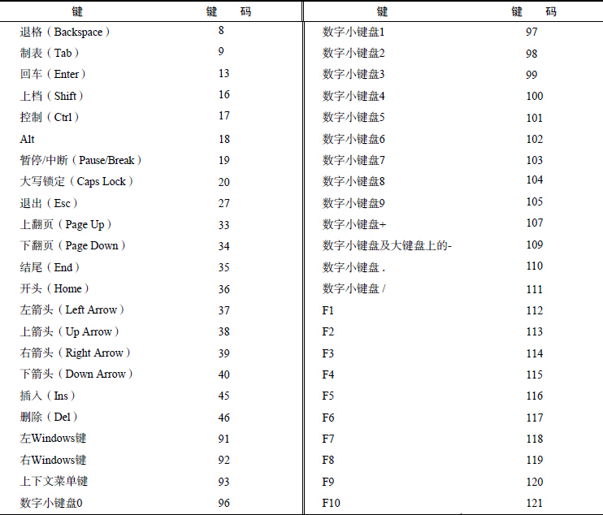

<link rel="stylesheet" href="./css/layout.css" type="text/css" />
# 事件 #

*	[事件流](#13.1)
	*	[事件冒泡](#13.1.1)
	*	[事件捕获](#13.1.2)
*	[事件处理程序](#13.2)
	*	[HTML事件处理程序](#13.2.1)
	*	[DOM0级事件处理程序](#13.2.2)
	*	[DOM2级事件处理程序](#13.2.3)
	*	[IE事件处理程序](#13.2.4)
	*	[跨浏览器事件处理程序](#13.2.5)
*	[事件对象](#13.3)
	*	[DOM中的事件对象](#13.3.1)
	*	[IE中的事件对象](#13.3.2)
	*	[跨浏览器的事件处理程序](#13.3.3)
*	[事件类型](#13.4)
	*	[UI事件](#13.4.1)
	*	[焦点事件](#13.4.2)
	*	[鼠标与滚轮事件](#13.4.3)
	*	[键盘与文本事件](#13.4.4)
*	[内存和性能](#13.5)
	*	[事件委托](#13.5.1)
	*	[移除事件处理程序](#13.5.2)
*	[模拟事件](#13.6)
	*	[DOM中的事件模拟](#13.6.1)
	*	[IE中的事件模拟](#13.6.2)

JavaScript 与HTML 之间的交互是通过事件实现的。事件，就是文档或浏览器窗口中发生的一些
特定的交互瞬间。可以使用侦听器（或处理程序）来预订事件，以便事件发生时执行相应的代
码。

<h2 id="13.1">事件流</h2>
浏览器厂商在这一点上达成了一致：单击按钮的同时，也单击了按钮的容器元素，甚至也单击了整个页面。

事件流描述的是从页面中接收事件的顺序。然而IE 和Netscape 开发团队居然提出了差不多是完全相反的事件流的概念。IE 的事件流是事件冒泡流，而Netscape Communicator 的事件流是事件捕获流。

<h3 id="13.1.1">事件冒泡</h3>
IE 的事件流叫做事件冒泡（event bubbling），即事件开始时由最具体的元素（文档中嵌套层次最深
的那个节点）接收，然后逐级向上传播到较为不具体的节点（文档）。

	<!DOCTYPE html>
	<html>
	<head>
		<title>Event Bubbling Example</title>
	</head>
	<body>
		
Click Me

	</body>
	</html>

如果你单击了页面中的
元素，那么这个click 事件会按照如下顺序传播：

所有现代浏览器都支持事件冒泡，但在具体实现上还是有一些差别。IE5.5 及更早版本中的事件冒泡会跳过`<html>`元素（从`<body>`直接跳到document）。IE9、Firefox、Chrome 和Safari 则将事件一直冒泡到window 对象。

<h3 id="13.1.2">事件捕获</h3>
Netscape Communicator 团队提出的另一种事件流叫做事件捕获（event capturing）。事件捕获的思想是不太具体的节点应该更早接收到事件，而最具体的节点应该最后接收到事件。事件捕获的用意在于在事件到达预定目标之前捕获它。如果仍以前面的HTML 页面作为演示事件捕获的例子，那么单击`
`元素就会以下列顺序触发click 事件。

虽然事件捕获是Netscape Communicator 唯一支持的事件流模型，但IE9、Safari、Chrome、Opera
和Firefox 目前也都支持这种事件流模型。

**由于老版本的浏览器不支持，因此很少有人使用事件捕获。我们也建议读者放心地使用事件冒泡，
在有特殊需要时再使用事件捕获。**

<h2 id="13.2">事件处理程序</h2>
事件就是用户或浏览器自身执行的某种动作。诸如click、load 和mouseover，都是事件的名字。
而响应某个事件的函数就叫做事件处理程序（或事件侦听器）。事件处理程序的名字以"on"开头，因此
click 事件的事件处理程序就是onclick，load 事件的事件处理程序就是onload。为事件指定处理
程序的方式有好几种。

<h3 id="13.2.1">HTML事件处理程序</h3>

	<input type="button" value="Click Me" onclick="alert('Clicked')" />

没什么好说的。

	
	<input type="button" value="Click Me" onclick="showMessage()" />

这样指定事件处理程序具有一些独到之处。首先，这样会创建一个封装着元素属性值的函数。这个
函数中有一个局部变量event，也就是事件对象。

	<!-- 输出 "click" -->
	<input type="button" value="Click Me" onclick="alert(event.type)">

通过event 变量，可以直接访问事件对象，你不用自己定义它，也不用从函数的参数列表中读取。
在这个函数内部，this 值等于事件的目标元素，例如：

	<!-- 输出 "Click Me" -->
	<input type="button" value="Click Me" onclick="alert(this.value)">

关于这个动态创建的函数，另一个有意思的地方是它扩展作用域的方式。在这个函数内部，可以像
访问局部变量一样访问document 及该元素本身的成员。这个函数使用with 像下面这样扩展作用域：

	function(){
		with(document){
			with(this){
				//元素属性值
			}
		}
	}

如此一来，事件处理程序要访问自己的属性就简单多了。下面这行代码与前面的例子效果相同：

	<!-- 输出 "Click Me" -->
	<input type="button" value="Click Me" onclick="alert(value)">

如果当前元素是一个表单输入元素，则作用域中还会包含访问表单元素（父元素）的入口，这个函
数就变成了如下所示：
	
	function(){
		with(document){
			with(this.form){
				with(this){
					//元素属性值
				}
			}
		}
	}

实际上，这样扩展作用域的方式，无非就是想让事件处理程序无需引用表单元素就能访问其他表单字段。

	<form method="post">
		<input type="text" name="username" value="">
		<input type="button" value="Echo Username" onclick="aler(username.value)">
	</form>

<h3 id="13.2.2">DOM0级事件处理程序</h3>

	var btn = document.getElementById("myBtn");
	btn.onclick = function(){
		alert("Clicked");
	};

使用DOM0 级方法指定的事件处理程序被认为是元素的方法。因此，这时候的事件处理程序是在
元素的作用域中运行；换句话说，程序中的this 引用当前元素。

	var btn = document.getElementById("myBtn");
	btn.onclick = function(){
		alert(this.id); //"myBtn"
	};

<h3 id="13.2.3">DOM2级事件处理程序</h3>
“DOM2级事件”定义了两个方法，用于处理指定和删除事件处理程序的操作：addEventListener()
和removeEventListener()。所有DOM节点中都包含这两个方法，并且它们都接受3 个参数：要处
理的事件名、作为事件处理程序的函数和一个布尔值。最后这个布尔值参数如果是true，表示在捕获
阶段调用事件处理程序；如果是false，表示在冒泡阶段调用事件处理程序。
	
	var btn = document.getElementById("myBtn");
	btn.addEventListener("click", function(){
		alert(this.id);
	}, false);

使用DOM2 级方法添加事件处理程序的主要好处是可以添加多个事件处理程序。

	var btn = document.getElementById("myBtn");
	btn.addEventListener("click", function(){
		alert(this.id);
	}, false);

	btn.addEventListener("click", function(){
		alert("Hello world!");
	}, f alse);

这里为按钮添加了两个事件处理程序。这两个事件处理程序会按照添加它们的顺序触发，因此首先
会显示元素的ID，其次会显示"Hello world!"消息。

通过addEventListener()添加的事件处理程序只能使用removeEventListener()来移除；移
除时传入的参数与添加处理程序时使用的参数相同。这也意味着通过addEventListener()添加的匿
名函数将无法移除。

	var btn = document.getElementById("myBtn");
	var handler = function(){
		alert(this.id);
	};

	btn.addEventListener("click", handler, false);

	//这里省略了其他代码

	btn.removeEventListener("click", handler, false); //有效！

IE9、Firefox、Safari、Chrome 和Opera 支持DOM2 级事件处理程序。

<h3 id="13.2.4">IE事件处理程序</h3>
IE 实现了与DOM 中类似的两个方法：attachEvent()和detachEvent()。这两个方法接受相同
的两个参数：事件处理程序名称与事件处理程序函数。由于IE8 及更早版本只支持事件冒泡，所以通过
attachEvent()添加的事件处理程序都会被添加到冒泡阶段。

捞比函数不展开了。

<h3 id="13.2.5">跨浏览器的事件处理程序</h3>
好用的事件处理程序应该像这样：

	var EventUtil = {
		addHandler: function(element, type, handler){
			if (element.addEventListener){
				element.addEventListener(type, handler, false);
			} else if (element.attachEvent){
				element.attachEvent("on" + type, handler);
			} else {
				element["on" + type] = handler;
			}
		},
		removeHandler: function(element, type, handler){
			if (element.removeEventListener){
				element.removeEventListener(type, handler, false);
			} else if (element.detachEvent){
				element.detachEvent("on" + type, handler);
			} else {
				element["on" + type] = null;
			}
		}
	};

使用如下：

	var btn = document.getElementById("myBtn");
	var handler = function(){
		alert("Clicked");
	};

	EventUtil.addHandler(btn, "click", handler);

	//这里省略了其他代码

	EventUtil.removeHandler(btn, "click", handler);

<h2 id="13.3">事件对象</h2>
在触发DOM上的某个事件时，会产生一个事件对象event，这个对象中包含着所有与事件有关的
信息。包括导致事件的元素、事件的类型以及其他与特定事件相关的信息。例如，鼠标操作导致的事件
对象中，会包含鼠标位置的信息，而键盘操作导致的事件对象中，会包含与按下的键有关的信息。所有
浏览器都支持event 对象，但支持方式不同。

<h3 id="13.3.1">DOM中的事件对象</h3>
兼容DOM 的浏览器会将一个event 对象传入到事件处理程序中。无论指定事件处理程序时使用什
么方法（DOM0 级或DOM2 级），都会传入event 对象。

	var btn = document.getElementById("myBtn");
	btn.onclick = function(event){
		alert(event.type); //"click"
	};
	btn.addEventListener("click", function(event){
		alert(event.type); //"click"
	}, false);

event 对象包含与创建它的特定事件有关的属性和方法。触发的事件类型不一样，可用的属性和方
法也不一样。

具体的属性方法见到时再看吧，不展开了，用处不大。

只有在事件处理程序执行期间，event 对象才会存在；一旦事件处理程序执行完成，event 对象就会被销毁。

<h3 id="13.3.2">IE中的事件对象</h3>
与访问DOM中的event 对象不同，要访问IE 中的event 对象有几种不同的方式，取决于指定事
件处理程序的方法。在使用DOM0 级方法添加事件处理程序时，event 对象作为window 对象的一个
属性存在。

	var btn = document.getElementById("myBtn");
	btn.onclick = function(){
		var event = window.event;
		alert(event.type); //"click"
	};

如果事件处理程序是使用attachEvent()添加的，那么就会有一个event 对象作为参数被传入事件处理程序函数中。

	var btn = document.getElementById("myBtn");
	btn.attachEvent("onclick", function(event){
		alert(event.type); //"click"
	});

<h3 id="13.3.3">跨浏览器的事件对象</h3>
按照惯例，求同存异：

	var EventUtil = {
		addHandler: function(element, type, handler){
			//省略的代码
		},

		getEvent: function(event){
			return event ? event : window.event;
		},

		getTarget: function(event){
			return event.target || event.srcElement;
		},

		preventDefault: function(event){
			if (event.preventDefault){
				event.preventDefault();
			} else {
				event.returnValue = false;
			}
		},

		removeHandler: function(element, type, handler){
			//省略的代码
		},

		stopPropagation: function(event){
			if (event.stopPropagation){
				event.stopPropagation();
			} else {
				event.cancelBubble = true;
			}
		}
	};

想要了解细节，看看书吧，个人觉着没什么用。

<h2 id="13.4">事件类型</h2>
不同的事件类型具有不同的信息，而“DOM3级事件”规定了以下几类事件。

- UI（User Interface，用户界面）事件，当用户与页面上的元素交互时触发；
- 焦点事件，当元素获得或失去焦点时触发；
- 鼠标事件，当用户通过鼠标在页面上执行操作时触发；
- 滚轮事件，当使用鼠标滚轮（或类似设备）时触发；
- 文本事件，当在文档中输入文本时触发；
- 键盘事件，当用户通过键盘在页面上执行操作时触发；
- 合成事件，当为IME（Input Method Editor，输入法编辑器）输入字符时触发；
- 变动（mutation）事件，当底层DOM 结构发生变化时触发。

<h3 id="13.4.1">UI事件</h3>
UI事件指的是那些不一定与用户操作有关的事件。这些事件在DOM规范出现之前，都是以这种或那种形式存在的，而在DOM 规范中保留是为了向后兼容。

- load：当页面完全加载后在window 上面触发，当所有框架都加载完毕时在框架集上触发，当图像加载完毕时在元素上面触发，或者当嵌入的内容加载完毕时在`<object>`元素上面触发。
- unload：当页面完全卸载后在window 上面触发，当所有框架都卸载后在框架集上面触发，或者当嵌入的内容卸载完毕后在`<object>`元素上面触发。
- abort：在用户停止下载过程时，如果嵌入的内容没有加载完，则在`<object>`元素上面触发。
- error：当发生JavaScript 错误时在window 上面触发，当无法加载图像时在``元素上面触发，当无法加载嵌入内容时在`<object>`元素上面触发，或者当有一或多个框架无法加载时在框架集上面触发。
- select：当用户选择文本框（`<input>`或`<texterea>`）中的一或多个字符时触发。
- resize：当窗口或框架的大小变化时在window 或框架上面触发。
- scroll：当用户滚动带滚动条的元素中的内容时，在该元素上面触发。`<body>`元素中包含所加载页面的滚动条。

1.load事件

JavaScript 中最常用的一个事件就是load。当页面完全加载后（包括所有图像、JavaScript 文件、CSS 文件等外部资源），就会触发window 上面的load 事件。

第一种方式：（采用前面封装的EventUtil对象）

	EventUtil.addHandler(window, "load", function(event){
		alert("Loaded!");
	});

第二种方式：（直接指定）

	<body onload="alert('Loaded!')">

建议尽可能使用JavaScript 方式。

图像上面也可以触发load 事件，无论是在DOM 中的图像元素还是HTML 中的图像元素。因此，可以在HTML 中为任何图像指定onload 事件处理程序：

	

这样，当例子中的图像加载完毕后就会显示一个警告框。同样的功能也可以使JavaScript 来实现：

	var image = document.getElementById("myImage");
	EventUtil.addHandler(image, "load", function(event){
		event = EventUtil.getEvent(event);
		alert(EventUtil.getTarget(event).src);
	});

在创建新的元素时，可以为其指定一个事件处理程序，以便图像加载完毕后给出提示。此时，最重要的是要在指定src 属性之前先指定事件：

	EventUtil.addHandler(window, "load", function(){
		var image = document.createElement("img");
			EventUtil.addHandler(image, "load", function(event){
			event = EventUtil.getEvent(event);
			alert(EventUtil.getTarget(event).src);
		});
		document.body.appendChild(image);
		image.src = "smile.gif";
	});

2.unload事件

与load 事件对应的是unload 事件，这个事件在文档被完全卸载后触发。只要用户从一个页面切换到另一个页面，就会发生unload 事件。而利用这个事件最多的情况是清除引用，以避免内存泄漏。与load 事件类似，也有两种指定onunload 事件处理程序的方式。第一种方式是使用JavaScript，第二种是直接指定。

3.resize事件

当浏览器窗口被调整到一个新的高度或宽度时，就会触发resize 事件。这个事件在window（窗口）上面触发，因此可以通过JavaScript 或者<body>元素中的onresize 特性来指定事件处理程序。

**浏览器窗口最小化或最大化时也会触发resize 事件。**

4.scroll事件

虽然scroll 事件是在window 对象上发生的，但它实际表示的则是页面中相应元素的变化。在混杂模式下，可以通过<body>元素的scrollLeft 和scrollTop 来监控到这一变化；而在标准模式下，除Safari 之外的所有浏览器都会通过<html>元素来反映这一变化。

与resize 事件类似，scroll 事件也会在文档被滚动期间重复被触发，所以有必要尽量保持事件处理程序的代码简单。

<h3 id="13.4.2">焦点事件</h3>
焦点事件会在页面元素获得或失去焦点时触发。利用这些事件并与document.hasFocus()方法及document.activeElement 属性配合，可以知晓用户在页面上的行踪。

有以下6 个焦点事件。

- blur：在元素失去焦点时触发。这个事件不会冒泡；所有浏览器都支持它。
- DOMFocusIn：在元素获得焦点时触发。这个事件与HTML 事件focus 等价，但它冒泡。只有Opera 支持这个事件。DOM3 级事件废弃了DOMFocusIn，选择了focusin。
- DOMFocusOut：在元素失去焦点时触发。这个事件是HTML 事件blur 的通用版本。只有Opera支持这个事件。DOM3 级事件废弃了DOMFocusOut，选择了focusout。
- focus：在元素获得焦点时触发。这个事件不会冒泡；所有浏览器都支持它。
- focusin：在元素获得焦点时触发。这个事件与HTML 事件focus 等价，但它冒泡。支持这个事件的浏览器有IE5.5+、Safari 5.1+、Opera 11.5+和Chrome。
- focusout：在元素失去焦点时触发。这个事件是HTML 事件blur 的通用版本。支持这个事件的浏览器有IE5.5+、Safari 5.1+、Opera 11.5+和Chrome。

主要用到的就是focus和blur。其他因为兼容问题没什么人用。

当焦点从页面中的一个元素移动到另一个元素，会依次触发下列事件：

1. focusout 在失去焦点的元素上触发；
2. focusin 在获得焦点的元素上触发；
3. blur 在失去焦点的元素上触发；
4. DOMFocusOut 在失去焦点的元素上触发；
5. focus 在获得焦点的元素上触发；
6. DOMFocusIn 在获得焦点的元素上触发。

其中，blur、DOMFocusOut 和focusout 的事件目标是失去焦点的元素；而focus、DOMFocusIn和focusin 的事件目标是获得焦点的元素。

确定浏览器是否支持：

	var isSupported = document.implementation.hasFeature("FocusEvent", "3.0");

<h3 id="13.4.3">鼠标与滚轮事件</h3>
鼠标事件是Web 开发中最常用的一类事件，毕竟鼠标还是最主要的定位设备。

DOM3 级事件中定义了9 个鼠标事件：

- click：在用户单击主鼠标按钮（一般是左边的按钮）或者按下回车键时触发。这一点对确保易访问性很重要，意味着onclick 事件处理程序既可以通过键盘也可以通过鼠标执行。
- dblclick：在用户双击主鼠标按钮（一般是左边的按钮）时触发。从技术上说，这个事件并不、是DOM2 级事件规范中规定的，但鉴于它得到了广泛支持，所以DOM3 级事件将其纳入了标准。
- mousedown：在用户按下了任意鼠标按钮时触发。不能通过键盘触发这个事件。
- mouseenter：在鼠标光标从元素外部首次移动到元素范围之内时触发。这个事件不冒泡，而且在光标移动到后代元素上不会触发。DOM2 级事件并没有定义这个事件，但DOM3 级事件将它纳入了规范。IE、Firefox 9+和Opera 支持这个事件。
- mouseleave：在位于元素上方的鼠标光标移动到元素范围之外时触发。这个事件不冒泡，而且在光标移动到后代元素上不会触发。DOM2 级事件并没有定义这个事件，但DOM3 级事件将它纳入了规范。IE、Firefox 9+和Opera 支持这个事件。
- mousemove：当鼠标指针在元素内部移动时重复地触发。不能通过键盘触发这个事件。
- mouseout：在鼠标指针位于一个元素上方，然后用户将其移入另一个元素时触发。又移入的另一个元素可能位于前一个元素的外部，也可能是这个元素的子元素。不能通过键盘触发这个事件。
- mouseover：在鼠标指针位于一个元素外部，然后用户将其首次移入另一个元素边界之内时触发。不能通过键盘触发这个事件。
- mouseup：在用户释放鼠标按钮时触发。不能通过键盘触发这个事件。

页面上的所有元素都支持鼠标事件。除了mouseenter 和mouseleave，所有鼠标事件都会冒泡，也可以被取消，而取消鼠标事件将会影响浏览器的默认行为。取消鼠标事件的默认行为还会影响其他事件，因为鼠标事件与其他事件是密不可分的关系。

> 细节：
> 
只有在同一个元素上相继触发mousedown 和mouseup 事件，才会触发click 事件；如果
mousedown 或mouseup 中的一个被取消，就不会触发click 事件。类似地，只有触发两次click 事件，才会触发一次dblclick 事件。如果有代码阻止了连续两次触发click 事件（可能是直接取消click事件，也可能通过取消mousedown 或mouseup 间接实现），那么就不会触发dblclick 事件了。

事件触发的顺序始终如下:

1. mousedown
2. mouseup
3. click
4. mousedown
5. mouseup
6. click
7. dblclick

显然，click 和dblclick 事件都会依赖于其他先行事件的触发；而mousedown 和mouseup 则不受其他事件的影响。

1.客户区坐标位置

鼠标事件都是在浏览器视口中的特定位置上发生的。这个位置信息保存在事件对象的clientX 和clientY 属性中。

	var div = document.getElementById("myDiv");
		EventUtil.addHandler(div, "click", function(event){
			event = EventUtil.getEvent(event);
			alert("Client coordinates: " + event.clientX + "," + event.clientY);
	});

2.页面坐标位置

通过客户区坐标能够知道鼠标是在视口中什么位置发生的，而页面坐标通过事件对象的pageX 和pageY 属性，能告诉你事件是在页面中的什么位置发生的。换句话说，这两个属性表示鼠标光标在页面中的位置，因此坐标是从页面本身而非视口的左边和顶边计算的。

	var div = document.getElementById("myDiv");
		EventUtil.addHandler(div, "click", function(event){
		event = EventUtil.getEvent(event);
		alert("Page coordinates: " + event.pageX + "," + event.pageY);
	});

3.屏幕坐标位置

鼠标事件发生时，不仅会有相对于浏览器窗口的位置，还有一个相对于整个电脑屏幕的位置。而通过screenX 和screenY 属性就可以确定鼠标事件发生时鼠标指针相对于整个屏幕的坐标信息。

	var div = document.getElementById("myDiv");
	EventUtil.addHandler(div, "click", function(event){
		event = EventUtil.getEvent(event);
		alert("Screen coordinates: " + event.screenX + "," + event.screenY);
	});

4.修改键

虽然鼠标事件主要是使用鼠标来触发的，但在按下鼠标时键盘上的某些键的状态也可以影响到所要采取的操作。这些修改键就是Shift、Ctrl、Alt 和Meta（在Windows 键盘中是Windows 键，在苹果机中是Cmd 键），它们经常被用来修改鼠标事件的行为。

DOM 为此规定了4 个属性，表示这些修改键的状态：shiftKey、ctrlKey、altKey 和metaKey。这些属性中包含的都是布尔值，如果相应的键被按下了，则值为true，否则值为false。当某个鼠标事件发生时，通过检测这几个属性就可以确定用户是否同时按下了其中的键。
	
	var div = document.getElementById("myDiv");
	EventUtil.addHandler(div, "click", function(event){
		event = EventUtil.getEvent(event);
		var keys = new Array();
	
		if (event.shiftKey){
			keys.push("shift");
		}
		if (event.ctrlKey){
			keys.push("ctrl");
		}
		if (event.altKey){
			keys.push("alt");
		}
		if (event.metaKey){
			keys.push("meta");
		}
		alert("Keys: " + keys.join(","));
	});

<h3 id="13.4.4">键盘与文本事件</h3>
有3 个键盘事件：
- keydown：当用户按下键盘上的任意键时触发，而且如果按住不放的话，会重复触发此事件。
- keypress：当用户按下键盘上的字符键时触发，而且如果按住不放的话，会重复触发此事件。按下Esc 键也会触发这个事件。Safari 3.1 之前的版本也会在用户按下非字符键时触发keypress事件。
- keyup：当用户释放键盘上的键时触发。

虽然所有元素都支持以上3 个事件，但只有在用户通过文本框输入文本时才最常用到。

1.键码

在发生keydown 和keyup 事件时，event 对象的keyCode 属性中会包含一个代码，与键盘上一个特定的键对应。对数字字母字符键，keyCode 属性的值与ASCII 码中对应小写字母或数字的编码相同。因此，数字键7 的keyCode 值为55，而字母A 键的keyCode 值为65——与Shift 键的状态无关。DOM 和IE 的event 对象都支持keyCode 属性。

	var textbox = document.getElementById("myText");
	EventUtil.addHandler(textbox, "keyup", function(event){
		event = EventUtil.getEvent(event);
		alert(event.keyCode);
	});

特殊键码表：

2.字符编码

发生keypress 事件意味着按下的键会影响到屏幕中文本的显示。在所有浏览器中，按下能够插入或删除字符的键都会触发keypress 事件；按下其他键能否触发此事件因浏览器而异。

**此外，还有些移动端的以及新规范不常见的事件不具体介绍了，可能一辈子都用不到，用到了再看看就好了。**

<h2 id="13.5">内存和性能</h2>
不分青红皂白的添加大量处理程序是不可取的，js毕竟是脚本，一旦尾大不掉，效率跌的厉害。

<h3 id="13.5.1">事件委托</h3>
对“事件处理程序过多”问题的解决方案就是**事件委托**。事件委托利用了事件冒泡，只指定一个事件处理程序，就可以管理某一类型的所有事件。例如，click 事件会一直冒泡到document 层次。也就是说，我们可以为整个页面指定一个onclick 事件处理程序，而不必给每个可单击的元素分别添加事件处理程序。以下面的HTML 代码为例。

	<ul id="myLinks">
		<li id="goSomewhere">Go somewhere</li>
		<li id="doSomething">Do something</li>
		<li id="sayHi">Say hi</li>
	</ul>

其中包含3 个被单击后会执行操作的列表项。按照传统的做法，需要像下面这样为它们添加3 个事件处理程序。

	var item1 = document.getElementById("goSomewhere");
	var item2 = document.getElementById("doSomething");
	var item3 = document.getElementById("sayHi");

	EventUtil.addHandler(item1, "click", function(event){
		location.href = "http://www.wrox.com";
	});
	EventUtil.addHandler(item2, "click", function(event){
		document.title = "I changed the document's title";
	});
	EventUtil.addHandler(item3, "click", function(event){
		alert("hi");
	});

这种写法真的吃屎，实际上委托给上一级就行了：

	var list = document.getElementById("myLinks");
	
	EventUtil.addHandler(list, "click", function(event){
		event = EventUtil.getEvent(event);
		var target = EventUtil.getTarget(event);
	
		switch(target.id){
		case "doSomething":
			document.title = "I changed the document's title";
			break;
		case "goSomewhere":
			location.href = "http://www.wrox.com";
			break;
		case "sayHi":
			alert("hi");
		break;
		}
	});

所有用到按钮的事件（多数鼠标事件和键盘事件）都适合采用事件委托技术。

<h3 id="13.5.2">移除事件处理程序</h3>
每当将事件处理程序指定给元素时，运行中的浏览器代码与支持页面交互的JavaScript 代码之间就会建立一个连接。这种连接越多，页面执行起来就越慢。如前所述，可以采用事件委托技术，限制建立的连接数量。另外，在不需要的时候移除事件处理程序，也是解决这个问题的一种方案。内存中留有那些过时不用的“空事件处理程序”（dangling event handler），也是造成Web 应用程序内存与性能问题的主要原因。

在两种情况下，可能会造成上述问题。第一种情况就是从文档中移除带有事件处理程序的元素时。这可能是通过纯粹的DOM操作，例如使用removeChild()和replaceChild()方法，但更多地是发生在使用innerHTML 替换页面中某一部分的时候。如果带有事件处理程序的元素被innerHTML 删除了，那么原来添加到元素中的事件处理程序极有可能无法被当作垃圾回收。

	

		<input type="button" value="Click Me" id="myBtn">
	

	

这里，有一个按钮被包含在
元素中。为避免双击，单击这个按钮时就将按钮移除并替换成一条消息；这是网站设计中非常流行的一种做法。但问题在于，当按钮被从页面中移除时，它还带着一个事件处理程序呢。在
元素上设置innerHTML 可以把按钮移走，但事件处理程序仍然与按钮保持着引用关系。有的浏览器（尤其是IE）在这种情况下不会作出恰当地处理，它们很有可能会将对元素和对事件处理程序的引用都保存在内存中。如果你知道某个元素即将被移除，那么最好手工移除事件处理程序：

	

		<input type="button" value="Click Me" id="myBtn">
	

	

<h2 id="13.6">模拟事件</h2>
可以使用JavaScript 在任意时刻来触发特定的事件，而此时的事件就如同浏览器创建的事件一样。

<h3 id="13.6.1">DOM中的事件模拟</h3>
可以在document 对象上使用createEvent()方法创建event 对象。这个方法接收一个参数，即表示要创建的事件类型的字符串。这个字符串可以是下列几字符串之一。

- UIEvents：一般化的UI 事件。鼠标事件和键盘事件都继承自UI 事件。DOM3 级中是UIEvent。
- MouseEvents：一般化的鼠标事件。DOM3 级中是MouseEvent。
- MutationEvents：一般化的DOM 变动事件。DOM3 级中是MutationEvent。
- HTMLEvents：一般化的HTML 事件。没有对应的DOM3 级事件（HTML 事件被分散到其他类别中）。

在创建了event 对象之后，还需要使用与事件有关的信息对其进行初始化。每种类型的event 对象都有一个特殊的方法，为它传入适当的数据就可以初始化该event 对象。不同类型的这个方法的名字也不相同，具体要取决于createEvent()中使用的参数。

模拟事件的最后一步就是触发事件。这一步需要使用dispatchEvent()方法，所有支持事件的DOM 节点都支持这个方法。调用dispatchEvent()方法时，需要传入一个参数，即表示要触发事件的event 对象。触发事件之后，该事件就跻身“官方事件”之列了，因而能够照样冒泡并引发相应事件处理程序的执行。

1.模拟鼠标事件

创建新的鼠标事件对象并为其指定必要的信息，就可以模拟鼠标事件。创建鼠标事件对象的方法是为createEvent()传入字符串"MouseEvents"。返回的对象有一个名为initMouseEvent()方法，用于指定与该鼠标事件有关的信息。这个方法接收15 个参数，分别与鼠标事件中每个典型的属性一一对应。、

- type（字符串）：表示要触发的事件类型，例如"click"。
- bubbles（布尔值）：表示事件是否应该冒泡。为精确地模拟鼠标事件，应该把这个参数设置为true。
- cancelable（布尔值）：表示事件是否可以取消。为精确地模拟鼠标事件，应该把这个参数设置为true。
- view（AbstractView）：与事件关联的视图。这个参数几乎总是要设置为document.defaultView。
- detail（整数）：与事件有关的详细信息。这个值一般只有事件处理程序使用，但通常都设置为0。
- screenX（整数）：事件相对于屏幕的X 坐标。
- screenY（整数）：事件相对于屏幕的Y 坐标。
- clientX（整数）：事件相对于视口的X 坐标。
- clientY（整数）：事件想对于视口的Y 坐标。
- ctrlKey（布尔值）：表示是否按下了Ctrl 键。默认值为false。
- altKey（布尔值）：表示是否按下了Alt 键。默认值为false。
- shiftKey（布尔值）：表示是否按下了Shift 键。默认值为false。
- metaKey（布尔值）：表示是否按下了Meta 键。默认值为false。
- button（整数）：表示按下了哪一个鼠标键。默认值为0。
- relatedTarget（对象）：表示与事件相关的对象。这个参数只在模拟mouseover 或mouseout时使用。

initMouseEvent()方法的这些参数是与鼠标事件的event 对象所包含的属性一一对应的。

模拟单击鼠标的例子：

	var btn = document.getElementById("myBtn");
	
	//创建事件对象
	var event = document.createEvent("MouseEvents");
	//初始化事件对象
	event.initMouseEvent("click", true, true, document.defaultView, 0, 0, 0, 0, 0,
	false, false, false, false, 0, null);
	
	//触发事件
	btn.dispatchEvent(event);

2.模拟键盘事件
DOM3级规定：调用createEvent()并传入"KeyboardEvent"就可以创建一个键盘事件。返回的事件对象会包含一个initKeyEvent()方法，这个方法接收下列参数。

- type（字符串）：表示要触发的事件类型，如"keydown"。
- bubbles（布尔值）：表示事件是否应该冒泡。为精确模拟鼠标事件，应该设置为true。
- cancelable（布尔值）：表示事件是否可以取消。为精确模拟鼠标事件，应该设置为true。
- view （AbstractView ）：与事件关联的视图。这个参数几乎总是要设置为document.
defaultView。
- key（布尔值）：表示按下的键的键码。
- location（整数）：表示按下了哪里的键。0 表示默认的主键盘，1 表示左，2 表示右，3 表示数字键盘，4 表示移动设备（即虚拟键盘），5 表示手柄。
- modifiers（字符串）：空格分隔的修改键列表，如"Shift"。
- repeat（整数）：在一行中按了这个键多少次。

由于DOM3级不提倡使用keypress 事件，因此只能利用这种技术来模拟keydown 和keyup 事件。

	var textbox = document.getElementById("myTextbox"),
	event;

	//以DOM3 级方式创建事件对象
	if (document.implementation.hasFeature("KeyboardEvents", "3.0")){
		event = document.createEvent("KeyboardEvent");
		//初始化事件对象
		event.initKeyboardEvent("keydown", true, true, document.defaultView, "a",0, "Shift", 0);
	}
	//触发事件
	textbox.dispatchEvent(event);

这个例子模拟的是按住Shift 的同时又按下A 键。

<h3 id="13.6.2">IE中的事件模拟</h3>
在IE8 及之前版本中模拟事件与在DOM中模拟事件的思路相似：先创建event 对象，然后为其指定相应的信息，然后再使用该对象来触发事件。当然，IE 在实现每个步骤时都采用了不一样的方式。

模拟click事件：

	var btn = document.getElementById("myBtn");
	//创建事件对象
	var event = document.createEventObject();
	//初始化事件对象
	event.screenX = 100;
	event.screenY = 0;
	event.clientX = 0;
	event.clientY = 0;
	event.ctrlKey = false;
	event.altKey = false;
	event.shiftKey = false;
	event.button = 0;
	//触发事件
	btn.fireEvent("onclick", event);

模拟keypress事件：

	var textbox = document.getElementById("myTextbox");
	//创建事件对象
	var event = document.createEventObject();
	//初始化事件对象
	event.altKey = false;
	event.ctrlKey = false;
	event.shiftKey = false;
	event.keyCode = 65;
	//触发事件
	textbox.fireEvent("onkeypress", event);

4/23/2016 12:58:14 PM @author: rootkit