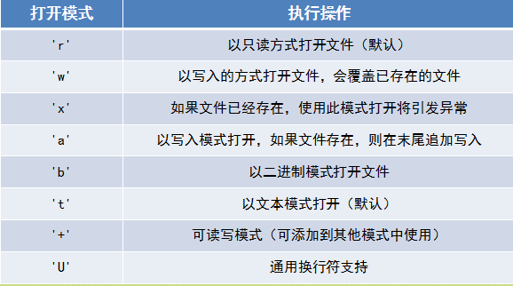
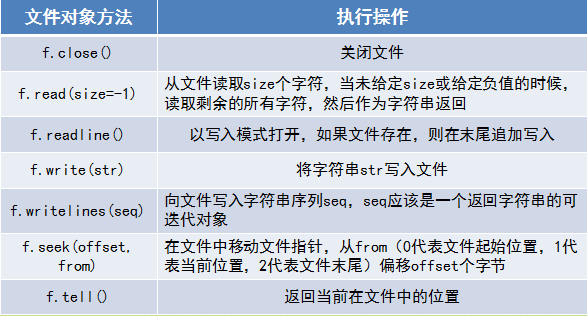

<link rel="stylesheet" href="./css/layout.css" type="text/css" />
<h2>文件</h2>

<h4>打开一个文件对象</h4>
	#使用open方法
	f = open("文件路径","打开模式")
	#需要注意的有一点
	#f = open('E:/test.txt', 'w')   # A
	#f = open('E:\test.txt', 'w')   # B
	#f = open('E://test.txt', 'w')  # C
	#f = open('E:\\test.txt', 'w')  # D
	
	#B这种打开方式会出现错误，\t是转义字符

<h4>可以用for循环打印文件对象</h4>
	f = open("文件路径","打开模式")
	for each in f
		print(each)

文件打开模式如下图，若无特殊指定，默认为文本只读模式——'rt'。

	这里有需要注意的是'w'与'x'两种方式的区别：
	'w'模式打开时，若存在相同名字的文件，则会被覆盖掉；
	而'x'模式打开时，则会引发异常；如果想在同一个文件末尾追加数据，可以用'a'的模式打开。

文件操作方法如下图

	&nbsp;&nbsp;&nbsp;&nbsp;养成好习惯，尽管Python有垃圾清理器，但是用open打开的文件还是注意用close关闭。 
	&nbsp;&nbsp;&nbsp;&nbsp;其他的函数使用，参考下面的一个经典例题。

<h4>文件操作经典例题</h4>
	def save_file(boy, girl, count):
    	file_name_boy = 'boy_' + str(count) + '.txt'
    	file_name_girl = 'girl_' + str(count) + '.txt'

    	boy_file = open(file_name_boy, 'w')
    	girl_file = open(file_name_girl, 'w')

    	boy_file.writelines(boy)
    	girl_file.writelines(girl)

    	boy_file.close()
    	girl_file.close()

	def split_file(file_name):
    	f = open('record.txt')

    	boy = []
    	girl = []
    	count = 1

    	for each_line in f:
      		if each_line[:6] != '======':
            	(role, line_spoken) = each_line.split(':', 1)
            	if role == '小甲鱼':
                	boy.append(line_spoken)
            	if role == '小客服':
                	girl.append(line_spoken)
        	else:
            	save_file(boy, girl, count)

            	boy = []
            	girl = []
            	count += 1

    	save_file(boy, girl, count)

    	f.close()

	split_file('record.txt')

<h4>检测两个文件内容是否相同</h4>
	def file_compare(file1, file2):
    	f1 = open(file1)
    	f2 = open(file2)
    	count = 0 # 统计行数
    	differ = [] # 统计不一样的数量

    	for line1 in f1:
       		line2 = f2.readline()
        	count += 1
        	if line1 != line2:
            	differ.append(count)

    	f1.close()
    	f2.close()
    	return differ

	file1 = input('请输入需要比较的头一个文件名：')
	file2 = input('请输入需要比较的另一个文件名：')

	differ = file_compare(file1, file2)

	if len(differ) == 0:
    	print('两个文件完全一样！')
	else:
    	print('两个文件共有【%d】处不同：' % len(differ))
    	for each in differ:
        	print('第 %d 行不一样' % each)

5/17/2016 10:27:23 PM	@author:Cloudking